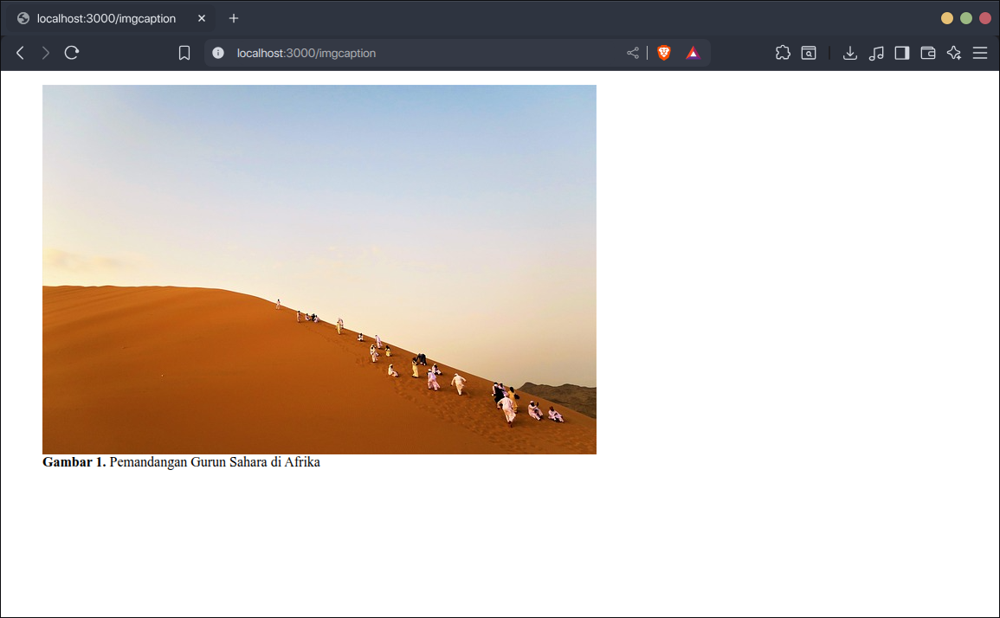
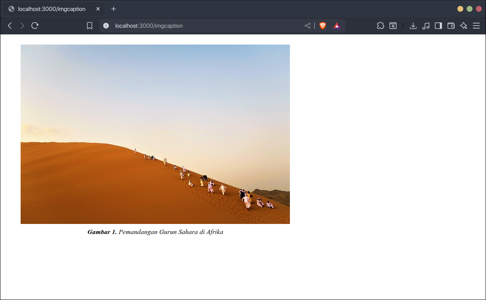
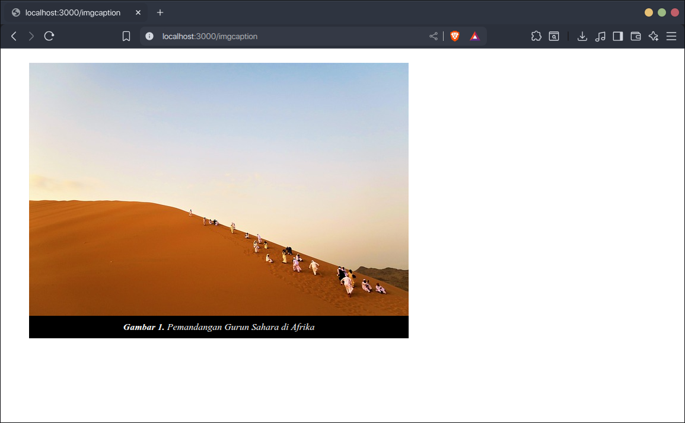
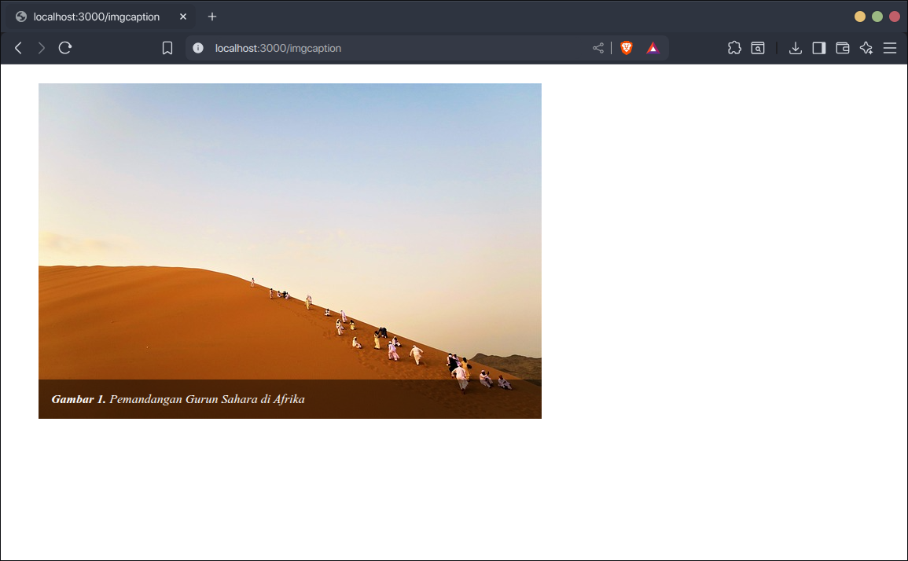

Caption adalah teks singkat untuk memberikan keterangan tambahan pada gambar. Biasanya terletak di bawah gambar.

Untuk menambahkan caption di gambar HTML, gunakan elemen `<figcaption>`, kemudian gambar dan `<figcaption>` dimasukkan ke dalam elemen `<figure>`.

Contoh:

```html
<figure>
    
    <figcaption>
        <b>Gambar 1.</b>
        Pemandangan Gurun Sahara di Afrika
    </figcaption>
</figure>
```

Hasilnya:



## Menambahkan Style Pada Caption

Berikut beberapa kode CSS untuk menambahkan style pada caption:

### 1. Caption Sederhana

```css
figure {
    text-align: center;
}
figcaption {
    margin-top: 10px;
    font-style: italic;
}
```



### 2. Caption dengan Background

```css
figure {
    display: inline-block;
}

figcaption {
    padding: 10px 0;
    width: 100%;
    font-style: italic;
    text-align: center;
    background-color: black;
    color: white;
}
```



### 3. Caption Overlay Transparan

```css
figure {
    display: inline-block;
    position: relative;
}
figcaption {
    position: absolute;
    bottom: 0;
    left: 0;
    box-sizing: border-box;
    padding: 16px 16px;
    width: 100%;
    font-style: italic;
    background-color: rgba(0, 0, 0, 0.5);
    color: white;
}
```



## Perbedaan Alt dan Caption

Teks alt dan caption adalah dua hal yang berbeda pada gambar.

Alt adalah teks yang **mendeskripsikan gambar**, sedangkan caption adalah teks yang **memberikan informasi tambahan pada gambar**.

Teks alt hanya akan muncul di browser ketika gambar tidak bisa dimuat, sedangkan caption akan selalu muncul bersama gambar.

Teks alt sangat disarankan untuk selalu ditambahkan pada gambar agar pengunjung yang tidak bisa melihat gambar (screen reader dan search engine) tetap bisa memahami apa gambar tersebut. Sedangkan caption tidak harus disertakan pada gambar, karena sifatnya informasi tambahan.

Contoh:

```html
<figure>
    
    <figcaption>
        <b>Gambar 1.</b>
        Pemandangan Gurun Sahara di Afrika
    </figcaption>
</figure>
```

Pada kode di atas, teks alt "Gurun Sahara" adalah deskripsi dari gambar, sedangkan "Gambar 1. Pemandangan Gurun Sahara di Afrika" adalah informasi tambahan pada gambar.