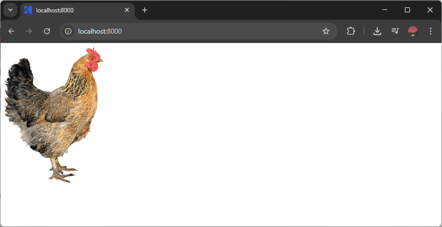
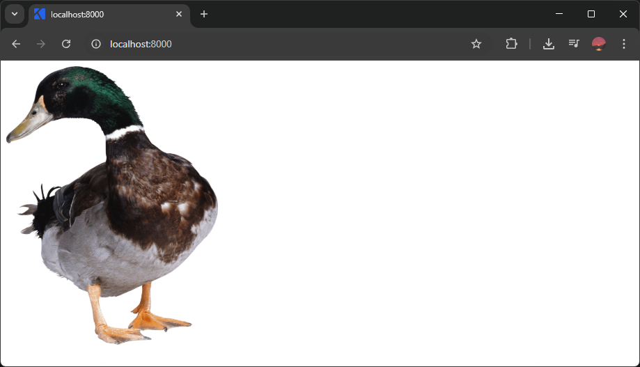

Elemen dapat diatur lebar dan tingginya dengan CSS, berikut penjelasannya:

## Mengatur Lebar Elemen

Lebar elemen dapat diatur dengan properti `width`. Nilainya berupa ukuran lebarnya.

Satuan ukuran di CSS dapat dibaca di materi [macam-macam satuan ukuran dasar di CSS](/courses/belajar-css-dasar/macam-satuan-ukuran-dasar-css).

Contoh:

```css
img {
    width: 200px;
}
```

```html

```

Hasilnya:



## Mengatur Tinggi Elemen

Tinggi elemen dapat diatur dengan properti `height`. Nilainya berupa ukuran tingginya.

Contoh:

```css
img {
    height: 400px;
}
```

```html

```

Hasilnya:

