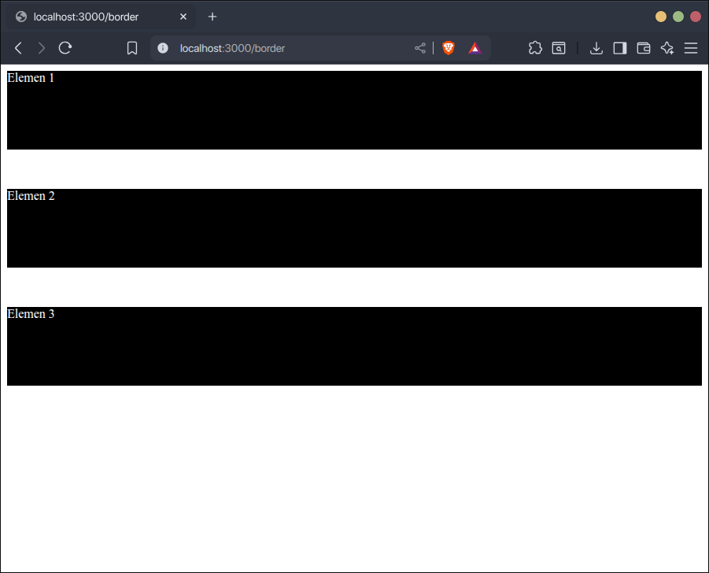

Margin adalah jarak antar elemen di CSS. Padding adalah jarak antara elemen ke dalam kontennya.


## Menambahkan Margin

Untuk menambahkan margin di CSS, gunakan properti `margin`. Nilainya berisi berapa besar ukuran marginnya. Contoh:

Satuan ukuran di CSS dapat dibaca di materi [macam-macam satuan ukuran dasar di CSS](/4-vZP2_pS1iAR7VpIMjzoQ).

```css
div {
    margin: 50px;
    
    background-color: black;
    color: white;
    height: 100px;
}
```

```html
<div>Elemen 1</div>
<div>Elemen 2</div>
<div>Elemen 3</div>
```

Hasilnya, setiap elemen `div` berjarak `50px` ke elemen lain.


### Menambahkan Margin di Sisi Tertentu

Jika ingin menambahkan margin di sisi tertentu saja, gunakan properti `margin-(top/bottom/right/left)`.

1. `top`, margin atas.
2. `bottom`, margin bawah.
3. `left`, margin kiri.
4. `right`, margin kanan.

Contoh:

```css
div {
    margin-bottom: 50px;

    background-color: black;
    color: white;
    height: 100px;
}
```

```html
<div>Elemen 1</div>
<div>Elemen 2</div>
<div>Elemen 3</div>
```

Hasilnya, setiap elemen `div` berjarak `50px` ke elemen di bawahnya. 



## Menambahkan Padding

Untuk menambahkan padding di CSS, gunakan properti `padding`. Nilainya berisi berapa besar ukuran padding-nya. Contoh:

Satuan ukuran di CSS dapat dibaca di materi [macam-macam satuan ukuran dasar di CSS](/4-vZP2_pS1iAR7VpIMjzoQ).

```css
div {
    margin-bottom: 10px;
}

.satu {
    padding: 20px;
    background-color: red;
}
.dua {
    padding: 40px;
    background-color: yellow;
}
.tiga {
    padding: 60px;
    background-color: green;
    color: white;
}
```

```html
<div class="satu">Elemen 1</div>
<div class="dua">Elemen 2</div>
<div class="tiga">Elemen 3</div>
```

Hasilnya, setiap elemen `div` memiliki beberapa jarak ke dalam kontennya.


### Menambahkan Padding di Sisi Tertentu

Jika ingin menambahkan padding di sisi tertentu saja, gunakan properti `padding-(top/bottom/right/left)`.

1. `top`, padding atas.
2. `bottom`, padding bawah.
3. `left`, padding kiri.
4. `right`, padding kanan.

Contoh:

```css
div {
    margin-bottom: 10px;
}

.satu {
    padding-top: 20px;
    background-color: red;
}
.dua {
    padding-left: 40px;
    padding-right: 40px;
    background-color: yellow;
}
.tiga {
    padding-bottom: 60px;
    background-color: green;
    color: white;
}
```

```html
<div class="satu">Elemen 1</div>
<div class="dua">Elemen 2</div>
<div class="tiga">Elemen 3</div>
```

Hasilnya, setiap elemen `div` memiliki variasi beberapa jarak ke dalam kontennya. 

