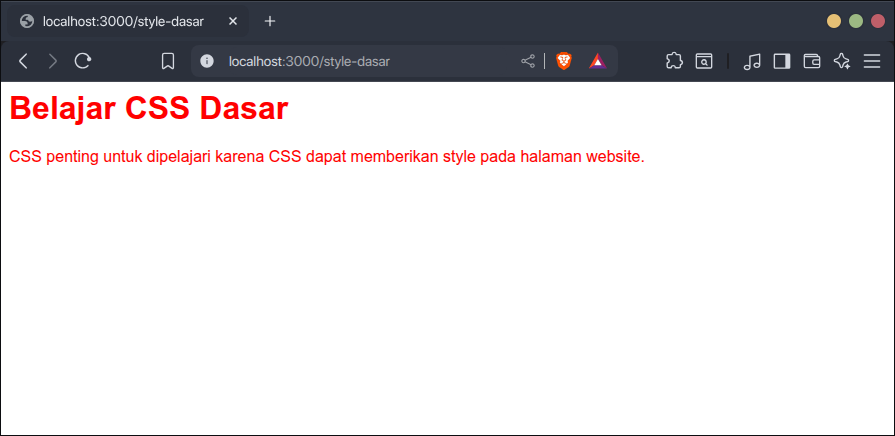
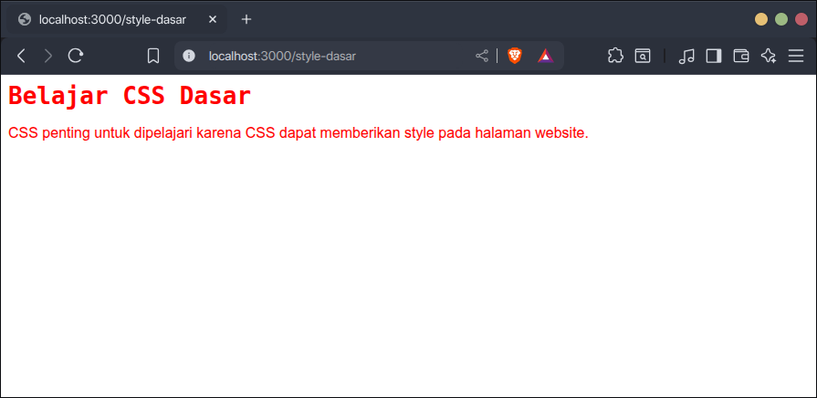
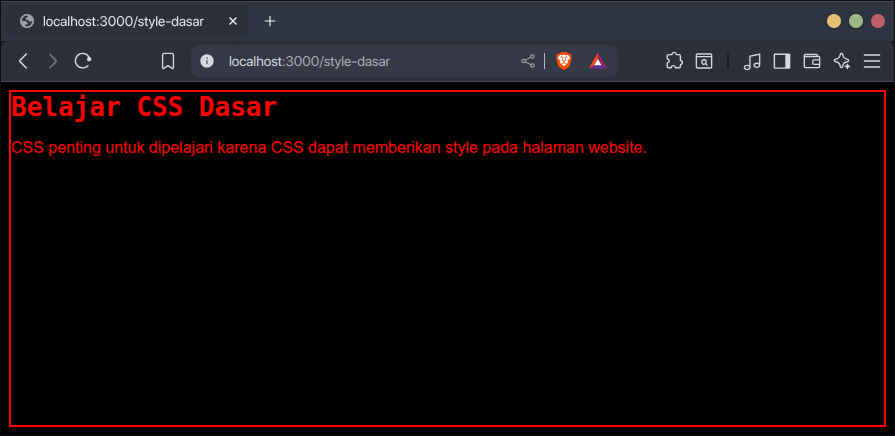

Style dasar CSS adalah style yang diterapkan di induk elemen (`body`) yang semua elemen di bawahnya akan otomatis mendapatkan style yang sama.

Fungsinya agar style-style yang sifatnya dasar di setiap elemen seperti font, warna teks bisa ditulis satu kali saja di elemen induk, sehingga lebih menghemat waktu.

## Menambahkan Style Dasar

Style dasar CSS ditambahkan di tag `body`, contoh:

```css
body {
    font-family: Arial, sans-serif;
    color: red;
}
```

Contoh dokumen HTML:

```html
<body>
    <h1>Belajar CSS Dasar</h1>
    <p>CSS penting untuk dipelajari karena ...</p>
</body>
```

Hasilnya, semua elemen di dalam tag `body` akan memiliki style yang sama dengan tag `body`, yaitu font Arial dan teks warna merah.



## Menonaktifkan Style Dasar

Jika ingin elemen tertentu punya style sendiri, tinggal ditambahkan stylenya di elemen tersebut. Maka style dasar dari elemen induk tidak akan dipakai. Contoh:

```css
body {
    font-family: Arial, sans-serif;
    color: red;
}

h1 {
    font-family: monospace;
}
```

Hasilnya, elemen `h1` memiliki font yang berbeda dengan `body` karena dia punya style font sendiri, tapi warnanya masih mengikuti style dasar dari `body`.



## Catatan Tentang Style Dasar

Tidak semua style dasar dari elemen induk akan otomatis diterapkan di elemen di bawahnya, seperti background dan border.

Ketika di elemen induk memiliki style background dan border, elemen di bawahnya tidak akan otomatis mendapatkan style yang sama. Contoh:

```css
body {
    font-family: Arial, sans-serif;
    color: red;
    background-color: black;
    border-width: 2px;
    border-style: solid;
    border-color: red;
}

h1 {
    font-family: monospace;
}
```

Hasilnya, meskipun di `body` ada style background dan border, `h1` dan `p` tidak mendapatkan style tersebut dari `body`.

