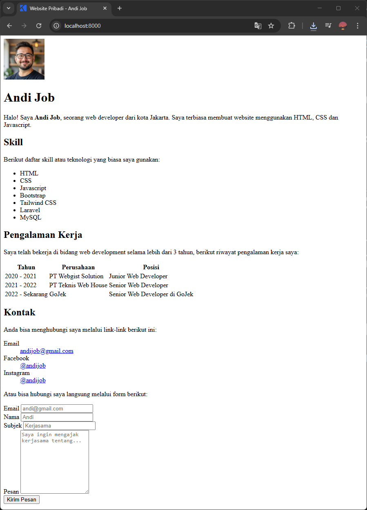
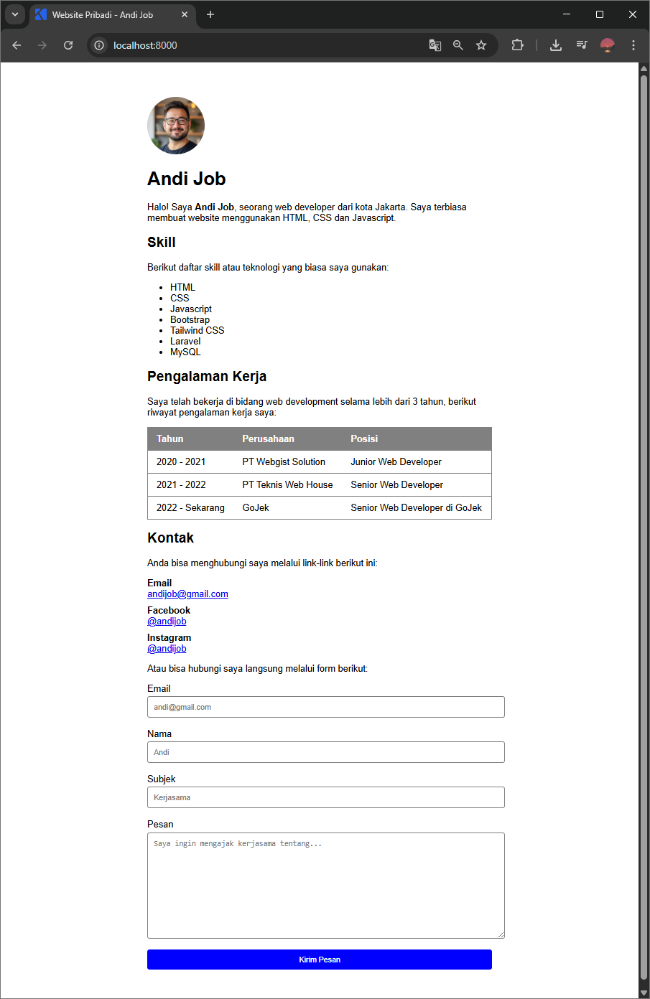
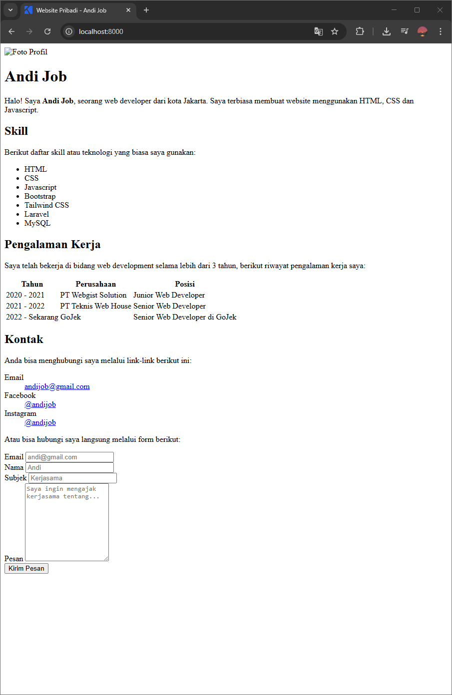
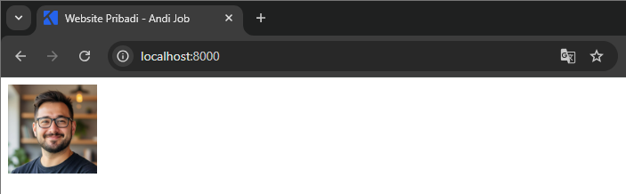
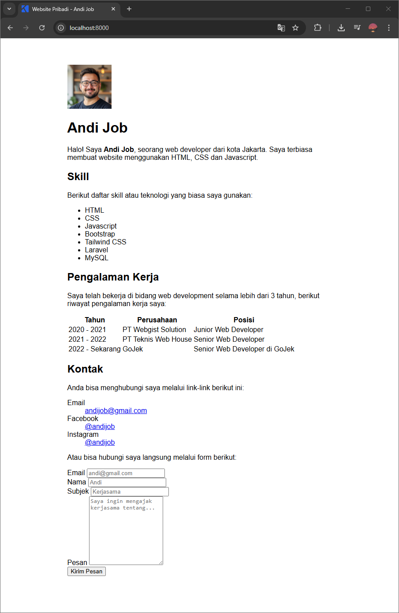
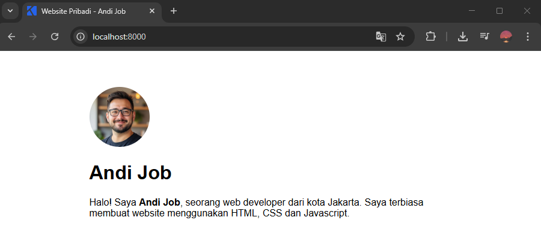
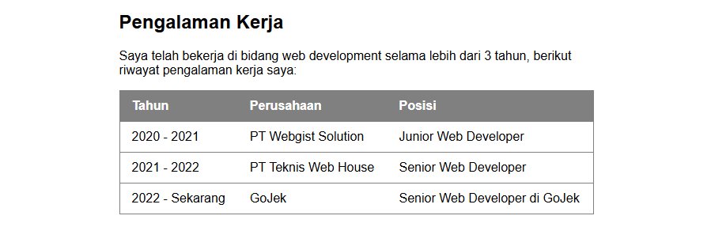
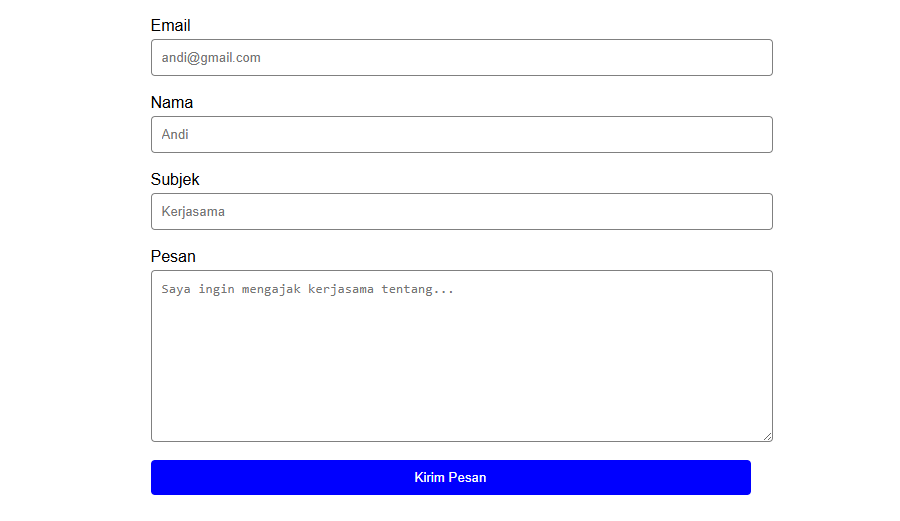

Setelah belajar beberapa cara styling website dengan CSS, sekarang saatnya kita praktek mengaplikasikannya pada sebuah website pribadi.

Website pribadi adalah website yang menampilkan informasi-informasi pribadi seperti nama, biografi, pengalaman kerja, dsb yang bisa digunakan sebagai CV, portofolio, biodata diri dsb.

Contoh website pribadi sebelum ditambahkan styling:



Hasilnya setelah ditambahkan styling:



Langsung saja, berikut langkah-langkahnya:

## Membuat Dokumen HTML

Pertama, buat dokumen HTML untuk website pribadi yang akan ditambahkan style CSS.

Berikut kode HTML website pribadi yang akan digunakan di materi ini, untuk langkah-langkah pembuatannya bisa dibaca di [membuat website pribadi sederhana dengan HTML](/courses/belajar-html-dasar/membuat-website-pribadi-sederhana-dengan-html).

```html
<!DOCTYPE html>
<html lang="id">
<head>
    <title>Website Pribadi - Andi Job</title>
</head>
<body>
  
  <h1>Andi Job</h1>
  <p>
    Halo! Saya <b>Andi Job</b>, seorang web developer dari kota Jakarta. Saya
    terbiasa membuat website menggunakan HTML, CSS dan Javascript.
  </p>
  <h2>Skill</h2>
  <p>Berikut daftar skill atau teknologi yang biasa saya gunakan:</p>
  <ul>
    <li>HTML</li>
    <li>CSS</li>
    <li>Javascript</li>
    <li>Bootstrap</li>
    <li>Tailwind CSS</li>
    <li>Laravel</li>
    <li>MySQL</li>
  </ul>
  <h2>Pengalaman Kerja</h2>
  <p>
    Saya telah bekerja di bidang web development selama lebih dari 3 tahun,
    berikut riwayat pengalaman kerja saya:
  </p>
  <table>
    <tr>
      <th>Tahun</th>
      <th>Perusahaan</th>
      <th>Posisi</th>
    </tr>
    <tr>
      <td>2020 - 2021</td>
      <td>PT Webgist Solution</td>
      <td>Junior Web Developer</td>
    </tr>
    <tr>
      <td>2021 - 2022</td>
      <td>PT Teknis Web House</td>
      <td>Senior Web Developer</td>
    </tr>
    <tr>
      <td>2022 - Sekarang</td>
      <td>GoJek</td>
      <td>Senior Web Developer di GoJek</td>
    </tr>
  </table>
  <h2>Kontak</h2>
  <p>Anda bisa menghubungi saya melalui link-link berikut ini:</p>
  <dl>
    <dt>Email</dt>
    <dd>
      <a href="mailto:andijob@gmail.com">andijob@gmail.com</a>
    </dd>
    <dt>Facebook</dt>
    <dd>
      <a href="https://facebook.com/andijob">@andijob</a>
    </dd>
    <dt>Instagram</dt>
    <dd>
      <a href="https://instagram.com/andijob">@andijob</a>
    </dd>
  </dl>
  <p>Atau bisa hubungi saya langsung melalui form berikut:</p>
  <form>
    <label for="email">Email</label>
    <input type="email" id="email" placeholder="andi@gmail.com" />
    <br />

    <label for="nama">Nama</label>
    <input type="text" id="nama" placeholder="Andi" />
    <br />

    <label for="subjek">Subjek</label>
    <input type="subjek" id="subjek" placeholder="Kerjasama" />
    <br />

    <label for="pesan">Pesan</label>
    <textarea
      id="pesan"
      rows="10"
      placeholder="Saya ingin mengajak kerjasama tentang..."
    ></textarea>
    <br />

    <button type="submit">Kirim Pesan</button>
  </form>
</body>
</html>
```

Hasilnya ketika dijalankan:



## Menambahkan Foto Profil

Pada website pribadi yang akan dibuat, terdapat gambar yang menampilkan foto profil.

Siapkan foto profil tersebut dengan diberi nama `foto.png`, lalu simpan ke dalam folder yang sama dengan dokumen HTML yang dibuat sebelumnya.

Hasilnya:



## Membuat File CSS

Untuk menambahkan style CSS ke halaman website, di sini kita menggunakan cara external CSS dengan membuat sebuah file CSS. File CSS diberi nama `style.css`.

File CSS dibuat di folder yang sama dengan dokumen HTML.

File CSS kemudian dihubungkan ke dokumen HTML dengan menambahkan kode berikut di dalam tag `<head>`:

```html
<head>
  <link rel="stylesheet" href="style.css">
  <title>Website Pribadi - Andi Job</title>
</head>
```

## Menambahkan Style Dasar

Pertama kita tambahkan style dasar pada website seperti font, ukuran teks dan warna teks.

```css
body {
  font-family: 'Arial', sans-serif;
    
  width: 600px;
    
  margin-top: 60px;
  margin-bottom: 60px;
  margin-left: auto;
  margin-right: auto;

  box-sizing: border-box;
}
```

Penjelasan style dasar di atas:

1. Font yang digunakan adalah `Arial`, jika belum diinstal di komputer, font yang digunakan `sans-serif`.
2. Lebar konten utama di halaman website `600px` agar konten terlihat lebih padat.
3. Margin atas dan bawah `60px` agar ada jarak ke bagian atas dan bawah website.
4. Margin kiri dan kanan dibuat `auto`, ini adalah trik untuk membuat posisi elemen menjadi di tengah secara horizontal.
5. `box-sizing: border-box`, agar perhitungan ukuran elemen menjadi lebih akurat. Akan dijelaskan di materi CSS lanjutan.

Hasilnya:



## Menambahkan Style Pada Foto Profil

Agar tampilan gambar foto profil lebih bagus, bentuknya bisa dibuat menjadi lingkaran. Dengan CSS properti `border-radius`, nilainya `100%`.

```css
img {
  border-radius: 100%;
}
```

Hasilnya:



## Menambahkan Style Pada Tabel Pengalaman Kerja

Tabel pengalaman kerja bisa dibuat lebih rapi dengan diatur lebar (`width`) tabel menjadi full `100%` dan diberi border.

```css
table {
  width: 100%;
  border: 1px solid gray;
  border-collapse: collapse;
}
```

`border-collapse: collapse` adalah cara styling tabel agar bordernya menyatu dengan tabel.

Setiap baris (`tr`) di dalam tabel ditambahkan border bottom agar terlihat seperti ada pemisah antar baris.

```css
tr {
  border-bottom: 1px solid gray;
}
```

Untuk kolom judul (`th`) dan kolom isi (`td`) tabel ditambahkan padding agar tidak terlalu rapat dan teksnya diratakan kiri.

```css
th, td {
  text-align: left;
  padding: 10px 15px;
}
```

Khusus untuk kolom judul `th`, ditambahkan background abu-abu agar bisa membedakan mana judul dan mana isi tabel. 

```css
th {
  background-color: gray;
  color: white;
}
```

Hasilnya:



## Menambahkan Style Pada Daftar Kontak

Agar daftar kontak terlihat lebih rapi, judul daftar kontak (`dt`) diberi sedikit jarak dan teksnya dibuat menjadi tebal. Kemudian deksripsi daftar kontak (`dd`) dihilangkan marginnya agar posisinya lurus dengan judulnya.

```css
dt {
  font-weight: bold;
  margin-top: 10px;
}
dd {
  margin: 0;
}
```

Hasilnya:


## Menambahkan Style Pada Form

Agar form terlihat lebih rapi dan bagus, kita perlu menambahkan style pada input, textarea dan button pada form.

Untuk input ditambahkan style border, border radius, diberi sedikit padding dan margin, dan lebarnya dibuat full.

```css
input, textarea {
  display: block;
  width: 100%;
  padding: 10px;
  margin-top: 4px;
  border-radius: 4px;
  border: 1px solid gray;
}
```

Untuk button, sama seperti input dengan ditambahkan background.

```css
button {
  display: block;
  width: 100%;
  padding: 10px;
  border: 0;
  border-radius: 4px;
  background-color: blue;
  color: white;
}
```

Hasilnya:



## Kode Akhir CSS Lengkap

Berikut kode akhir CSS lengkap yang telah dibuat:

```css
body {
  font-family: 'Arial', sans-serif;
    
  width: 600px;
    
  margin-top: 60px;
  margin-bottom: 60px;
  margin-left: auto;
  margin-right: auto;

  box-sizing: border-box;
}
img {
  border-radius: 100%;
}
table {
  width: 100%;
  border: 1px solid gray;
  border-collapse: collapse;
}
tr {
  border-bottom: 1px solid gray;
}
th, td {
  text-align: left;
  padding: 10px 15px;
}
th {
  background-color: gray;
  color: white;
}
dt {
  font-weight: bold;
  margin-top: 10px;
}
dd {
  margin: 0;
}
input, textarea {
  display: block;
  width: 100%;
  padding: 10px;
  margin-top: 4px;
  border-radius: 4px;
  border: 1px solid gray;
}
button {
  display: block;
  width: 100%;
  padding: 10px;
  border: 0;
  border-radius: 4px;
  background-color: blue;
  color: white;
}
```

## Tampilan Hasil Akhir

Berikut hasil tampilan akhir website pribadi setelah ditambahkan style CSS:

