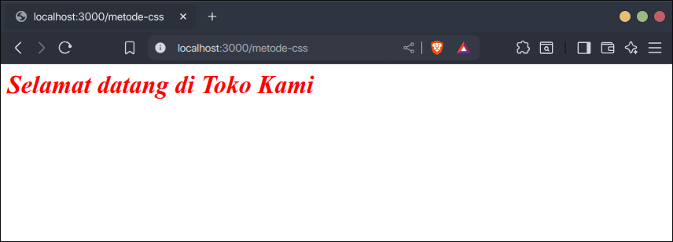

Ada tiga cara untuk menambahkan CSS ke HTML.

## 1. Inline CSS

Inline CSS adalah CSS yang ditambahkan langsung ke elemen HTML tertentu melalui atribut `style`.

Contoh:

```html
<h1 style="color: red; font-style: italic;">
    Selamat datang di Toko Kami
</h1>
```

Kode `color: red; font-style: italic;` adalah kode CSS yang ditambahkan langsung ke elemen HTML `<h1>`.

Hasilnya:



Inline CSS memiliki kelebihan dan kekurangan. Kelebihannya:

1. Lebih cepat untuk styling, karena tinggal langsung menulis kode CSS ke elemen yang diinginkan.
2. Tidak perlu menulis selector (kode css untuk mencari elemen yang ingin diberi style).
3. Tidak perlu file CSS khusus.

Kekurangan Inline CSS:

1. Kalau style CSS nya banyak, maka kode HTML menjadi semakin panjang dan ruwet.
2. Inline CSS hanya bisa digunakan per satu elemen, harus ditulis ulang jika stylenya ingin digunakan di elemen lain.
3. Elemen HTML sejatinya hanya digunakan untuk membuat kerangkanya saja tidak dengan stylenya.

## 2. Internal CSS

Internal CSS adalah CSS yang ditambahkan di dalam dokumen HTML melalui tag `<style>` di dalam tag `<head>`.

Bedanya dengan inline, style internal CSS bisa digunakan di banyak elemen.

Contoh:

```html
<!DOCTYPE html>
<html>
<head>
    <title>Document</title>
    
    <style>
        h1 {
            color: red;
            font-style: italic;
        }
    </style>
</head>
<body>
    <h1>Selamat datang di Toko Kami</h1>
    <h1>Silakan berbelanja!</h1>
</body>
</html>
```

Hasilnya:


Internal CSS memiliki kelebihan dan kekurangan. Kelebihannya:

1. Kode HTML menjadi lebih rapi karena tidak ada kode CSS inline.
2. Style CSS bisa digunakan ke banyak elemen.
3. Kode style CSS bisa panjang dan masih terlihat rapi.

Kekurangan internal CSS:

1. Semakin banyak kode CSS, maka semakin besar ukuran dokumen HTML.
2. Internal CSS hanya bisa digunakan per satu dokumen HTML. Harus ditulis ulang jika stylenya ingin digunakan di dokumen HTML lain.

## 3. External CSS

External CSS adalah CSS yang disimpan di file tersendiri di luar dokumen HTML. File external css memiliki format `.css`.

External CSS dihubungkan ke dokumen HTML menggunakan tag `<link>` yang dimasukkan ke dalam tag `<head>`. Nama file css dimasukkan ke dalam atribut `href`. Contoh:

```html
<!DOCTYPE html>
<html>
<head>
    <title>Document</title>
    
    <link rel="stylesheet" href="style.css">
</head>
<body>
    <h1>Selamat datang di Toko Kami</h1>
    <h1>Silakan berbelanja!</h1>
</body>
</html>
```

Contoh isi file `style.css`

```css
h1 {
    color: red;
    font-style: italic;
}
```

Hasilnya:


Ini adalah cara yang paling sering digunakan di mayoritas website. Kelebihan external CSS:

1. Bisa digunakan di banyak dokumen HTML, bahkan di website lain.
2. Memisahkan kode HTML dengan kode CSS, sehingga kode HTML dan kode CSS lebih bersih dan rapih.
3. Menulis kode CSS lebih fokus karena di satu file khusus.

Kekurangan external CSS:

1. Browser akan melakukan http request tambahan ketika memuat file CSS external.

---

## Menggabungkan Inline, Internal dan External CSS

Tiga cara diatas bisa digunakan secara bersamaan, ketika suatu elemen memiliki style CSS dari inline, internal dan external maka browser akan menerapkan prioritas style dengan urutan berikut:

1. Inline CSS
2. Internal CSS
3. External CSS

Contoh:

```html
<!DOCTYPE html>
<html>
<head>
    <title>Document</title>
    
    <link rel="stylesheet" href="style.css">
    
    <style>
        h1 {
            color: blue;
        }
    </style>
</head>
<body>
    <h1 style="color: red">Selamat datang di Toko Kami</h1>
</body>
</html>
```

Isi file `style.css`

```css
h1 {
    color: green;
}
```

Hasilnya, warna elemen `h1` menjadi merah, karena browser mengutamakan inline CSS.


## Mana yang Harus Saya Gunakan?

Saya sarankan untuk menggunakan external CSS karena menulis CSS jadi lebih fokus tanpa menyentuh file HTML, dan kebanyakan webiste juga menggunakan external CSS.

Tetapi boleh-boleh saja menggunakan inline dan internal CSS, berikut tabel panduan memilih metode menambahkan CSS ke HTML:

| Kebutuhan | Inline CSS | Internal CSS | External CSS |
| -------- | -------- | -------- | --- |
| Styling untuk satu elemen | Bisa  | Bisa | Bisa |
| Styling untuk lebih dari satu elemen | Tidak Bisa  | Bisa | Bisa |
| Styling untuk satu dokumen HTML | Bisa  | Bisa | Bisa |
| Styling untuk lebih dari satu dokumen HTML | Tidak Bisa  | Tidak Bisa | Bisa |
| Styling CSS banyak | Membuat kode HTML menjadi ruwet  | Membuat dokumen HTML menjadi besar | Tidak berpengaruh ke kode HTML |