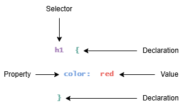
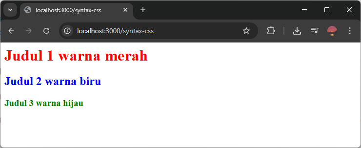
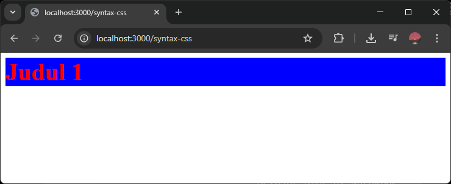

Untuk mulai menulis kode CSS, kita harus mengetahui syntax (aturan) dasar penulisan kode CSS.

Sebuah kode CSS terdiri dari dua bagian:

1. Selector, yaitu elemen HTML yang mau diberi style.
2. Declaration Block, yaitu daftar style yang mau diterapkan ke selector, terdiri dari property dan value.

Contoh kode CSS lengkap:

```css
h1 {
    color: red;
}
```


Penjelasan kode diatas:

- `h1` adalah selector.
- `{` adalah awal declaration block.
- `color` adalah property.
- `red` adalah value.
- `}` adalah akhir declaration block.



Berikut penjelasan masing-masing bagiannya:

## Selector

Selector adalah cara untuk memilih elemen HTML yang akan diberi style.

Misalnya kita ingin memberi style pada judul, maka selectornya bisa berupa nama tag judul, yaitu `h1`, `h2`, `h3`, dst.

Contoh:

```css
h1 {
    color: red;
}

h2 {
    color: blue;
}

h3 {
    color: green;
}
```

File HTML:

```html
<h1>Judul 1 warna merah</h1>
<h2>Judul 2 warna biru</h2>
<h3>Judul 3 warna hijau</h3>
```

Hasilnya:



Selector ada banyak jenisnya, bukan hanya nama tag, bisa dengan nama `class` pada tag, atau nama `id` pada tag, dsb. Untuk penjelasan lengkapnya bisa dibaca di [macam-macam selector dasar CSS](./macam-selector-dasar-css).

## Declaration Block

Declaration block adalah blok untuk menulis style CSS yang mau diterapkan pada selector.

Declaration block ditandai dengan tanda kurung kurawal buka (`{`) dan diakhiri dengan kurung kurawal tutup (`}`).

Contoh:

```css
h1 {
    /* Isi style css yang mau diterapkan */
}
```

Di dalam declaration block, ada daftar style CSS yang mau diterapkan pada selector. Setiap style CSS tersebut tediri dari property dan value.

- Property adalah nama jenis style yang mau diterapkan, misalnya `color`, `font-size`, `background-color`.
- Value adalah isi jenis style yang mau diterapkan, misalnya `red`, `10px`, `blue`.

Aturan penulisan property dan value:

- Property dan value dipisahkan dengan tanda titik dua (`:`).
- Value diakhiri dengan tanda titik komah (`;`).
- Jika style CSS lebih dari satu, maka dipisahkan dengan baris baru. (Tidak wajib, tapi direkomendasikan agar kode lebih rapi).

Contoh:

```css
h1 {
    color: red;
    font-size: 40px;
    background-color: blue;
}
```

File HTML:

```html
<h1>Judul 1</h1>
```

Hasilnya:

