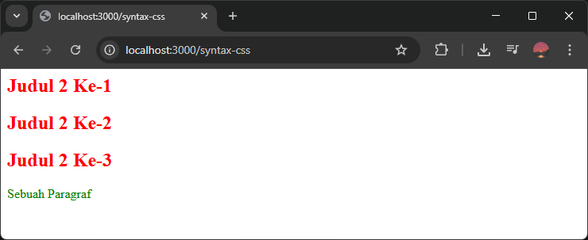
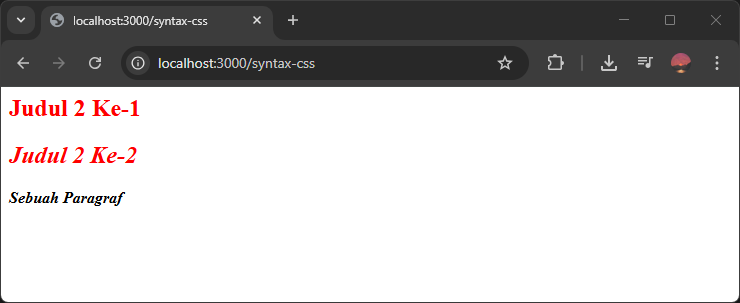
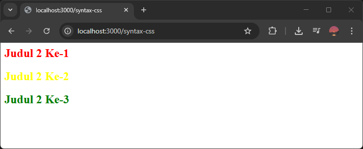
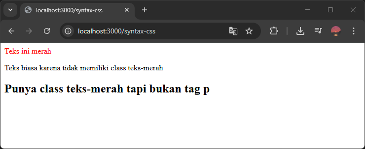
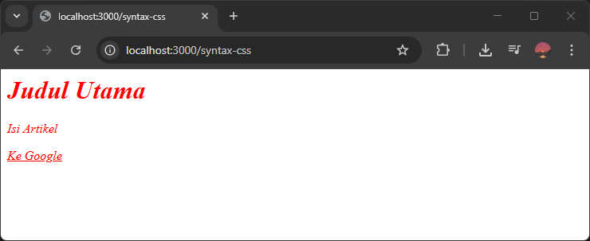

Selector adalah elemen HTML yang ingin diberikan style CSS.

Selector ada banyak macamnya, yang paling dasar dan sering digunakan ada tiga macam, yaitu:

1. Tag Selector
2. Class Selector
3. ID Selector

## Tag Selector

Tag selector adalah selector untuk memilih elemen HTML berdasarkan nama tag / nama elemennya. Misalnya `h1`, `p`, `img`, `a`, dsb.

Jika elemen HTML yang dipilih ada beberapa di HTML, maka seluruh elemen tersebut akan terkena style pada selector.

Contoh:

```css
h2 {
    color: red;
}

p {
    color: green;
}
```

Arti kode CSS di atas, seluruh elemen `h2` di HTML akan berwarna merah dan seluruh elemen `p` di HTML akan berwarna hijau.

Contoh:

```html
<h2>Judul 2 Ke-1</h2>
<h2>Judul 2 Ke-2</h2>
<h2>Judul 2 Ke-3</h2>
<p>Sebuah Paragraf</p>
```

Hasilnya:



## Class Selector

Class selector adalah selector untuk memilih elemen HTML yang memiliki atribut class dengan nilai tertentu.

Elemen HTML dapat memiliki atribut class yang isinya teks nama class-nya. Nama class bisa lebih dari satu, dipisahkan dengan spasi. Contoh:

```html
<h2 class="teks-merah">Judul 2 Ke-1</h2>
<h2 class="teks-merah teks-tebal-miring">Judul 2 Ke-2</h2>
<p class="teks-tebal-miring">Sebuah Paragraf</p>
```

Class selector ditulis dengan simbol titik (`.`) diikuti nama class-nya: `.namaclass`. Contoh `.teks-merah` dan `.teks-tebal-miring`.

Contoh:

```css
.teks-merah {
    color: red;
}

.teks-tebal-miring {
    font-weight: bold;
    font-style: italic;
}
```

Hasilnya:



## ID Selector

ID selector adalah selector untuk memilih elemen HTML berdaarkan nilai atribut id pada elemen.

Elemen HTML dapat memiliki atribut id berisi teks nama id-nya. Setiap elemen hanya bisa memiliki satu id. Nama id bersifat unik, artinya hanya bisa bisa digunakan di satu elemen saja.

Contoh:

```html
<h2 id="judul-pertama">Judul 2 Ke-1</h2>
<h2 id="judul-kedua">Judul 2 Ke-2</h2>
<h2 id="judul-ketiga">Judul 2 Ke-3</h2>
```

ID selector ditulis dengan simbol pagar (`#`) diikuti nama id-nya: `#id`, Contoh: `#judul-pertama`, `#judul-kedua`, `#judul-ketiga`.

Contoh:

```css
#judul-pertama {
    color: red;
}

#judul-kedua {
    color: yellow;
}

#judul-ketiga {
    color: green;
}
```

Hasilnya:



---

## Menggabungkan Tag dan Class Selector

Tag dan class selector bisa digabungkan untuk memberikan style pada nama tag tertentu yang memiliki class tertentu. Contoh:

```css
p.teks-merah {
    color: red;
}
```

Arti kode di atas, seluruh tag `p` yang memiliki class `teks-merah` akan berwarna merah.

Contoh HTML:

```html
<p class="teks-merah">Teks ini merah</p>
<p>Teks biasa karena tidak memiliki class teks-merah</p>
<h2 class="teks-merah">Punya class teks-merah tapi bukan tag p</h2>
```

Hasilnya:



## Mengelompokan Style Beberapa Selector

Jika kita ingin memberikan style yang sama pada beberapa selector, kita bisa mengelompokan selector-selector tersebut ke style yang sama.

Caranya dengan menuliskan nama selector yang mau dikelompokan, dipisahkan dengan komah (`,`) lalu tulis style CSS-nya.

Contoh:

```css
h1, p.artikel, #link-google {
    color: red;
    font-style: italic;
}
```

Contoh HTML:

```html
<h1>Judul Utama</h1>
<p class="artikel">
    Isi Artikel
</p>
<a href="https://google.com" id="link-google">Ke Google</a>
```

Hasilnya:



## Panduan Memilih Selector

Berikut tabel panduan memilih selector yang tepat sesuai kebutuhan:

| Kebutuhan | Selector yang Tepat |
| -------- | -------- |
| Styling ke elemen berdasarkan nama tag     | Tag Selector     |
| Styling ke banyak elemen     | Class Selector     |
| Styling ke satu elemen khusus     | ID Selector     |
| Styling ke elemen berdasarkan nama tag tapi ada kondisi tambahan     | Tag Selector + Class Selector    |
