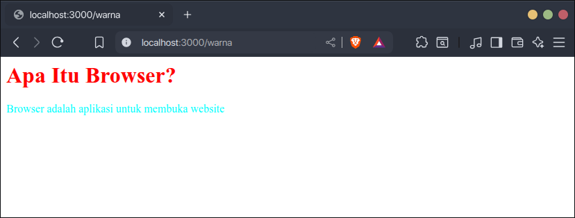
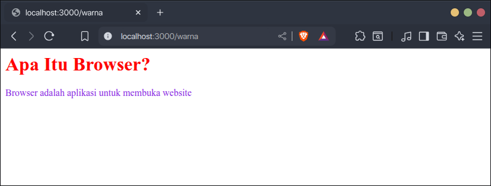
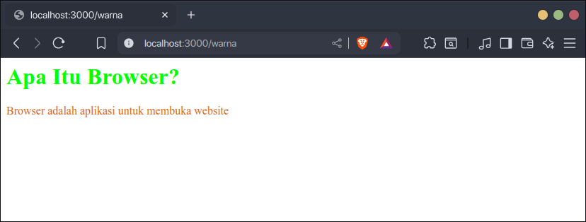
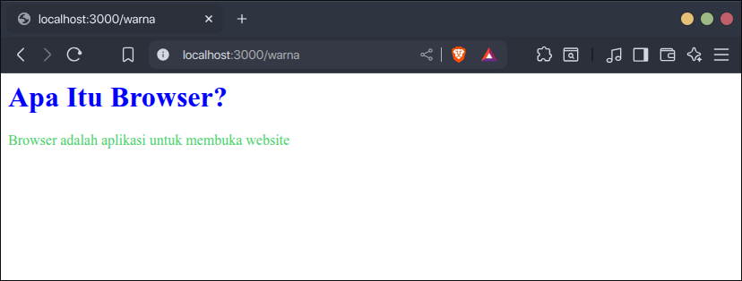

Ada beberapa properti CSS untuk mengatur warna pada elemen, seperti:

- `color`, untuk mengatur warna teks.
- `background-color`, untuk mengatur warna background.

Properti-properti tersebut nilainya dapat berupa nama warna, kode hex, kode rgb, dsb.  Di materi ini kita membahas beberapa macam-macam nilai warna tersebut, yaitu:

1. Nama warna
2. Kode Hex
3. Kode RGB
4. Kode HSL

## 1. Nama Warna

Nama warna adalah warna yang ditandai dengan namanya, misal warna merah namanya `red`, biru namanya `blue`, dsb. Namanya tidak sembarangan diterjemahkan saja, tapi ada daftar nama warna yang digunakan. Berikut beberapa di antaranya:

1. black <span class="inline-block w-4 h-4 ml-1" style="background-color: black"></span>	
2. silver <span class="inline-block w-4 h-4 ml-1" style="background-color: silver"></span>
3. gray <span class="inline-block w-4 h-4 ml-1" style="background-color: gray"></span>
4. white <span class="inline-block w-4 h-4 ml-1" style="background-color: white"></span>
5. maroon <span class="inline-block w-4 h-4 ml-1" style="background-color: maroon"></span>
6. red <span class="inline-block w-4 h-4 ml-1" style="background-color: red"></span>
7. purple <span class="inline-block w-4 h-4 ml-1" style="background-color: purple"></span>
8. fuchsia <span class="inline-block w-4 h-4 ml-1" style="background-color: fuchsia"></span>
9. green <span class="inline-block w-4 h-4 ml-1" style="background-color: green"></span>
10. lime <span class="inline-block w-4 h-4 ml-1" style="background-color: lime"></span>
11. olive <span class="inline-block w-4 h-4 ml-1" style="background-color: olive"></span>
12. yellow <span class="inline-block w-4 h-4 ml-1" style="background-color: yellow"></span>
13. navy <span class="inline-block w-4 h-4 ml-1" style="background-color: navy"></span>
14. blue <span class="inline-block w-4 h-4 ml-1" style="background-color: blue"></span>
15. teal <span class="inline-block w-4 h-4 ml-1" style="background-color: teal"></span>
16. aqua <span class="inline-block w-4 h-4 ml-1" style="background-color: aqua"></span>

Dan masih banyak lagi, untuk lebih lengkapnya cek di [daftar nama warna dokumentasi MDN](https://developer.mozilla.org/en-US/docs/Web/CSS/named-color).

Contoh penggunaan nama warna di CSS:

```css
h1 {
    color: red;
}

p {
    color: aqua;
}
```

```html
<h1>Apa Itu Browser?</h1>
<p>Browser adalah aplikasi untuk membuka website</p>
```

Hasilnya:



## 2. Kode Hex

Kode Hex adalah nilai warna yang dihasilkan dari kombinasi tiga warna dasar, merah (red), hijau (green) dan biru (blue) yang dituliskan dalam bilangan heksadesimal.

Bilangan heksadesimal adalah bilangan yang menggunakan 16 simbol, angka 0 - 9 dan huruf A - F.

Formatnya seperti ini:

```
#RRGGBB
```

Setiap warna dasar dapat bernilai 00 (0) - FF (255). Semakin tinggi nilai warna dasar tersebut, semakin dominan di warna yang dihasilkan.

Contoh:

- `FF0000` akan menghasilkan warna merah <span class="inline-block w-4 h-4" style="background-color: #FF0000"></span>, karena warna merahnya bernilai FF (255) paling tinggi, sedangkan hijau dan biru 00 (0).
- `FFC0CB` akan menghasilkan warna pink <span class="inline-block w-4 h-4" style="background-color: #FFC0CB"></span>, warna merah dominan FF (255) dicampur dengan hijau C0 (192) dan biru CB (203).

Contoh penggunaan kode hex di CSS.

```css
h1 {
    color: #FF0000; /* Merah */
}

p {
    color: #8A2BE2; /* Ungu */
}
```

```html
<h1>Apa Itu Browser?</h1>
<p>Browser adalah aplikasi untuk membuka website</p>
```

Hasilnya:



Kalau ingin membuat warna hex sendiri, Anda bisa menggunakan tool ini: [HTML Color Picker](https://htmlcolorcodes.com/color-picker/).

## 3. Kode RGB

Kode RGB adalah nilai warna yang dihasilkan dari kombinasi tiga warna dasar, merah (red), hijau (green), dan biru (blue). Setiap warna dasar dituliskan dalam angka 0 - 255.

Formatnya seperti ini:

```
rgb(red, green, blue)
```

Semakin tinggi nilai warna dasarnya, semakin dominan warna dasar tersebut pada warna yang dihasilkan. Contoh:

- `rgb(0, 255, 0)` akan menghasilkan warna hijau <span class="inline-block w-4 h-4" style="background-color: rgb(0, 255, 0)"></span>, karena warnanya hijau paling dominan (255), sedangkan merah dan biru (0).
- `rgb(210, 105, 30)` akan menghasilkan warna coklat <span class="inline-block w-4 h-4" style="background-color: rgb(210, 105, 30)"></span>, karena perpaduan warna merah yang paling dominan (210) dengan hijau yang lumayan (105) dan biru (30).

Contoh penggunaan kode RGB di CSS.

```css
h1 {
    color: rgb(0, 255, 0); /* Hijau */
}

p {
    color: rgb(210, 105, 30); /* Coklat */
}
```

```html
<h1>Apa Itu Browser?</h1>
<p>Browser adalah aplikasi untuk membuka website</p>
```

Hasilnya:



Kalau ingin membuat warna rgb sendiri, Anda bisa menggunakan tool ini: [HTML Color Picker](https://htmlcolorcodes.com/color-picker/).

## 4. Kode HSL

Kode HSL adalah nilai warna yang dihasilkan dari kombinasi hue, saturation dan lightness.

Formatnya seperti ini:

```
hsl(hue, saturation, lightness)
```

- Hue adalah warna dasar yang ingin dihasilkan, nilainya angka 0 - 360, 0 berarti merah, 120 mulai warna hijau, 240 mulai warna biru, 360 kembali ke merah.
- Saturation adalah intensitas warna, nilainya 0% - 100%, 100% berarti intensitas warna penuh, 0% berarti warnanya semakin pudar.
- Lightness adalah kecerahan warna, nilainya 0% - 100%, 100% berarti warna sangat terang, 0% berarti warnanya sangat gelap.

Contoh:

- `hsl(240, 100%, 50%)` akan menghasilkan warna biru <span class="inline-block w-4 h-4" style="background-color: hsl(240, 100%, 50%)"></span>, karena hue-nya 240 (biru), intensitasnya penuh, dan kecerahannya normal.
- `hsl(135, 60%, 55%)` akan menghasilkan hijau lembut <span class="inline-block w-4 h-4" style="background-color: hsl(135, 60%, 55%)"></span>, karena hue-nya 135 (hijau), intensitasnya tidak terlalu penuh, dan kecerahannya normal sedikit terang.

Contoh penggunaan kode HSL di CSS

```css
h1 {
    color: hsl(240, 100%, 50%); /* Biru */
}

p {
    color: hsl(135, 60%, 55%); /* Hijau Lembut */
}
```

```html
<h1>Apa Itu Browser?</h1>
<p>Browser adalah aplikasi untuk membuka website</p>
```

Hasilnya:



Kalau ingin membuat warna hsl sendiri, Anda bisa menggunakan tool ini: [HTML Color Picker](https://htmlcolorcodes.com/color-picker/).

## Panduan Memililih Nilai Warna

Keempat nilai warna memiliki cara penulisan, kelebihan dan kekurangannya masing-masing. Berikut tabel perbandingannya:

| Format | Kelebihan | Kekurangan |
| -------- | -------- | -------- |
| Nama warna     | Sudah disediakan browser, mudah diketahui warnanya     | Jumlahnya terbatas dan tidak bisa dimodifikasi     |
| Kode HEX     | Format penulisan singkat, paling umum digunakan     | Sulit mengetahui warna yang dihasilkan hanya dari kodenya saja, kurang intuitif     |
| Kode RGB     | Sederhana, mudah digunakan dengan hanya memasukan angka     | Sulit mengetahui warna yang dihasilkan hanya dari kodenya saja, kurang intuitif     |
| Kode HSL     | Lebih intuitif, bisa mengatur intensitas dan kecerahan warna    | Kurang umum bagi pemula     |
