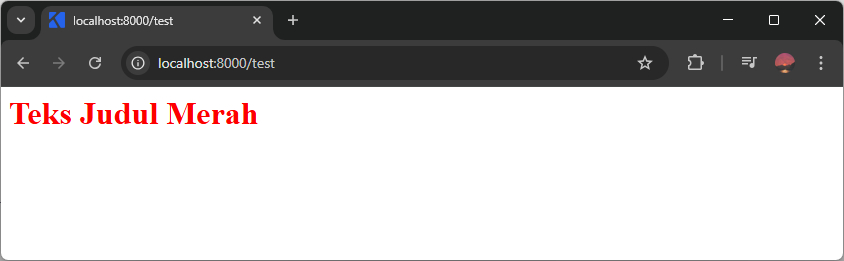
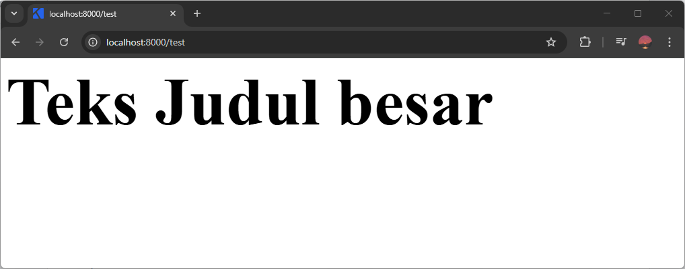
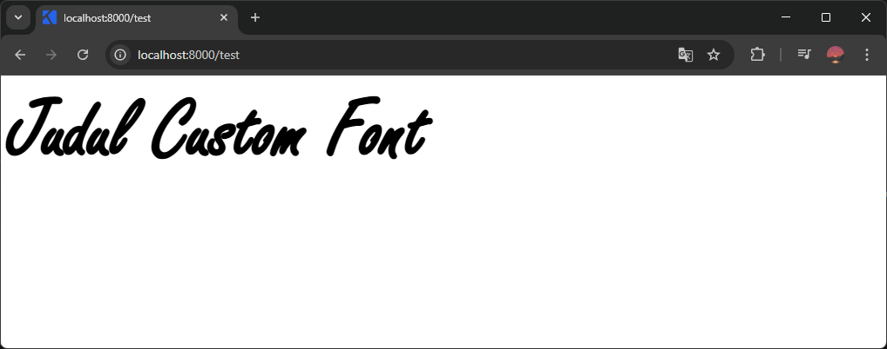
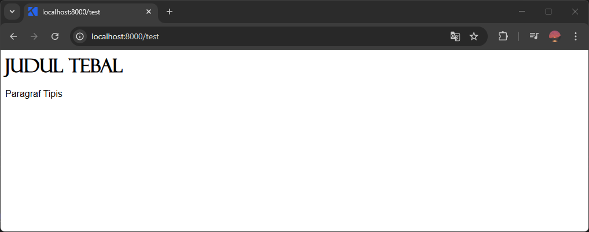
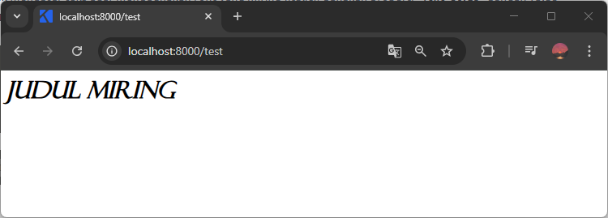
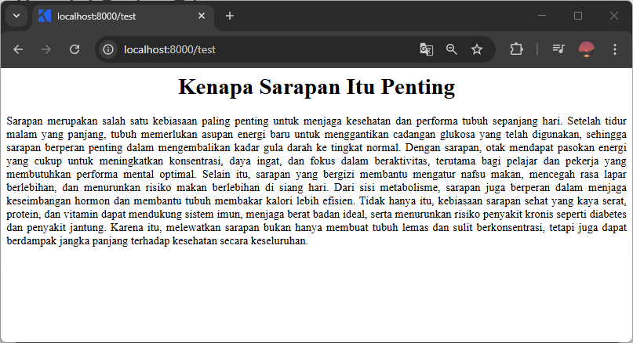

Dengan CSS kita bisa mengubah warna teks, ukuran dan jenis font.

## Mengubah Warna Teks

Untuk mengubah warna teks, gunakan properti `color`. Value-nya berisi warnanya.

Contoh:

```css
h1 {
    color: red;
}
```

```html
<h1>Teks Judul Merah</h1>
```

Hasilnya:



Ada beberapa jenis warna yang bisa digunakan:

1. Nama warna, contohnya `red`, `blue`, `green`.
2. Kode hex, contohnya `#ffffff`, `#ff0000`, `#0000ff`.
3. Kode rgb, contohnya `rgb(255, 0, 0)`, `rgb(100, 255, 0)`, `rgb(230, 100, 43)`.
4. rgba, hsl, hsla, dan masih banyak lagi.

Untuk lebih jelasnya bisa dibaca di [mengenal macam-macam nilai warna dasar di CSS](/courses/belajar-css-dasar/macam-nilai-warna-dasar-css).

## Mengubah Ukuran Teks

Untuk mengubah ukuran teks, gunakan properti `font-size`. Value-nya berisi angka ukuran beserta satuannya.

Contoh:

```css
h1 {
    font-size: 100px;
}
```

```html
<h1>Teks Judul besar</h1>
```

Hasilnya:



Value ukuran teks harus ada angka dan satuannya, penulisannya digabung tanpa spasi. Contoh `100px`, `25px`, `10px`.

Ada beberapa jenis satuan yang bisa digunakan:

1. Piksel, ditulis dengan `px`. Contoh: `100px`.
2. Persen, ditulis dengan `%`. Contoh: `80%`.
3. cm, mm, em, rem, vh. dan masih banyak lagi.

Untuk lebih jelasnya bisa baca di [mengenal macam-macam satuan ukuran dasar di CSS](/courses/belajar-css-dasar/macam-satuan-ukuran-dasar-css).

## Mengubah Font Pada Teks

Untuk mengubah jenis font, gunakan properti `font-family`. Value-nya berisi nama font yang ingin digunakan.

Contoh:

```css
h1 {
    font-family: 'Freestyle Script', serif;
    font-size: 100px;
}
```

```html
<h1>Judul Custom Font</h1>
```

Hasilnya:



Beberapa aturan seputar menggunakan font di css:

1. Font yang digunakan bisa lebih dari satu, dipisahkan dengan komah. Yang otomatis digunakan adalah yang pertama. Jika font yang pertama tidak ditemukan, font yang kedua akan digunakan, dst.
2. Nama font yang ada spasinya harus ditulis dengan tanda petik satu.
3. Font yang digunakan harus diinstal terlebih dahulu di komputer.
4. Jika ingin menggunakan file font sendiri, caranya akan dibahas di pelajaran CSS lanjutan.

### Mengubah Ketebalan Font

Setiap font biasanya ada versi tipis, normal, tebal, sangat tebal, dst. Untuk mengaturnya di CSS, gunakan properti `font-weight`. Value-nya bisa berisi:

1. Angka ketebalannya, dari 100 - 900, 100 paling tipis, 900 paling tebal
2. Nama ketebalannya, terdiri dari (lighter, normal, bold, dan bolder). Lighter paling tipis, bolder paling tebal.

Contoh:

```css
h1 {
    font-family: 'Felix Titling', serif;
    font-weight: 900;
}

p {
    font-family: Arial, sans-serif;
    font-weight: lighter;
}
```

```html
<h1>Judul Tebal</h1>
<p>Paragraf Tipis</p>
```

Hasilnya:



### Mengubah Kemiringan Font

Untuk mengatur teks agar menggunakan font yang miring (italic), gunakan properti `font-style` dengan value `italic`.

```css
h1 {
    font-family: 'Felix Titling', serif;
    font-style: italic;
}
```

```html
<h1>Judul Miring</h1>
```

Hasilnya:



## Mengubah Perataan Teks

Untuk mengubah perataan teks, gunakan properti `text-align`. Value-nya bisa berisi:

1. `left`, teks rata kiri.
2. `center`, teks rata tengah.
3. `right`, teks rata kanan.
4. `justify`, teks rata kiri dan kanan.

Contoh:

```css
h1 {
    text-align: center;
}

p {
    text-align: justify;
}
```

```html
<h1>Kenapa Sarapan Itu Penting</h1>
<p>Sarapan itu penting ....</p>
```

Hasilnya:

