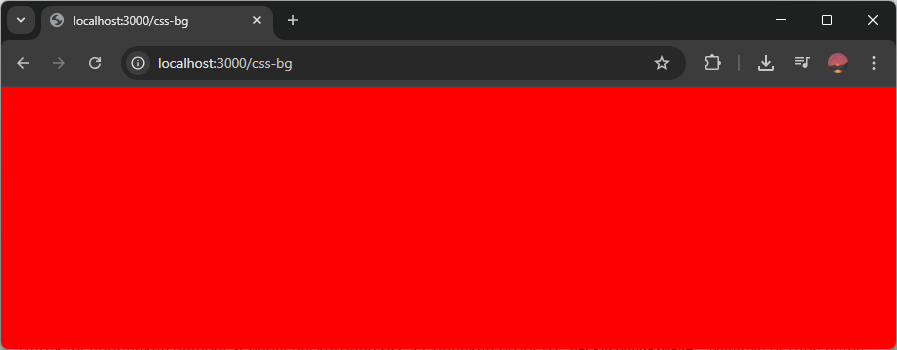

Background di CSS adalah latar belakang visual yang bisa berupa warna dan gambar. Keduanya akan dibahas di materi ini.

## Menambahkan Background Warna

Untuk menambahkan background warna di CSS, gunakan properti `background-color`. Nilainya berupa warna CSS.

Untuk daftar warna yang bisa digunakan di CSS bisa dibaca di materi [macam-macam warna dasar di CSS](/courses/belajar-css-dasar/macam-nilai-warna-dasar-css).

Contoh:

```css
body {
    background-color: red;
}
```

Hasilnya, halaman website akan berlatar belakang warna merah, karena seluruh halaman (tag `<body>`) diberi background warna merah.



## Menambahkan Background Gambar

Untuk menggunakan gambar sebagai background di CSS, gunakan properti `background-image`. Nilainya berupa nama file gambar, ditulis dengan tanda petik dan dibungkus di dalam kode `url()`.

Contoh:

```
background-image: url('langit.jpg');
```

Gambar bisa dari file lokal di komputer atau bisa juga dari gambar online. Jika dari gambar online pastikan urlnya lengkap dengan protokol (`http` / `https`) dan nama domainnya.

Contoh penggunaan background gambar:

```css
body {
    background-image: url('langit.jpg');
}
```

Hasilnya, halaman website akan berlatar belakang gambar `langit.jpg`, karena seluruh halaman (tag `<body>`) diberi background gambar tersebut.


### Mengatasi Background Gambar yang Berulang

Ketika gambar yang dijadikan background ukurannya lebih kecil dari elemen, maka gambarnya diulang agar memenuhi ukuran elemen.

Untuk mengatasinya, tambahkan properti `background-repeat`, dengan nilai `no-repeat`.

Contoh:

```css
body {
    background-image: url('langit.jpg');
    background-repeat: no-repeat;
}
```

Hasilnya, gambar background tidak berulang, tapi background gambar jadi tidak memenuhi elemen.


### Mengatur Posisi Gambar di Background

Secara default, gambar yang dijadikan backgorund akan ditampilkan dari pojok kiri atas. Untuk mengganti posisinya, tambahkan properti `background-position` dengan dua nilai: horizontal dan vertikal.

- horizontal (left, center, right)
- vertikal (top, center, bottom)

Contoh:

```css
body {
    background-image: url('langit.jpg');
    background-repeat: no-repeat;
    background-position: center center;
}
```

Hasilnya, gambar background akan ditampilkan dari tengah.


### Mengatur Ukuran Gambar di Background

Ukuran gambar yang dijadikan background juga bisa disesuaikan di CSS, dengan menggunakan properti `background-size`. Nilainya ada beberapa macam.

1. Satuan ukuran, misalnya `100px 100px` atau `50% 50%`. Nilai pertama jadi lebar gambar, nilai kedua jadi tingi gambar.
2. `auto` gambarnya ditampilkan sesuai ukuran asli gambar.
3. `cover` gambarnya akan dipaksa untuk memenuhi background, jika lebih kecil akan dizoom, jika lebih besar akan dipotong.
4. `contain` gambarnya akan dipaksa dengan diubah ukurannya agar bisa memenuhi background dan gambarnya tidak terpotong.

Contoh dengan nilai satuan ukuran:

```css
body {
    background-image: url('langit.jpg');
    background-repeat: no-repeat;
    background-size: 400px 200px;
}
```

Hasilnya:


Contoh dengan nilai `cover`:

```css
body {
    background-image: url('langit.jpg');
    background-repeat: no-repeat;
    background-size: cover;
}
```

Hasilnya:

