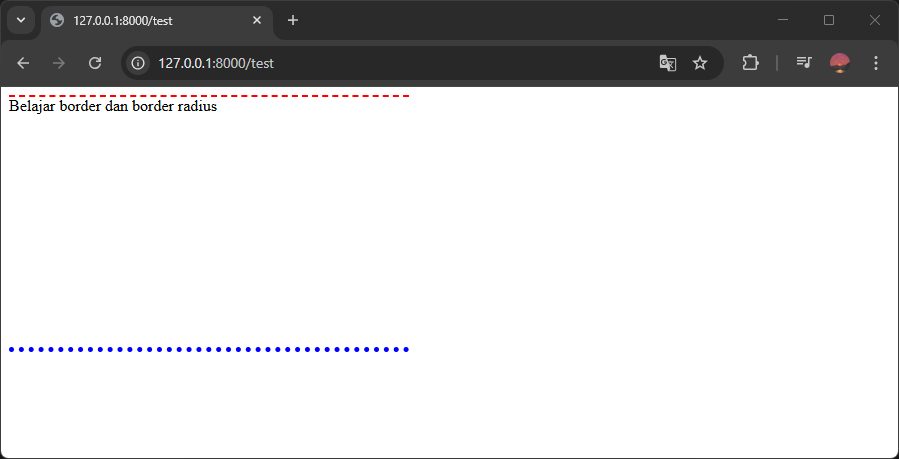

Border adalah garis yang berada di tepi sisi elemen. Border berfungsi untuk memberikan efek visual yang menunjukan batas sisi elemen.

Border radius adalah lengkungan pada sudut elemen. Untuk membuat bentuk elemen menjadi lebih halus.

## Menambahkan Border di CSS

Ada beberapa properti untuk menambahkan border di CSS:

1. `border-width`, untuk mengatur ketebalan border.
2. `border-style`, untuk mengatur jenis tampilan border.
3. `border-color`, untuk mengatur warna border.

Contoh:

```css
div {
    border-width: 1px;
    border-style: solid;
    border-color: red;
    
    width: 400px;
    height: 250px;
}
```

```html
<div>Belajar border dan border radius</div>
```

Hasilnya:


### Mengubah Ketebalan Border

Ketebalan border bisa diubah menggunakan properti `border-width`. Nilainya berupa angka dengan satuannya. Jika nilainya 0, maka tidak ada border yang ditampilkan.

Contoh:

```css
div {
    border-width: 10px;
    border-style: solid;
    border-color: red;
    
    width: 400px;
    height: 250px;
}
```

```html
<div>Belajar border dan border radius</div>
```

Hasilnya:


### Mengubah Jenis Tampilan Border

Default tampilan border di CSS adalah garis lurus (solid). Ada jenis tampilan lainnya yang bisa digunakan di properti `border-style`, yaitu:

1. `solid`, garis lurus.
2. `dotted`, garis titik-titik.
3. `dashed`, garis strip,
4. dll

Contoh:

```css
div {
    border-width: 2px;
    border-style: dashed;
    border-color: red;
    
    width: 400px;
    height: 250px;
}
```

```html
<div>Belajar border dan border radius</div>
```

Hasilnya:


### Mengubah Warna Border

Warna border bisa diubah menggunakan properti `border-color`. Nilainya berupa nilai warna.

Contoh:

```css
div {
    border-width: 4px;
    border-style: solid;
    border-color: blue;
    
    width: 400px;
    height: 250px;
}
```

```html
<div>Belajar border dan border radius</div>
```

Hasilnya:


## Menambahkan Border di Sisi Tertentu

Untuk menambahkan border di sisi tertentu saja, tambahkan nama sisi nya di nama properti border yang ingin diubah. Contoh:

```
border-(top/bottom/right/left)-(width/style/color)
```

Nama sisi border dapat berupa:

- top (atas)
- bottom (bawah)
- left (kiri)
- right (kanan)

Contoh menambahkan border di sisi atas dan bawah elemen:

```css
div {
    border-top-width: 2px;
    border-top-style: dashed;
    border-top-color: red;
    
    border-bottom-width: 5px;
    border-bottom-style: dotted;
    border-bottom-color: blue;
    
    width: 400px;
    height: 250px;
}
```

```html
<div>Belajar border dan border radius</div>
```

Hasilnya:



## Menambahkan Border Radius

Border Radius bisa digunakan membuat sudut elemen menjadi melengkung untuk membuat bentuknya menjadi lebih terlihat halus.

Caranya dengan menambahkan properti `border-radius`, nilainya berupa angka yang menentukan besar lengkungannya.

Contoh:

```css
div {
    border-radius: 10px;
    
    border-width: 2px;
    border-style: solid;
    border-color: red;
    
    width: 400px;
    height: 250px;
}
```

```html
<div>Belajar border dan border radius</div>
```

Hasilnya:


Untuk menambahkan border radius di sudut tertentu saja, tambahkan nama sudutnya didalam properti `border-radius`. Contoh:

```
border-(top-left/top-right/bottom-left/bottom-right)-radius: 10px
```

Nama sudut border radius dapat berupa:

- top-right (kanan atas)
- top-left (kiri atas)
- bottom-right (kanan bawah)
- bottom-left (kiri bawah)

Contoh menambahkan border radius di sudut kanan atas dan bawah elemen:

```css
div {
    border-top-right-radius: 10px;
    border-bottom-right-radius: 10px;
    
    border-width: 2px;
    border-style: solid;
    border-color: red;
    
    width: 400px;
    height: 250px;
}
```

```html
<div>Belajar border dan border radius</div>
```

Hasilnya:

