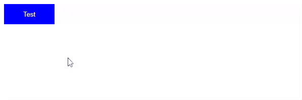

Selain untuk membuat style statis, CSS juga bisa digunakan untuk membuat style yang dinamis (berubah-ubah berdasarkan kondisi tertentu).

Mari kita bahas apa itu interaksi, animasi dan transisi di CSS.

## Apa itu Interaksi di CSS?

Interaksi di CSS digunakan untuk mengubah style CSS berdasarkan aktifitas pengguna. Contoh:

- Mengubah warna background ketika elemen dihover mouse (dilewati mouse).
- Menambahkan border ketika input diklik.
- Mengubah warna teks ketika link sudah pernah dikunjungi.

Interaksi di CSS bisa dibuat dengan menggunakan *CSS Pseudo-classes*. 

CSS Pseudo-classes adalah nama tambahan pada selector CSS yang menunjukan kondisi elemen selector tersebut, ditulis dengan titik dua (`:`). Contoh:

```css
button {
    background-color: blue;
    color: white;
    padding: 10px 0;
    border: 0;
    width: 100px;
    height: 40px;
}

button:hover {
    background-color: red;
    width: 200px;
    height: 60px;
}
```

Hasilnya, ketika tombol dilewati mouse (hover), warna background dan ukurannya akan berubah.


Penjelasan lebih lengkap tentang interaksi CSS akan dijelaskan di materi selanjutnya.

## Apa itu Transisi di CSS?

Transisi di CSS digunakan untuk menambahkan animasi pada perubahan style CSS. Sehingga perubahan style terasa lebih halus.

Pada contoh interaksi CSS sebelumnya, transisi bisa ditambahkan agar perubahan warna dan ukuran tombol menjadi lebih halus.

Transisi ditambahkan dengan properti `transition`.

```css
button {
    background-color: blue;
    color: white;
    padding: 10px 0;
    border: 0;
    width: 100px;
    height: 40px;
    transition: width 1s, height 2s, background-color 3s;
}

button:hover {
    background-color: red;
    width: 200px;
    height: 40px;
}
```

Hasilnya:



Penjelasan lebih lengkap tentang transisi CSS akan dijelaskan di materi selanjutnya.

## Apa itu Animasi di CSS?

Dengan CSS, kita bisa membuat animasi pada elemen dengan mengubah style CSS nya secara berkala hingga membentuk suatu animasi.

Contoh animasi loading spinner dengan CSS.

```html
<div class="spinner"></div>
```

```css
.spinner {
    width: 40px;
    height: 40px;
    border: 10px solid whitesmoke;
    border-top: 10px solid dodgerblue;
    border-radius: 100%;
    
    animation-name: spinner;
    animation-duration: 1s;
    animation-iteration-count: infinite;
    animation-timing-function: linear;
}

@keyframes spinner {
    from {
        transform: rotate(0deg);
    }
    to {
        transform: rotate(360deg);
    }
}
```

Hasilnya.


Animasi biasanya dikombinasikan dengan transformasi elemen di CSS, itu juga akan dibahas di materi selanjutnya.