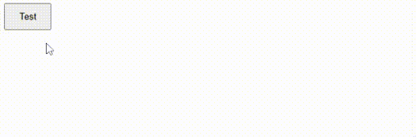
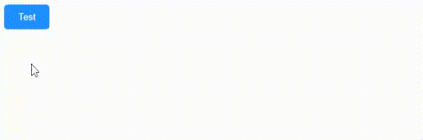

Hover adalah interaksi dasar pada elemen yang bisa ditambahkan dengan CSS.

## Apa itu Hover?



Hover adalah kondisi elemen ketika sedang dilewati mouse.

Hover di CSS masuk dalam kategori *pseudo-class*, yaitu nama tambahan pada selector untuk memberikan style CSS ke selector pada kondisi tertentu.

Contoh-contoh penggunaan umum hover:

- Mengubah warna tombol ketika dihover.
- Menambahkan garis bawah pada link ketika dihover
- Menampilkan elemen ketika dihover yang awalnya tidak tampil.
- Memperbesar ukuran elemen ketika dihover.
- dll

## Cara Menambahkan Hover dengan CSS

Hover ditambahkan dengan menuliskan kode `:hover` di sebelah selector elemen yang ingin diberi style hover.

Contoh:

```css
button:hover {
    background-color: red;
    color: white;
}
```

Hasilnya:


## Contoh Style Elemen dengan Hover

Berikut beberapa contoh styling elemen dengan hover:

### 1. Mengubah Warna Tombol

Contoh mengubah warna background tombol ketika dihover.

```html
<button>Test</button>
```

```css
button {
    background-color: dodgerblue;
    color: white;
    border: 0;
    padding: 10px 20px;
    border-radius: 5px;
}

button:hover {
    background-color: darkblue;
}
```

Hasilnya:



### 2. Menambahkan Garis Bawah Pada Link

Contoh menambahkan garis bawah dengan `text-decoration: underline` ketika link dihover.

```html
<a href="http://google.com">Pergi ke Google</a>
```

```css
a {
    color: dodgerblue;
    text-decoration: none;
}

a:hover {
    color: crimson;
    text-decoration: underline;
}
```

Hasilnya:


### 3. Menampilkan Elemen yang Tersembunyi

Contoh menampilkan teks caption gambar yang awalnya tersembunyi dengan `display: none` menjadi `display:block` ketika dihover.

```html
<figure>
    
    <figcaption>Gunung Siguniang adalah gunung tertinggi dari Pegunungan Qionglai di Tiongkok Barat</figcaption>
</figure>
```

```css
figure {
    width: 400px;
    position: relative;
}

img {
    width: 100%;
}

figcaption {
    background-color: rgba(0, 0, 0, 0.5);
    padding: 10px;
    color: white;
    text-align: center;
    font-style: italic;
    display: none;
    position: absolute;
    bottom: 0;
    left: 0;
}

figure:hover figcaption {
    display: block;
}
```

Hasilnya:

