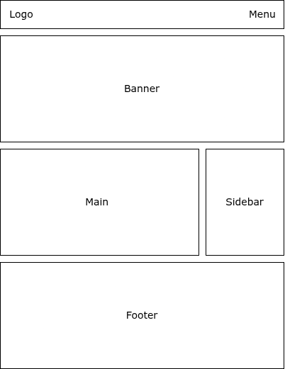

Untuk memulai belajar membuat layout website dengan CSS, kita akan mengenal apa itu layout website terlebih dahulu.

## Pengertian Layout Website

Layout website adalah cara untuk menata dan meletakkan elemen-elemen di halaman website.

Di halaman website tentu ada banyak elemen, misalnya pada website berita ada elemen-elemen berikut:

1. Logo
2. Menu
3. Artikel Utama
4. Daftar Artikel Terbaru
5. Daftar Artikel Populer
6. Form untuk Subscribe
7. Kontak dan Informasi Website

Agar semua elemen di atas dapat tampil dengan baik dan rapi, maka perlu dibuat layout pada halaman website.

Contoh layout untuk menata elemen-elemen di atas:

1. Navbar, isinya logo dan menu, posisinya paling atas sendiri.
2. Banner, isinya artikel utama, posisinya di bawah navbar.
3. Main, isinya daftar artikel terbaru, posisinya di bawah banner lebarnya 3/4 halaman website.
4. Sidebar, isinya daftar artikel populer, posisinya di sebelah kanan main, lebarnya 1/4 halaman website.
5. Footer, isinya form untuk subscribe, kontak dan informasi website. Posisinya paling bawah sendiri.

Layout tersebut adalah layout yang paling umum digunakan di website berita, gambaran visualnya seperti berikut:

## Fungsi Layout Website

Layout website memiliki beberapa fungsi:

1. Membuat struktur website secara visual.
2. Mengoptimalkan penempatan konten di website.
3. Memudahkan pengunjung dalam mengakses konten di website.
4. Membuat website bisa tampil dengan baik di semua perangkat.

## Fungsi CSS Untuk Membuat Layout Website

Layout website adalah tata letak website yang secara visual yang hanya bisa dibuat dengan CSS. HTML hanya kerangkanya saja.

Contoh fungsi CSS untuk membuat layout website:

1. Membuat navbar yang bisa tetap muncul ketika browser discroll.
2. Membuat sidebar berada di sebelah elemen lain.
3. Memunculkan dan menyembunyikan elemen.
4. Mengatur posisi elemen, misalnya di pojok atas, di tengah, di pojok kiri, dll.
5. Mengatur posisi elemen secara horizontal maupun vertical. 
6. Mengatur tata letak elemen, misalnya berderet, sejajar, berbaris, dll.
7. Membuat tata letak elemen yang menyesuaikan ukuran perangkat.
8. dan masih banyak lagi.

Ini yang akan kita pelajari di panduan belajar cara membuat layout website dengan CSS ini.