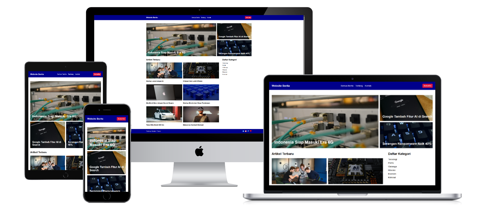
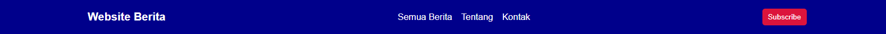
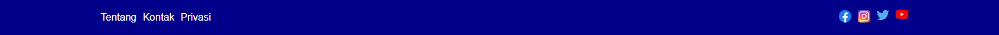
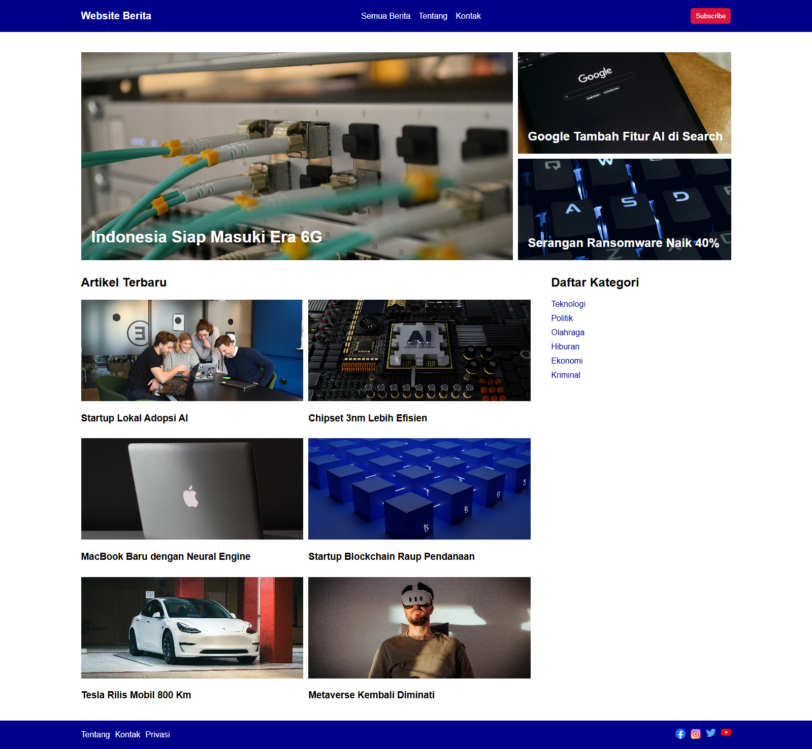

Setelah memelajari cara membuat layout website dengan CSS, saatnya kita mempraktekkannya dimulai dengan membuat layout untuk website berita.

Website berita adalah website yang menampilkan informasi terkini seputar topik tertentu dalam bentuk artikel.

Halaman website berita yang akan kita buat terdiri dari beberapa elemen:

1. Navbar, berisi logo, daftar menu dan tombol subscribe.
2. Banner, berisi 3 artikel utama.
3. Main, berisi daftar artikel terbaru.
4. Sibebar, berisi daftar kategori.
5. Footer, berisi informasi website, daftar menu, dan daftar link sosial media.

Hasil akhirnya seperti berikut:



Berikut langkah-langkahnya:

## 1. Persiapan HTML, CSS dan Gambar

Pertama, download [semua gambar thumbnail berita dan logo sosial media](https://github.com/narakode/praktik-web-berita-responsive).

Kemudian, buat dua file `index.html` dan `style.css`.

Isi file `index.html` dengan kerangka elemen-elemen dalam website berita berikut:

```html
<!DOCTYPE html>
<html lang="en">

<head>
  <title>Website Berita</title>
  <meta name="viewport" content="width=device-width, initial-scale=1.0">
  <link rel="stylesheet" href="style.css">
</head>

<body>
  <nav>
    <div class="container">
      <a href="" class="brand">Website Berita</a>
      <div class="menu">
        <a href="/berita">Semua Berita</a>
        <a href="/about">Tentang</a>
        <a href="/contact">Kontak</a>
      </div>
      <button>Subscribe</button>
    </div>
  </nav>

  <header>
    <div class="container">
      <div class="artikel-utama artikel-utama-1">
        
        <h2>Indonesia Siap Masuki Era 6G</h2>
      </div>
      <div class="artikel-utama">
        
        <h2>Google Tambah Fitur AI di Search</h2>
      </div>
      <div class="artikel-utama">
        
        <h2>Serangan Ransomware Naik 40%</h2>
      </div>
    </div>
  </header>

  <div class="container konten-utama">
    <main>
      <h2>Artikel Terbaru</h2>
      <div class="daftar-artikel">
        <div class="artikel">
          
          <h3>Startup Lokal Adopsi AI</h3>
        </div>
        <div class="artikel">
          
          <h3>Chipset 3nm Lebih Efisien</h3>
        </div>
        <div class="artikel">
          
          <h3>MacBook Baru dengan Neural Engine</h3>
        </div>
        <div class="artikel">
          
          <h3>Startup Blockchain Raup Pendanaan</h3>
        </div>
        <div class="artikel">
          
          <h3>Tesla Rilis Mobil 800 Km</h3>
        </div>
        <div class="artikel">
          
          <h3>Metaverse Kembali Diminati</h3>
        </div>
      </div>
    </main>

    <aside>
      <h2>Daftar Kategori</h2>
      <ul>
        <li>
            <a href="">Teknologi</a>
        </li>
        <li>
            <a href="">Politik</a>
        </li>
        <li>
            <a href="">Olahraga</a>
        </li>
        <li>
            <a href="">Hiburan</a>
        </li>
        <li>
            <a href="">Ekonomi</a>
        </li>
        <li>
            <a href="">Kriminal</a>
        </li>
      </ul>
    </aside>
  </div>

  <footer>
    <div class="container">
      <div class="menu">
        <a href="">Tentang</a>
        <a href="">Kontak</a>
        <a href="">Privasi</a>
      </div>
      <div class="menu">
        <a href="">
          
        </a>
        <a href="">
          
        </a>
        <a href="">
          
        </a>
        <a href="">
          
        </a>
      </div>
    </div>
  </footer>
</body>

</html>
```

## 2. Membuat Style Dasar

Pertama, buat style dasar untuk menghapus margin bawaan browser, mengatur font, dan container.

Buka file `style.css`, lalu tambahkan kode CSS berikut:

```css
body {
  margin: 0;
  box-sizing: border-box;
  font-family: sans-serif;
}

.container {
  max-width: 1280px;
  margin: auto;
  padding: 0 20px;
}

@media (min-width: 1280px) {
    .container {
        padding: 0;
    }
}
```

## 3. Menambahkan Style Navbar

Tambahkan style berikut pada navbar:

- Navbar diberi background dan padding.
- Teks brand diberi style font dan warna.
- Tombol subscribe diberi background, warna dan padding.
- Container diberi layout flex.
- Daftar menu tidak muncul di mobile.
- Daftar menu munculnya di tablet dan desktop.
- Daftar menu diberi layout flex.
- Link menu diberi warna putih.

Contoh:

```css
nav {
  background-color: darkblue;
  padding: 16px 0;
}

nav .container {
  display: flex;
  align-items: center;
  justify-content: space-between;
}

nav a {
  color: white;
  text-decoration: none;
}

nav .brand {
  font-weight: bold;
  font-size: 1.25rem;
}

nav .menu {
  display: none;
}

nav button {
  padding: 8px 10px;
  border: 0;
  background-color: crimson;
  color: white;
  border-radius: 5px;
}

@media (min-width: 640px) {
    nav .menu {
        display: flex;
        gap: 16px;
    }
}
```

Hasilnya:



## 4. Menambahkan Style Banner

Tambahkan style berikut pada banner untuk perangkat mobile:

- Container header diberi layout grid 1 kolom, dengan tinggi baris 200px.
- Setiap artikel diberi posisi relatif.
- Judul artikel diposisikan absolut di pojok kiri bawah gambar artikel.
- Gambar artikel dibuat memenuhi grid item.

Tambahkan style berikut pada banner untuk perangkat tablet:

- Container header menjadi 2 kolom.
- Artikel pertama lebar kolomnya mencakup 2 kolom.
- Artikel pertama judulnya lebih besar.

Tambahkan style berikut pada banner untuk perangkat desktop:

- Container header menjadi 3 kolom.

Contoh:

```css
header {
  margin-top: 40px;
  margin-bottom: 10px;
}

header .container {
  display: grid;
  grid-template-columns: auto;
  grid-template-rows: repeat(3, 200px);
  gap: 10px;
}

header .artikel-utama {
  position: relative;
}

header img {
  width: 100%;
  height: 100%;
  object-fit: cover;
}

header h2 {
  position: absolute;
  bottom: 0px;
  left: 20px;
  color: white;
}

@media (min-width: 640px) {
    header .container {
        grid-template-columns: repeat(2, 1fr);
        grid-template-rows: repeat(2, 200px);
    }

    header .artikel-utama-1 {
        grid-column: span 2;
        grid-row: span 2;
    }

    header .artikel-utama-1 h2 {
      font-size: 2rem;
    }
}

@media (min-width: 768px) {
    header .container {
        grid-template-columns: repeat(3, 1fr);
    }
}
```

Hasilnya:


## 5. Menambahkan Style Daftar Artikel dan Daftar Kategori

Tambahkan style berikut pada daftar artikel dan daftar kategori untuk perangkat mobile:

- Container daftar artikel dan daftar kategori diberi layout grid 1 kolom.
- Daftar artikel diberi layout 1 kolom.
- Gambar di artikel dibuat lebarnya memenuhi grid dan tingginya `200px`.
- Daftar kategori dihilangkan tanda daftar, padding, margin dan diberi warna pada link.

Tambahkan style berikut pada daftar artikel dan daftar kategori untuk perangkat tablet:

- Daftar artikel diberi layout 2 kolom.

Tambahkan style berikut pada daftar artikel dan daftar kategori untuk perangkat desktop:

- Container daftar artikel dan daftar kategori diberi layout grid 2 kolom, kolom pertama (daftar artikel) lebarnya 5 bagian, kolom kedua (daftar kategori) lebarnya 2 bagian.

```css
.konten-utama {
  display: grid;
  grid-template-columns: auto;
  margin-bottom: 20px;
}

main .daftar-artikel {
  display: grid;
  grid-template-columns: auto;
  gap: 10px;
}

main .artikel img {
  width: 100%;
  height: 200px;
  object-fit: cover;
}

aside ul {
  list-style: none;
  margin: 0;
  padding: 0;
  display: flex;
  flex-direction: column;
  gap: 10px;
}

aside a {
  color: darkblue;
  text-decoration: none;
}

@media (min-width: 640px) {
    main .daftar-artikel {
        grid-template-columns: repeat(2, 1fr);
    }
}

@media (min-width: 768px) {
    .konten-utama {
        grid-template-columns: 5fr 2fr;
        gap: 40px;
    }
}
```

Hasilnya:


## 6. Menambahkan Style Footer

Tambahkan style berikut pada footer untuk perangkat mobile:

- Footer diberi background dan padding.
- Container footer diberi layout flex kolom rata tengah.
- Daftar menu dan link sosial media diberi layout flex.
- Link diberi warna putih.
- Gambar icon sosial media diberi ukuran `20px`.

Tambahkan style berikut pada footer untuk perangkat tablet:

- Container footer diubah menjadi layout flex row.
- Container footer diatur posisi itemnya menjadi berjarak dari kiri ke kanan.

```css
footer {
  background-color: darkblue;
  padding: 16px 0;
}

footer .container {
  display: flex;
  flex-direction: column;
  align-items: center;
  gap: 10px;
}

footer .menu {
  display: flex;
  gap: 10px;
}

footer a {
  color: white;
  text-decoration: none;
}

footer img {
    width: 20px;
}

@media (min-width: 640px) {
    footer .container {
        flex-direction: row;
        gap: 0;
        justify-content: space-between;
    }
}
```

Hasilnya:



---

## Kode Lengkap dan Hasil AKhir

Berikut kode lengkap style CSS website berita:

```css
body {
  margin: 0;
  box-sizing: border-box;
  font-family: sans-serif;
}

.container {
  max-width: 1280px;
  margin: auto;
  padding: 0 20px;
}

nav {
  background-color: darkblue;
  padding: 16px 0;
}

nav .container {
  display: flex;
  align-items: center;
  justify-content: space-between;
}

nav a {
  color: white;
  text-decoration: none;
}

nav .brand {
  font-weight: bold;
  font-size: 1.25rem;
}

nav .menu {
  display: none;
}

nav button {
  padding: 8px 10px;
  border: 0;
  background-color: crimson;
  color: white;
  border-radius: 5px;
}

header {
  margin-top: 40px;
  margin-bottom: 10px;
}

header .container {
  display: grid;
  grid-template-columns: auto;
  grid-template-rows: repeat(3, 200px);
  gap: 10px;
}

header .artikel-utama {
  position: relative;
}

header img {
  width: 100%;
  height: 100%;
  object-fit: cover;
}

header h2 {
  position: absolute;
  bottom: 0px;
  left: 20px;
  color: white;
}

.konten-utama {
  display: grid;
  grid-template-columns: auto;
  margin-bottom: 20px;
}

main .daftar-artikel {
  display: grid;
  grid-template-columns: auto;
  gap: 10px;
}

main .artikel img {
  width: 100%;
  height: 200px;
  object-fit: cover;
}

aside ul {
  list-style: none;
  margin: 0;
  padding: 0;
  display: flex;
  flex-direction: column;
  gap: 10px;
}

aside a {
  color: darkblue;
  text-decoration: none;
}

footer {
  background-color: darkblue;
  padding: 16px 0;
}

footer .container {
  display: flex;
  flex-direction: column;
  align-items: center;
  gap: 10px;
}

footer .menu {
  display: flex;
  gap: 10px;
}

footer a {
  color: white;
  text-decoration: none;
}

footer img {
    width: 20px;
}

@media (min-width: 640px) {
    nav .menu {
        display: flex;
        gap: 16px;
    }

    header .container {
        grid-template-columns: repeat(2, 1fr);
        grid-template-rows: repeat(2, 200px);
    }

    header .artikel-utama-1 {
        grid-column: span 2;
        grid-row: span 2;
    }

    header .artikel-utama-1 h2 {
        font-size: 2rem;
    }

    main .daftar-artikel {
        grid-template-columns: repeat(2, 1fr);
    }

    footer .container {
        flex-direction: row;
        gap: 0;
        justify-content: space-between;
    }
}

@media (min-width: 768px) {
    header .container {
        grid-template-columns: repeat(3, 1fr);
    }

    .konten-utama {
        grid-template-columns: 5fr 2fr;
        gap: 40px;
    }
}

@media (min-width: 1280px) {
    .container {
        padding: 0;
    }
}
```

Untuk seluruh kode lengkap dari HTML, CSS dan gambar bisa dilihat di [repository praktik layout website berita](https://github.com/narakode/praktik-layout-web-berita).

Hasil akhirnya seperti berikut:

