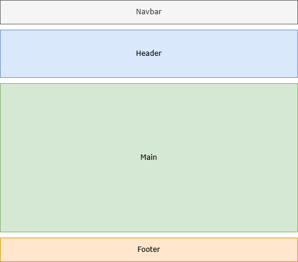
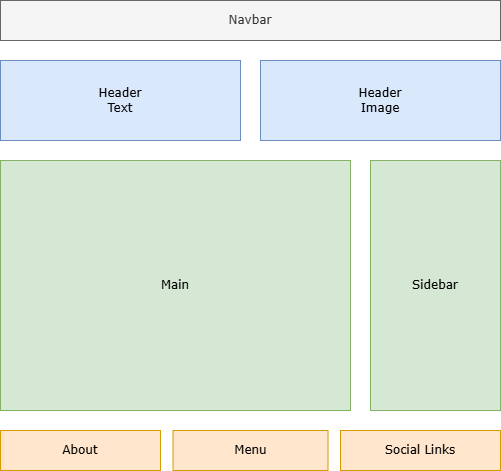
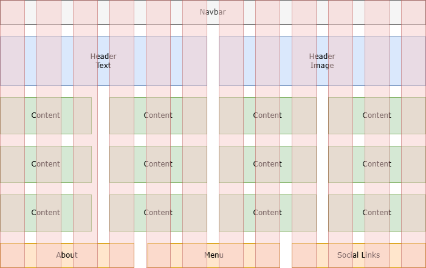
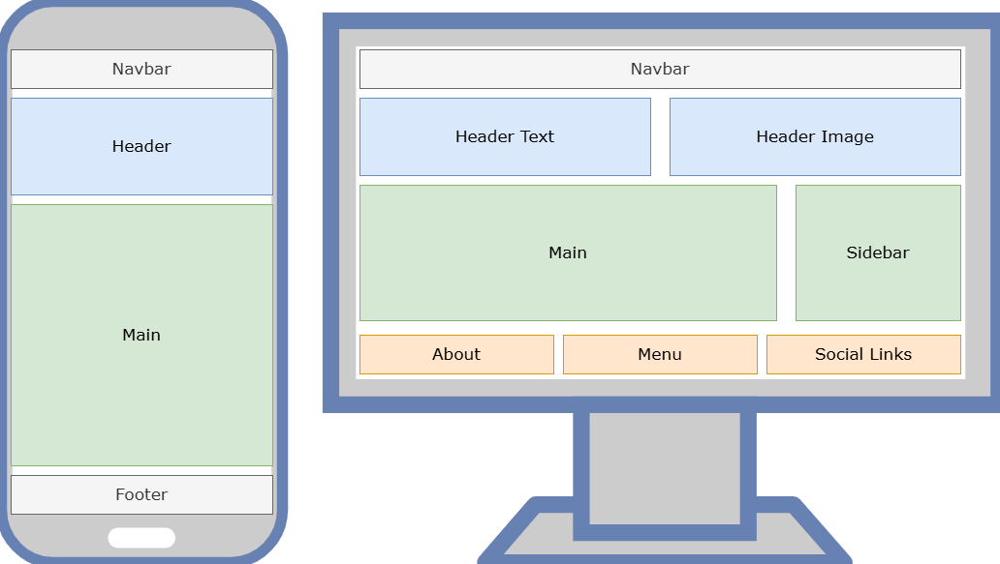

Ada empat jenis layout yang biasa digunakan di website:

1. Single Column Layout
2. Multiple Column Layout
3. Grid Layout
4. Responsive Layout

Berikut penjelasan masing-masingnya:

## Single Column Layout

Single column layout adalah layout website yang kontennya ditampilkan dalam satu kolom vertikal dari atas ke bawah.

Ini adalah layout yang paling sederhana dan paling cocok digunakan untuk website ketika dibuka di perangkat mobile.

Layout ini cocok digunakan untuk halaman website yang fokus pada konten, misalnya:

1. Website Pribadi
2. Halaman Baca Artikel
3. Website untuk menampilkan CV

Kelebihan single column layout:

1. Simpel dan sederhana
2. Fokus ke konten
3. Memudahkan pengunjung karena tidak ada navigasi kompleks
4. Mudah dibuat
5. Bisa tampil baik di semua perangkat

Kekurangan single column layout:

1. Tidak terlalu cocok untuk menampilkan jenis konten yang beragam
2. Tidak terlalu cocok untuk landing page
3. Ketika dibuka di perangkat desktop akan terasa banyak ruang yang kosong
4. Tidak cocok untuk website showcase

## Multiple Column Layout

Multiple column layout adalah layout yang kontennya ditampilkan dengan dibagi menjadi beberapa kolom secara berjejer.

Misalnya layout website berita, kolom sebelah kiri iklan, sebelah tengah daftar berita, sebelah kanan daftar kategori berita.

Layout ini cocok untuk website ketika dibuka di perangkat yang layarnya lebar seperti laptop atau desktop, karena konten di halaman website akan terasa penuh dan meminimalisir ruang kosong.

Layout ini biasa digunakan di website berita, toko online, website dokumentasi, dll.

Kelebihan multiple column layout:

1. Informasi yang ditampilkan lebih informatif, penuh dan padat
2. Bisa ditaruh banyak beragam jenis konten
3. Meminimalisir ruang kosong tanpa konten

Kekurangan multiple column layout:

1. Website bisa terasa sesak karena banyaknya konten berjejer
2. Fokus pengunjung bisa terpecah
3. Navigasi website menjadi lebih kompleks
4. Hanya tampil bagus ketika dibuka di laptop atau desktop

## Grid Layout

Grid layout adalah layout yang kontennya ditampilkan dalam struktur baris dan kolom.

Umumnya grid layout membagi konten di dalamnya per 1 baris ada 12 kolom. Setiap kolom akan memiliki lebar yang sama yaitu 1/12. Kalau kontennya hanya ada 4, per kolom bisa dibuat lebar jadi 3/12. Bisa juga per kolom beda-beda lebarnya, misalnya 2/12, 5/12 dan 5/12.

Di desain web modern, grid layout sangat sering digunakan karena penataan elemen jadi lebih seimbang, konsisten dan rapi.

Grid layout juga sering digunakan untuk layout yang responsive, misalnya ketika di layar mobile kolomnya jadi 12/12, di tablet jadi 6/12, di desktop jadi 3/12.

## Responsive Layout

Responsive layout adalah layout yang bentuknya dinamis menyesuaikan ukuran layar perangkat pengunjung.

Misalnya ketika di perangkat mobile layoutnya single column, ketika di tablet dan dekstop menjadi multiple column. Atau menggunakan grid layout, ketika di perangkat mobile 12/12, di tablet 6/12, di desktop 3/12.

Di desain web modern, responsive layout sudah menjadi standar yang harus digunakan di website, tujuannya agar website bisa tampil dengan baik di semua perangkat.