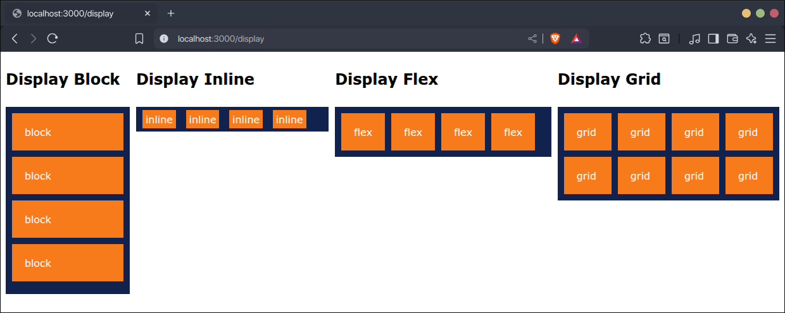
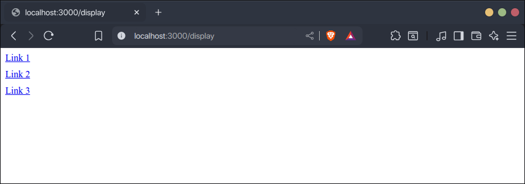
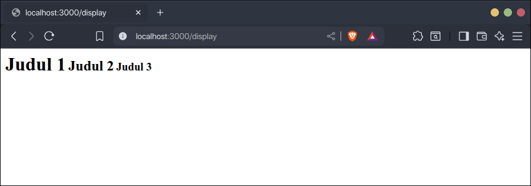
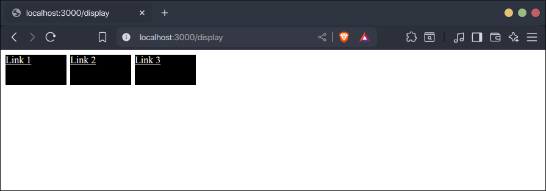
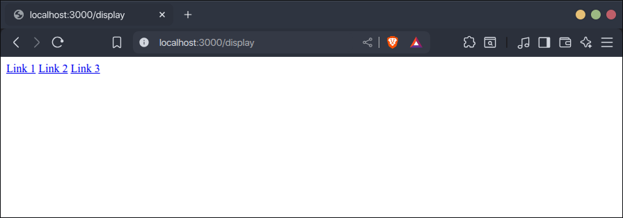
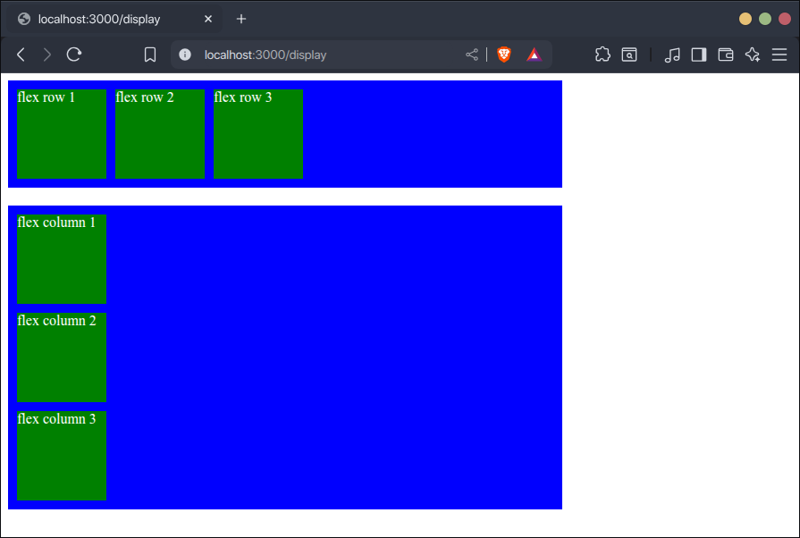
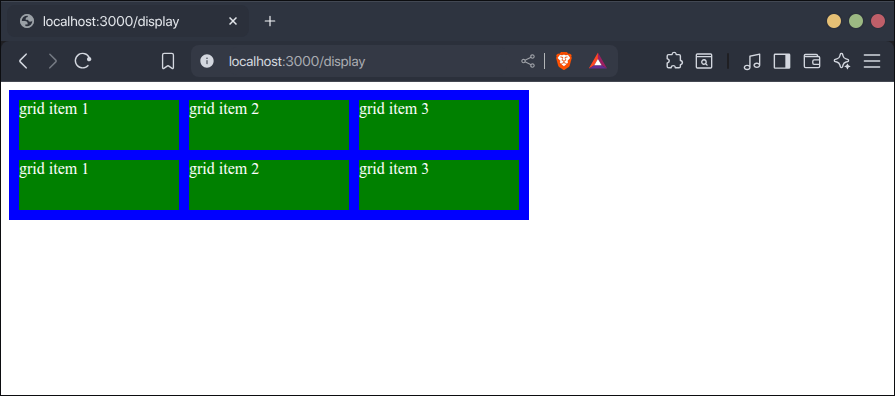

Display adalah properti CSS yang penting ketika membuat layout website.

## Pengertian CSS Display



Display adalah properti CSS untuk menentukan elemen ditampilkan sebagai elemen blok atau elemen inline.

- Elemen blok adalah elemen yang akan ditampilkan di baris sendiri, tidak berjejer dengan elemen lain.
- Elemen inline adalah elemen yang akan ditampilkan berjejer di baris yang sama dengan elemen inline lain di sebelum dan setelahnya.

Display juga bisa digunakan untuk menentukan layout elemen di dalamnya, misalnya flex atau grid.

- Flex adalah layout satu dimensi, bisa baris atau kolom. Jika baris maka elemen di dalam flex akan ditampilkan dalam satu baris, jika kolom maka elemen di dalam flex akan ditampilkan dalam satu kolom.
- Grid adalah layout dua dimensi, terdiri dari baris dan kolom. Elemen di dalam grid bisa diatur berapa jumlah barisnya dan berapa jumlah kolomnya.

## Cara Mengatur Display Elemen

Untuk mengatur display elemen gunakan properti `display`, nilainya bisa salah satu dari jenis display berikut:

- block
- inline
- inline-block
- none
- flex
- grid

Contoh:

```css
a {
    display: block;
    margin-bottom: 10px;
}
```

```html
<a href="">Link 1</a>
<a href="">Link 2</a>
<a href="">Link 3</a>
```

Hasilnya, semua link akan ditampilkan sebagai blok:



Setiap elemen memiliki  default displaynya masing-masing. Misalnya elemen `<a>`, default displaynya adalah inline, sehingga beberapa link akan ditampilkan di satu baris yang sama secara berjejer.

## Macam-Macam Display CSS

Ada beberapa macam display CSS:

### Display Block

Display block fungsinya untuk menampilkan elemen menjadi blok di baris sendiri, tidak berjejer dengan elemen lain.

Display block juga akan membuat lebar elemen menjadi full memenuhi lebar elemen induknya.

Elemen yang secara default displaynya block adalah `<h1-h6>`, `<div>`, `<p>`, dsb.

Contoh membuat beberapa link dengan display block:

```css
a {
    display: block;
    margin-bottom: 10px;
}
```

```html
<a href="">Link 1</a>
<a href="">Link 2</a>
<a href="">Link 3</a>
```

Hasilnya:


### Display Inline

Display inline fungsinya untuk menampilkan elemen di baris yang sama dengan elemen sebelum dan setelahnya secara berjajar.

Display inline juga akan membuat elemen tidak bisa diatur ukuran lebar dan tingginya.

Elemen yang secara default displaynya inline adalah `<a>`, `<span>`, dsb.

Contoh membuat beberapa judul dengan display inline:

```css
h1, h2, h3 {
    display: inline;
}
```

```html
<h1>Judul 1</h1>
<h2>Judul 2</h2>
<h3>Judul 3</h3>
```

Hasilnya:



### Display Inline-Block

Display inline-block adalah perpaduan inline dan block. Display inline-block akan menampilkan elemen seperti inline tapi bisa diatur ukuran lebar dan tingginya.

Contoh membuat beberapa link dengan display inline-block:

```css
a {
    display: inline-block;
    width: 100px;
    height: 50px;
    margin-right: 2px;
    background-color: black;
    color: white;
}
```

```html
<a href="">Link 1</a>
<a href="">Link 2</a>
<a href="">Link 3</a>
```

Hasilnya:



### Display None

Display none fungsinya untuk menghilangkan elemen dari tampilan website. Elemen setelahnya akan bergeser ke posisi yang elemen yang terkena display none.

Contoh, elemen `<h1>` dan `` pada kode berikut akan hilang dari tampilan website:

```css
h1, img {
    display: none;
}
```

```html
<h1>Judul</h1>
<a href="">Link 1</a>
<a href="">Link 2</a>
<a href="">Link 3</a>

```

Hasilnya:



### Display Flex

Display flex fungsinya untuk mengatur layout di dalam elemen menjadi baris (row) atau kolom (column). Defaultnya baris.

Elemen yang diberi display flex disebut dengan container.

Jika displaynya flex baris, maka semua elemen di dalam container akan ditampilkan dalam satu baris yang sama, defaultnya dari kiri ke kanan.

Jika displaynya flex column, maka semua elemen di dalam container akan ditampilkan dalam satu kolom yang sama, defaultnya dari atas ke bawah.

Contoh:

```css
.flex-container {
    background-color: blue;
    padding: 10px;
    margin-bottom: 20px;
    width: 600px;
}

.flex-row {
    display: flex;
    flex-direction: row;
    gap: 10px;
}

.flex-column {
    display: flex;
    flex-direction: column;
    gap: 10px;
}

.flex-item {
    width: 100px;
    height: 100px;
    background-color: green;
    color: white;
}
```

```html
<div class="flex-container flex-row">
    <div class="flex-item">flex row 1</div>
    <div class="flex-item">flex row 2</div>
    <div class="flex-item">flex row 3</div>
</div>
<div class="flex-container flex-column">
    <div class="flex-item">flex column 1</div>
    <div class="flex-item">flex column 2</div>
    <div class="flex-item">flex column 3</div>
</div>
```

Hasilnya:



Penjelasan lebih lengkap tentang layout flex akan dibahas di materi berikutnya. 

### Display Grid

Display grid fungsinya untuk mengatur layout di dalam elemen menjadi terdiri dari baris dan kolom.

Elemen yang diberi display grid disebut dengan container.

Contoh:

```css
.grid {
    display: grid;
    grid-template-rows: 50px 50px;
    grid-template-columns: auto auto auto;
    gap: 10px;
    
    background-color: blue;
    padding: 10px;
    width: 500px
}

.grid-item {
    background-color: green;
    color: white;
}
```

```html
<div class="grid">
    <div class="grid-item">grid item 1</div>
    <div class="grid-item">grid item 2</div>
    <div class="grid-item">grid item 3</div>
    <div class="grid-item">grid item 1</div>
    <div class="grid-item">grid item 2</div>
    <div class="grid-item">grid item 3</div>
</div>
```

Hasilnya:



Penjelasan lebih lengkap tentang layout grid akan dibahas di materi berikutnya. 