Flexbox adalah salah satu cara untuk membuat layout website.

## Apa itu Flexbox?

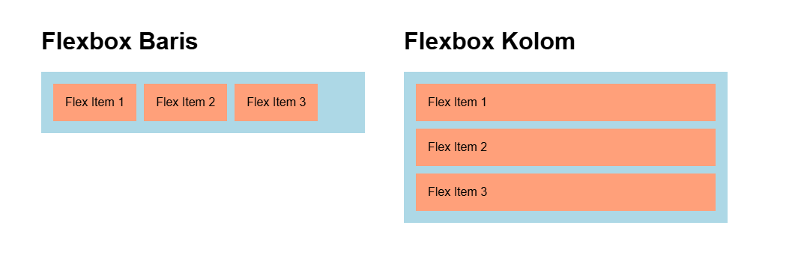

Flexbox adalah layout satu dimensi, bisa baris atau kolom. Defaultnya baris.

Flexbox baris adalah layout yang menampilkan elemen di dalam satu baris yang sama, defaultnya dari kiri ke kanan.

Flexbox kolom adalah layout yang menampilkan elemen di dalam satu kolom yang sama, defaultnya dari atas ke bawah.

Fitur-fitur flexbox:

1. Membuat layout baris atau kolom
2. Mengatur ukuran elemen di dalamnya
3. Mengatur posisi elemen di dalamnya
4. Menambahkan jarak antar elemen di dalamnya

## Cara Membuat Layout Flexbox

Flexbox terdiri dari dua elemen:

1. Container, yaitu induk flexbox.
2. Flex Item, yaitu isi flexbok, bisa lebih dari satu.

Cara membuat flexbox:

1. Buat container dengan elemen apa saja, misalnya `<div>`.
2. Tambahkan class `.container` pada elemen container untuk dijadikan selector css.
3. Tambahkan beberapa elemen di dalam container, misalnya `<div>`. Setiap item diberi class `.flex-item`
4. Buat style css dengan selector `.container`.
5. Di selector `.container`, tambahkan properti `display: flex`.

Contoh:

```html
<div class="container">
  <div class="flex-item">Flex Item 1</div>
  <div class="flex-item">Flex Item 2</div>
  <div class="flex-item">Flex Item 3</div>
</div>
```

```css
.container {
  display: flex;
}
```

Hasilnya:

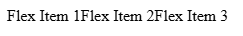

Tambahkan styling seperti background, padding dan ukuran agar flexbox lebih terlihat:

```css
.container {
  display: flex;

  background-color: lightblue;
  padding: 16px;
  width: 400px;
  font-family: sans-serif;
}

.flex-item {
  background-color: lightsalmon;
  padding: 16px;
}
```

Hasilnya:

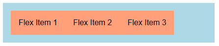

### Mengatur Arah Susunan Flex Item

Flex item secara default disusun dalam satu baris (row). Untuk menggantinya, tambahkan properti `flex-direction` pada container. Nilainya beberapa macam:

- `row`, flex item disusun satu baris (default).
- `column`, flex item disusun satu kolom.

Contoh:

```css
.container {
  display: flex;
  flex-direction: column;
}
```

Hasilnya:

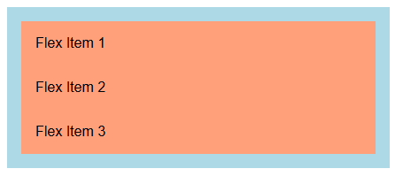

### Menambahkan Jarak Antar Flex Item

Antara flex item bisa diberi jarak agar tidak berdempetan dengan menambahkan properti `gap` pada container. Nilainya bisa px, rem, persen, dsb.

Contoh:

```css
.container {
  display: flex;
  gap: 10px;
}
```

Hasilnya:

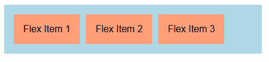

### Mengatur Ukuran Flex Item

Ukuran flex item bisa diatur dengan properti `flex-basis`. Nilainya bisa persen, px, rem, dll.

Ukuran yang diatur `flex-basis` bergantung pada properti `flex-direction`:

- Jika `flex-direction: row`, maka `flex-basis` akan mengubah lebar elemen (seperti width).
- Jika `flex-direction: column`, maka `flex-basis` akan mengubah tinggi elemen (seperti height).

Properti `flex-basis` diterapkan ke elemen flex item. Setiap flex item bisa berbeda-beda ukurannya.

Contoh, semua flex item diberi ukuran `80px`, kecuali flex item dengan class `flex-item-3` ukurannya `100px`:

```html
<div class="container">
  <div class="flex-item">Flex Item 1</div>
  <div class="flex-item">Flex Item 2</div>
  <div class="flex-item flex-item-3">Flex Item 3</div>
</div>
```

```css
.flex-item {
  flex-basis: 50px;
}

.flex-item-3 {
  flex-basis: 100px;
}
```

Hasilnya:

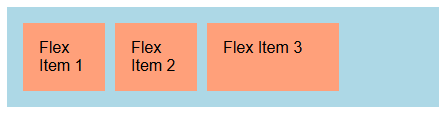

### Mengatur Posisi Flex Item

Flex item bisa diatur posisinya terhadap container dengan Tiga properti:

1. `align-items`
2. `justify-content`
3. `align-self`

#### 1. Align Items

Align items digunakan untuk mengatur posisi flex item secara vertikal di dalam container. Macam-macam nilainya:

- `flex-start`, flex item ditampilkan di posisi atas di dalam container.
- `flex-end`, flex item ditampilkan di posisi bawah di dalam container.
- `center`, flex item ditampilkan di tengah container.
- `stretch`, flex item ditampilkan dari atas sampai bawah container (memenuhi tinggi container).

Defaultnya flex item akan menggunakan `stretch`.

Jika flex-direction bernilai `column`, maka align-items akan mengatur posisi flex item secara horizontal terhadap container.

Contoh, ada dua container, dengan `align-items: center` dan `align-items: flex-end`:

```html
<div class="container container-1">
  <div class="flex-item">Flex Item 1</div>
  <div class="flex-item">Flex Item 2</div>
  <div class="flex-item">Flex Item 3</div>
</div>

<div class="container container-2">
  <div class="flex-item">Flex Item 1</div>
  <div class="flex-item">Flex Item 2</div>
  <div class="flex-item">Flex Item 3</div>
</div>
```

```css
.container {
  display: flex;
  gap: 10px;
    
  width: 600px;
  height: 100px;

  background-color: lightblue;
  padding: 16px;
  margin-bottom: 10px;
  font-family: sans-serif;
}

.container-1 {
  align-items: center;
}

.container-2 {
  align-items: end;
}

.flex-item {
  background-color: lightsalmon;
  padding: 16px;
}
```

Hasilnya:

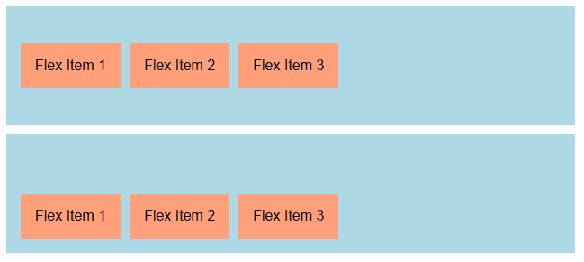

#### 2. Justify Content

Justify content digunakan untuk mengatur posisi flex item secara horizontal di dalam container. Macam-macam nilainya:

- `flex-start`, flex item ditampilkan di posisi kiri di dalam container.
- `flex-end`, flex item ditampilkan di posisi kanan di dalam container.
- `center`, flex item ditampilkan di posisi tengah container.
- `space-between`, flex item ditampilkan berjarak satu sama lain.

Defaultnya flex item akan menggunakan `flex-start`.

Jika flex-direction bernilai `column`, maka justify-content akan mengatur posisi flex item secara vertical terhadap container.

Contoh, ada dua container, dengan `justify-content: center` dan `justify-content: space-between`:

```html
<div class="container container-1">
  <div class="flex-item">Flex Item 1</div>
  <div class="flex-item">Flex Item 2</div>
  <div class="flex-item">Flex Item 3</div>
</div>

<div class="container container-2">
  <div class="flex-item">Flex Item 1</div>
  <div class="flex-item">Flex Item 2</div>
  <div class="flex-item">Flex Item 3</div>
</div>
```

```css
.container {
  display: flex;
  gap: 10px;
    
  width: 600px;
  height: 100px;

  background-color: lightblue;
  padding: 16px;
  font-family: sans-serif;
  margin-bottom: 10px;
}

.container-1 {
  justify-content: center;
}

.container-2 {
  justify-content: space-between;
}

.flex-item {
  background-color: lightsalmon;
  padding: 16px;
}
```

Hasilnya:

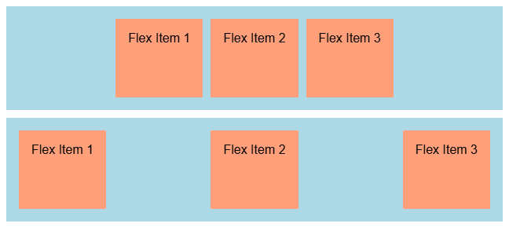

#### 3. Align Self

Align self fungsinya sama seperti align items, tetapi ini diberikan khusus kepada flex item tertentu. Macam-macam nilainya sama seperti align items.

Contoh, ada sebuah container dengan posisi flex item nya di atas (flex-start), salah satu flex item-nya ada yang posisinya di bawah (flex-end):

```html
<div class="container">
  <div class="flex-item">Flex Item 1</div>
  <div class="flex-item">Flex Item 2</div>
  <div class="flex-item flex-item-3">Flex Item 3</div>
</div>
```

```css
.container {
  display: flex;
  gap: 10px;
  align-items: flex-start;

  width: 600px;
  height: 100px;

  background-color: lightblue;
  padding: 16px;
  margin-bottom: 10px;
  font-family: sans-serif;
}

.flex-item {
  background-color: lightsalmon;
  padding: 16px;
}

.flex-item-3 {
  align-self: flex-end;
}
```

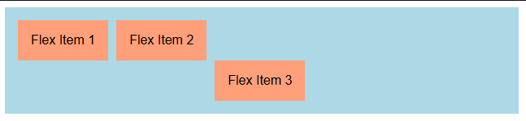

### Mengisi Ruang Kosong Container

Ketika ada ruang kosong di container, kita bisa membuat flex item untuk otomatis mengisi ruang kosong tersebut.

Caranya dengan menambahkan properti `flex-grow: 1` pada flex item yang ingin otomatis mengisi ruang container.

Properti `flex-grow` bisa diberikan ke beberapa flex item, CSS akan otomatis menghitung lebar masing-masing flex item agar bisa mengisi ruang kosong container.

Contoh:

```html
<div class="container">
  <div class="flex-item">Flex Item 1</div>
  <div class="flex-item">Flex Item 2</div>
  <div class="flex-item">Flex Item 3</div>
</div>
```

```css
.container {
  display: flex;
  gap: 10px;

  width: 600px;

  background-color: lightblue;
  padding: 16px;
  margin-bottom: 10px;
  font-family: sans-serif;
}

.flex-item {
  flex-grow: 1;
  
  background-color: lightsalmon;
  padding: 16px;
}
```

Hasilnya:


### Mengatasi Kondisi Ketika Container Tidak Muat

Ketika flex item yang ditampilkan di container ukurannya melebihi ukuran container, maka ukuran flex item akan dipaksa mengecil supaya bisa muat di container.

Untuk mengatasinya, ada dua properti yang harus ditambahkan:

1. Tambahkan `flex-shrink: 0` pada flex item. Agar flex item ukurannya tidak berubah ketika tidak muat di container.
2. Tambahkan `flex-wrap: wrap` pada container. Agar flex item yang tidak mendapatkan ruang di container ditampilkan di baris baru.

Contoh, container berikut lebarnya `300px`, setiap flex item lebarnya `110px`, karena tidak ada ruang untuk flex item 3, maka flex item 3 ditampilkan di baris baru tampa mengubah lebarnya:

```css
.container {
  display: flex;
  flex-wrap: wrap;
  gap: 10px;

  width: 300px;

  background-color: lightblue;
  padding: 16px;
  margin-bottom: 10px;
  font-family: sans-serif;
}

.flex-item {
  flex-basis: 110px;
  flex-shrink: 0;

  background-color: lightsalmon;
  padding: 16px;
}
```

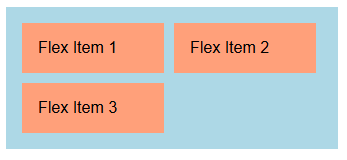

## Contoh Layout Flexbox: Membuat Navbar

Sekarang kita akan belajar mengimplementasikan flexbox untuk membuat layout pada navbar.

Navbar adalah kotak navigasi website yang biasanya berada di paling atas website. Biasanya terdiri dari beberapa elemen:

- Logo, posisi di kiri.
- Daftar menu, posisi di tengah.
- Tombol (login, pencarian, dll), posisi di kanan.

Dengan flexbox kita bisa membuat navbar dengan mudah. Berikut kerangka HTML-nya:

```html
<nav>
  

  <div class="menu">
    <a href="">Tentang</a>
    <a href="">Produk</a>
    <a href="">Kontak</a>
  </div>

  <button>Login</button>
</nav>
```

Hasilnya, masih berantakan:


Sekarang tambahkan flexbox navbar, ada dua container:

1. `nav`, container utama navbar.
2. `.menu`, container daftar menu.

Langkah-langkah membuat flexbox navbar:

1. Tambahkan `display: flex` ke container navbar, yaitu elemen `nav`.
2. Tambahkan `justify-content: space-between` ke container navbar, agar elemen navbar bisa berposisi di kiri, tengah dan kanan.
3. Tambahkan `align-items: center` ke container navbar, agar posisi elemen navbar bisa sejajar di tengah secara vertikal.
4. Tambahkan `display: flex` ko container daftar menu, yaitu elemen `.menu`.
5. Tambahkan `gap: 16px` ke container daftar menu, agar daftar menu ada jarak masing-masing di menu.
6. Tambahkan `align-items: center` ke container daftar menu, agar posisi daftar menu bisa sejajar di tengah secara vertikal.

Hasil kodenya:

```css
nav {
  display: flex;
  justify-content: space-between;
  align-items: center;
}

.menu {
  display: flex;
  align-items: center;
  gap: 16px;
}
```

Hasil ketika dijalankan:

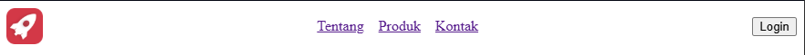

Tambahkan padding, background, color, dll untuk mempercantik navbar:

```css
body {
  font-family: sans-serif;
  margin: 0;
}

nav {
  display: flex;
  justify-content: space-between;
  align-items: center;
  padding: 12px;

  background-color: dodgerblue;
}

.menu {
  display: flex;
  align-items: center;
  gap: 16px;
}

a {
  color: white;
  text-decoration: none;
}

button {
  background-color: white;
  border: 0;
  padding: 10px 14px;
  border-radius: 6px;
  font-weight: bold
}
```

Hasilnya:

