Grid merupakan salah satu cara untuk membuat layout website.

## Apa itu Grid?

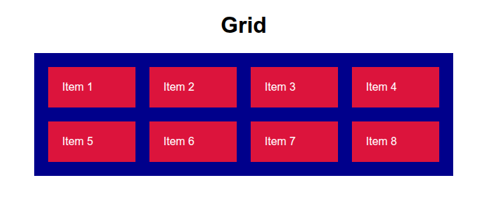

Grid adalah layout dua dimensi yang terdiri dari baris (row) dan kolom (column).

Fitur-fitur grid:

1. Menampilkan elemen-elemen dalam bentuk baris dan kolom
2. Mengatur ukuran elemen di dalamnya
3. Mengatur jarak antar elemen di dalamnya
4. Mengatur posisi elemen di dalamnya

## Cara Membuat Grid

Grid terdiri dari dua elemen:

1. Container, wadah dari grid.
2. Grid Item, elemen-elemen untuk mengisi grid, bisa lebih dari satu.

Untuk membuat grid, minimal ada dua properti yang harus ditambahkan ke container:

1. `display: grid`, untuk mengaktifkan grid.
2. `grid-template-columns: jumlah kolom`, untuk menentukan jumlah kolom.

Contoh:

```html
<div class="container">
    <div class="grid-item">Item 1</div>
    <div class="grid-item">Item 2</div>
    <div class="grid-item">Item 3</div>
    <div class="grid-item">Item 4</div>
    <div class="grid-item">Item 5</div>
    <div class="grid-item">Item 6</div>
</div>
```

```css
.container {
    display: grid;
    grid-template-columns: auto auto auto;
    gap: 10px;

    width: 600px;
    background-color: darkblue;
    padding: 20px;
}
.grid-item {
    background-color: crimson;
    color: white;
    padding: 20px;
    font-family: sans-serif;
}
```

Hasilnya:

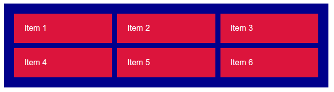

### Menentukan Jumlah dan Lebar Kolom Grid

Untuk menentukan jumlah dan lebar kolom grid, tambahkan properti `grid-template-columns` pada container. Langkah-langkahnya:

1. Tentukan jumlah kolom grid, misalnya 3.
2. Tambahkan properti `grid-template-columns` pada container.
3. Isi nilai properti tersebut dengan daftar kolom grid, jumlahnya sesuai dengan yang telah ditentukan, setiap kolom dipisahkan dengan spasi, setiap kolom diisi dengan ukuran lebar kolom tersebut.

Contoh:

```css
.container {
    grid-template-columns: 100px 100px 100px;
}
```

Hasilnya, grid akan menampilkan 3 kolom, dengan masing-masing lebarnya 100px.

Jika jumlah grid item ada lebih dari jumlah kolom yang ditentukan, maka akan dibuat baris baru. Contoh:

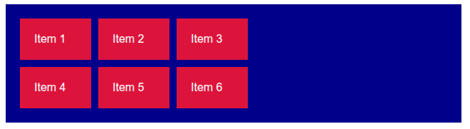

### Menentukan Tinggi Baris Grid

Untuk menentukan tinggi baris grid, tambahkan properti `grid-template-rows` pada container. Langkah-langkahnya:

1. Tentukan berapa baris grid yang ingin diubah tingginya, misalnya 2 baris.
2. Tambahkan properti `grid-template-rows` pada container.
3. Isi nilai properti tersebut dengan daftar baris grid, jumlahnya sesuai dengan yang telah ditentukan, setiap baris dipisahkan dengan spasi, setiap baris diisi dengan ukuran tinggi baris tersebut.

Contoh:

```css
.container {
    grid-template-rows: 100px 100px;
    grid-template-columns: 100px 100px;
}
```

Hasilnya, 2 baris awal grid masing-masing tingginya 100px, baris ke-3 dst tingginya akan menyesuaikan kontennya:

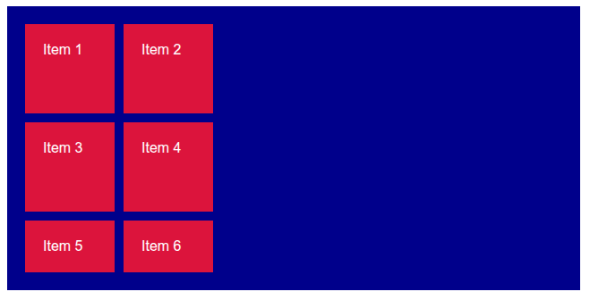

### Macam-Macam Ukuran Lebar Kolom dan Tinggi Baris Grid

Ketika membuat kolom dan baris di grid, kita juga harus menentukan ukuran lebar atau tingginya. Berikut macam-macam nilai ukuran lebar dan tinggi grid:

#### 1. Satuan Dasar Px, %, dll

Ukuran kolom dan baris grid bisa menggunakan satuan dasar seperti `px`, `%`, dll. [Daftar satuan ukuran dasar di CSS](./).

Contoh:

```css
.container {
    grid-template-columns: 100px 100px 100px;
}
```


Hasilnya:

#### 2. Auto

Kolom atau baris yang diberi ukuran `auto` maka lebar dan tingginya akan otomatis mengikuti kontennya.

Contoh:

```css
.container {
    grid-template-columns: auto auto auto;
}
```

Hasilnya:


#### 3. fr

Fr (fraction) adalah satuan ukuran untuk membagi ruang kosong dalam container.

- `1fr` berarti 1 bagian dari ruang kosong
- `2fr` berarti 2 bagian dari ruang kosong (2x lebih besar dari 1fr)
- `3fr`, `4fr`, dst.

Contoh:

```css
.container {
    grid-template-columns: 1fr 2fr 1fr;
}
```

Hasilnya, kolom ke-1 dan ke-3 lebarnya mengambil 1 bagian dari ruang kosong container, sedangkan kolom ke-2 mengambil 2 bagian, sehingga kolom ke-2 lebih lebar:

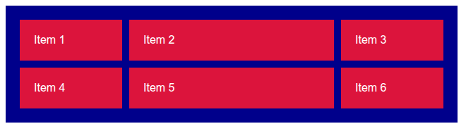

#### 4. minmax()

Minmax adalah fungsi untuk menentukan ukuran minimal dan maksimal pada kolom atau baris grid. Syntaxnya:

```
minmax(x, y)
```

- `x` adalah ukuran minimal, bisa satuan `px`, `%`, `fr`, dll.
- `y` adalah ukuran maksimal, bisa satuan `px`, `%`, `fr`, dll.

Contoh:

```css
.container {
    grid-template-columns: minmax(50px, 100px) auto auto;
}
```

Hasilnya, kolom pertama akan dibuat dengan ukuran minimal `50px` tapi tidak akan melebihi `100px`.

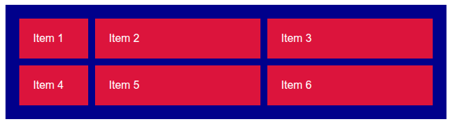

#### 5. repeat()

Repeat adalah fungsi untuk membuat beberapa kolom atau baris grid dengan ukuran yang sama sekaligus. Syntaxnya:

```
repeat(jumlah, ukuran)
```

- `repeat(3, 1fr)` sama dengan `1fr 1fr 1fr`.
- `repeat(5, auto)` sama dengan `auto auto auto`.
- `repeat(2, 10px)` sama dengan `10px 10px`.

Contoh:

```css
.container {
    grid-template-columns: repeat(3, 1fr);
}
```

Hasilnya:


### Menambahkan Jarak Antar Grid Item

Untuk menambahkan jarak antar grid item, tambahkan beberapa properti berikut di container:

1. `column-gap`, menambahkan jarak antar kolom
2. `row-gap`, menambahkan jarak antar baris
3. `gap`, menambahkan jarak antar kolom dan baris

Nilai jaraknya berupa ukuran, biasanya `px`.

Untuk `gap` bisa berisi dua nilai, yang pertama untuk jarak antar baris, yang kedua untuk jarak antar kolom. Jika jarak antar kolom dan baris sama, nilainya bisa ditulis satu saja.

Contoh:

```css
.container {
    display: grid;
    grid-template-columns: repeat(3, 1fr);
    gap: 20px 50px;
}
```

Hasilnya, antar baris ada jarak 20px, antar kolom ada jarak 50px:

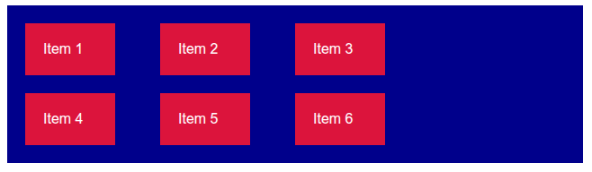

### Mengatur Posisi Grid Item

Untuk mengatur posisi grid item di dalam container, ada beberapa properti yang bisa digunakan:

#### 1. Justify Content

Properti `justify-content` digunakan untuk mengatur posisi semua grid item di dalam container secara horizontal. Macam-macam nilainya:

1. `start`, grid item ditampilkan di kiri dalam container
2. `center`, grid item ditampilkan di tengah container
3. `end`, grid item ditampilkan di kanan dalam container
4. `space-between`, grid item ditampilkan dari kiri container, kemudian diberi jarak setiap grid item sampai ke kanan container.

Contoh, grid container dengan `justify-content: center`:

```css
.container {
    display: grid;
    grid-template-columns: repeat(3, 100px);
    justify-content: center;
}
```


Contoh, grid container dengan `justify-content: space-between`:

```css
.container {
    display: grid;
    grid-template-columns: repeat(3, 100px);
    justify-content: space-between;
}
```

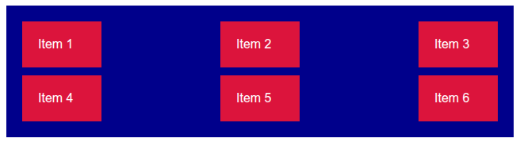

#### 2. Align Content

Properti `align-content` digunakan untuk mengatur posisi semua grid item di dalam container secara vertikal. Macam-macam nilainya:

1. `start`, grid item ditampilkan di atas dalam container
2. `center`, grid item ditampilkan di tengah container
3. `end`, grid item ditampilkan di bawah dalam container
4. `space-between`, grid item ditampilkan dari atas container, kemudian diberi jarak setiap grid item sampai ke bawah container.

Contoh, grid container dengan `align-content: center`:

```css
.container {
    grid-template-columns: repeat(2, 100px);
    grid-template-rows: repeat(3, 100px);
    align-content: center;
    
    height: 500px;
}
```

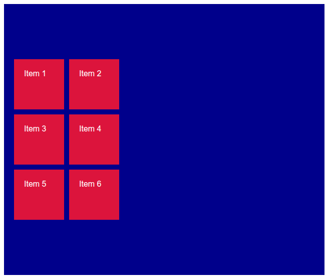

Contoh, grid container dengan `align-content: space-between`:

```css
.container {
    grid-template-columns: repeat(2, 100px);
    grid-template-rows: repeat(3, 100px);
    align-content: space-between;
    
    height: 500px;
}
```

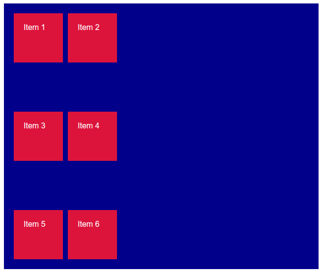

Selain `justify-content` dan `align-content`, ada beberapa properti lain untuk mengatur posisis grid item yang akan dijelaskan di materi grid lanjutan.

### Melebarkan Kolom dan Baris Grid Item

Secara default, 1 grid item memiliki 1 kolom dan 1 baris. Tapi ini bisa dilebarkan jadi beberapa kolom dan beberapa baris.

Untuk melebarkan kolom, tambahkan properti `grid-column` pada grid item yang ingin dilebarkan, nilainya `span angka-jumlah-lebar`. Misalnya `span 2`, maka grid akan menempati 2 kolom.

Untuk melebarkan baris, tambahkan properti `grid-row` pada grid item yang ingin dilebarkan, nilainya `span angka-jumlah-lebar`. Misalnya `span 2`, maka grid akan menempati 2 baris.

Contoh:

```html
<div class="container">
    <div class="grid-item grid-item-1">Item 1</div>
    <div class="grid-item">Item 2</div>
    <div class="grid-item">Item 3</div>
    <div class="grid-item">Item 4</div>
    <div class="grid-item">Item 5</div>
    <div class="grid-item">Item 6</div>
</div>
```

```css
.container {
    display: grid;
    grid-template-columns: repeat(3, auto);
    gap: 10px;
}

.grid-item-1 {
    grid-column: span 2;
    grid-row: span 2;
}
```

Hasilnya, grid item pertama akan menempati 2 kolom dan 2 baris:

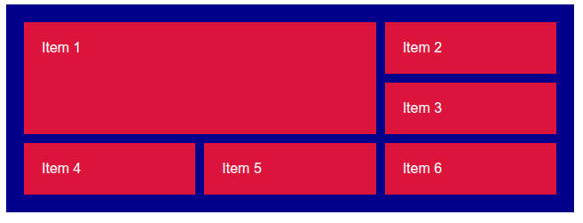

## Contoh: Membuat Galeri Foto dengan Layout Grid

Setelah belajar cara membuat grid dasar, saatnya praktek menggunakan grid untuk membuat layout galeri foto.

Galeri foto akan dibuat dalam layout grid dengan 3 kolom. Berikut langkah-langkahnya:

### 1. Buat Kerangka Galeri dengan HTML

Pertama buat kerangka HTML yang terdiri dari beberapa elemen:

1. `div` dengan class `.container`, untuk membuat container grid.
2. Beberapa elemen `img`, misalnya ada 6 gambar, digunakan sebagai grid item.

Contoh:

```html
<h1>Galeri Foto</h1>
<div class="container">
    
    
    
    
    
    
</div>
```

Hasilnya:

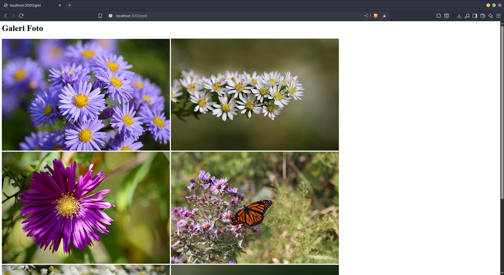

### 2. Buat Layout Grid Galeri dengan CSS

Tambahkan beberapa properti berikut pada container untuk membuat layout grid:

1. `display: grid`, untuk mengaktifkan grid.
2. `grid-template-columns: repeat(3, 1fr)`, untuk membuat 3 kolom grid dengan ukuran lebar yang sama.
3. `gap: 10px`, untuk membuat jarak antar grid item.

Contoh:

```css
.container {
    display: grid;
    grid-template-columns: repeat(3, 1fr);
    gap: 10px;
}

img {
    width: 100%;
}
```

Hasilnya:

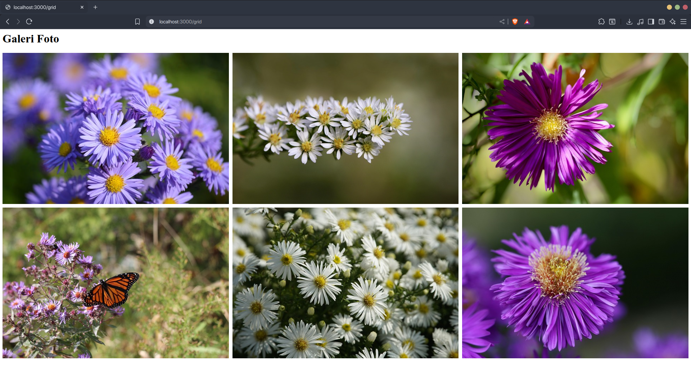

### 3. Menambahkan Styling

Agar terlihat lebih cantik, bisa kita tambahkan styling, misalnya dengan membatasi lebar container dan menambahkan border radius pada grid item.

Contoh:

```css
body {
    font-family: sans-serif;
    max-width: 1400px;
    margin: 50px auto;
}

.container {
    display: grid;
    grid-template-columns: repeat(3, 1fr);
    gap: 10px;
}

img {
    width: 100%;
}
```

Hasilnya:

