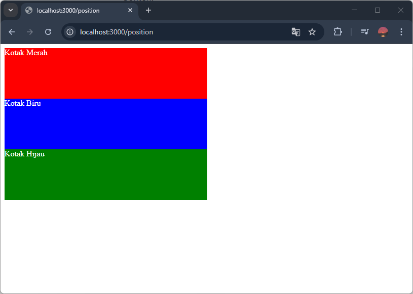
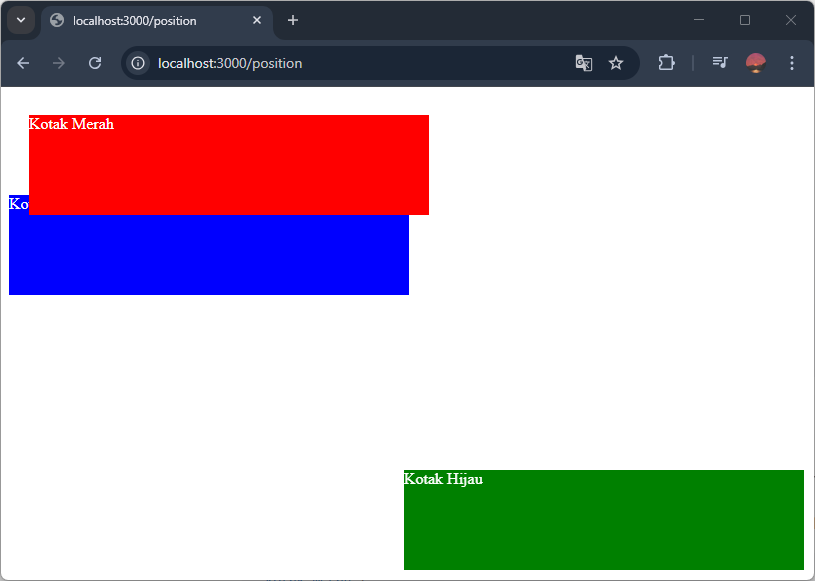
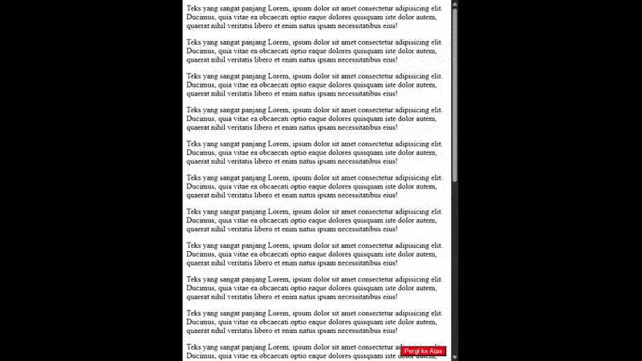
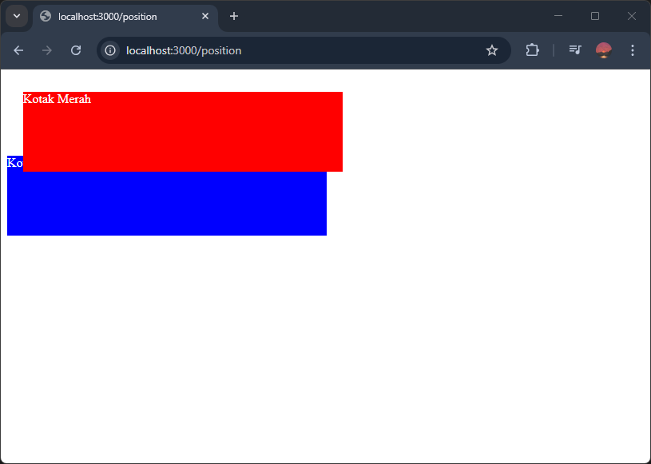
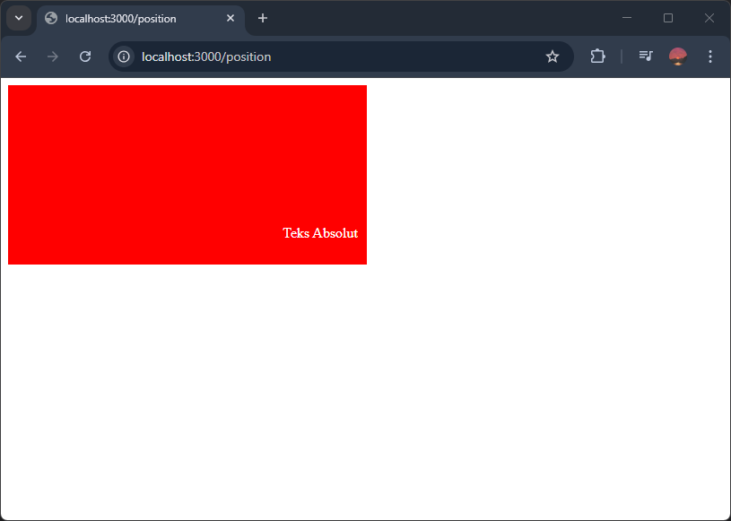
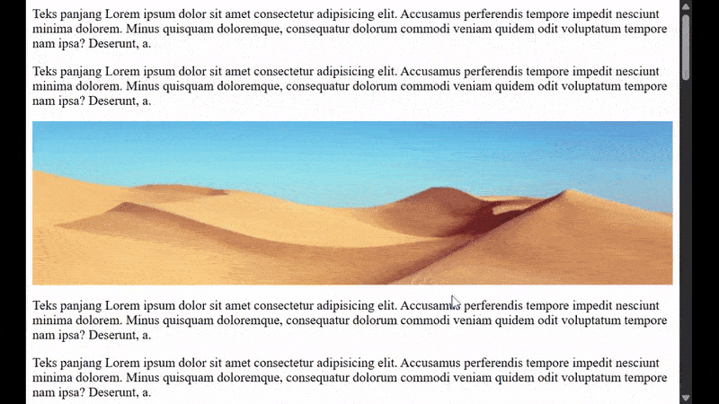

Mengatur posisi elemen merupakan salah satu hal yang perlu diketahui ketika membuat layout website.

## Apa itu Posisi Elemen?

Posisi elemen adalah bagaimana elemen ditempatkan di halaman website.

Elemen HTML secara default ditempatkan secara berurutan dari atas ke bawah untuk elemen yang blok dan dari kiri ke kanan untuk elemen yang inline.

[Pengertian Elemen Block dan Inline](/courses/belajar-css-layout/mengatur-tampilan-elemen-css-display#display-block).

Contoh:

```html
<div class="kotak-merah">Kotak Merah</div>
<div class="kotak-biru">Kotak Biru</div>
<div class="kotak-hijau">Kotak Hijau</div>
```

```css
div {
    width: 400px;
    height: 100px;
    color: white;
}

.kotak-merah {
    background-color: red;
}

.kotak-biru {
    background-color: blue;
}

.kotak-hijau {
    background-color: green;
}
```

Hasilnya, setiap kotak akan ditampilkan berurutan sesuai urutan penulisannya dari atas ke bawah:



Dengan CSS, kita bisa mengubah posisi elemen ke tempat lain yang ditentukan.

Contoh, kotak merah dan hijau di atas diubah posisinya dengan CSS berikut:

```css
.kotak-merah {
    position: relative;
    top: 20px;
    right: -20px;
}

.kotak-hijau {
    position: fixed;
    bottom: 10px;
    right: 10px;
}
```

Hasilnya:



## Cara Mengatur Posisi Elemen dengan CSS

Untuk mengatur posisi elemen dengan CSS ada dua properti perlu ditambahkan, jenis posisi dan koordinat posisi.

Untuk menentukan jenis posisi, gunakan properti `position`, macam-macam nilainya:

1. `static`, elemen ditempatkan sesuai posisi aslinya. (Default)
2. `relative`, elemen ditempatkan sesuai posisi aslinya, tapi bisa sesuaikan koordinat posisinya
3. `absolute`, elemen ditempatkan di koordinat tertentu relatif terhadap elemen di atasnya
4. `fixed`, elemen ditempatkan di koordinat tertentu relatif terhadap layar browser
5. `sticky`, elemen berubah-ubah posisinya, bisa `relative` dan `fixed`, tergantung kondisinya.

Untuk menentukan koordinat posisi, gunakan properti `top`, `left`, `right`, dan `bottom`. Nilainya berupa angka dan satuannya. Satuan yang biasa digunakan adalah `px`.

Contoh:

```html
<p>Teks yang sangat panjang.....</p>
<button>Pergi ke Atas</button>
```

```css
button {
    position: fixed;
    bottom: 10px;
    right: 10px;
    
    background-color: red;
    color: white;
}
```

Hasilnya, `button` akan berposisi di pojok kanan bawah layar browser dan akan terus disana ketika halaman discroll:



## Macam-Macam Posisi Elemen

Ada lima macam jenis posisi, berikut penjelasannya masing-masing:

### 1. Static

Static adalah posisi elemen yang menempatkan elemen sesuai urutan penulisannya.

Elemen yang pertama ditulis akan ditampilkan paling atas, diikuti elemen selanjutnya, dst.

Ini adalah `position` default untuk setiap elemen HTML.

Contoh:

```html
<div class="kotak-merah">Kotak Merah</div>
<div class="kotak-biru">Kotak Biru</div>
<div class="kotak-hijau">Kotak Hijau</div>
```

```css
div {
    position: static;
    
    width: 400px;
    height: 100px;
    color: white;
}

.kotak-merah {
    background-color: red;
}

.kotak-biru {
    background-color: blue;
}

.kotak-hijau {
    background-color: green;
}
```

Hasilnya, kotak merah, biru dan hijau akan ditampilkan berurutan dari atas ke bawah sesuai penulisan di kode HTML-nya:


### 2. Relative

Relative adalah posisi elemen yang sama seperti static, tapi bisa digeser koordinat posisinya.

Contoh:

```html
<div class="kotak-merah">Kotak Merah</div>
<div class="kotak-biru">Kotak Biru</div>
```

```css
div {
    width: 400px;
    height: 100px;
    color: white;
}

.kotak-merah {
    position: relative;
    top: 20px;
    right: -20px;

    background-color: red;
}

.kotak-biru {
    background-color: blue;
}
```

Hasilnya, karena `.kotak-merah` akan bergeser `10px` ke bawah dan ke kanan, sehingga sedikit menutupi `.kotak-biru`.



### 3. Absolute

Absolute adalah posisi elemen yang ditempatkan sesuai koordinat posisinya, relatif terhadap induk elemen.

Induk elemen dari posisi yang absolute adalah elemen di atasnya yang posisinya relatif.

Contoh:

```html
<div>
    <p>Teks Absolut</p>
</div>
```

```css
div {
    position: relative;

    background-color: red;
    color: white;
    width: 400px;
    height: 200px;
}

p {
    position: absolute;
    bottom: 10px;
    right: 10px;
}
```

Hasilnya, elemen `<p>` akan ditampilkan di pojok kanan bawah dari elemen `<div>`.



### 4. Fixed

Fixed adalah posisi elemen yang ditempatkan sesuai koordinat posisinya, relatif terhadap layar browser.

Ketika browser discroll, ellemen yang fixed akan tetap berada di koordinat posisinya, tidak berubah-ubah.

Contoh:

```html
<p>Teks panjang.....</p>
<button>Pergi ke Atas</button>
```

```css
button {
    position: fixed;
    bottom: 10px;
    right: 10px;
    
    background-color: red;
    color: white;
}
```

Hasilnya, tombol "Pergi ke Atas" posisinya ditempatkan di pojok kanan bawah layar browser, dan akan terus di sana ketika browser discroll.


### 5. Sticky

Sticky adalah posisi elemen yang posisinya berubah-ubah dari relative ke fixed dan sebaliknya, berdasarkan keadaan scroll browser.

Awalnya elemen sticky akan ditampilkan secara relative, kemudian ketika browser discroll sampai melewati elemen, posisi elemen akan berubah jadi fixed.

Agar sticky dapat berfungsi, minimal harus ada satu titik koordinat posisi yang ditambahkan. 

Contoh:

```html
<p>Teks panjang....</p>

<p>Teks Panjang</p>
```

```css
img {
    position: sticky;
    top: 10px;
}
```

Hasilnya, elemen gambar "gurun.png" awalnya ditampilkan seperti biasa, ketika browser discroll sampai melewati gambar, gambar akan menetap tampil di bagian atas layar browser.

