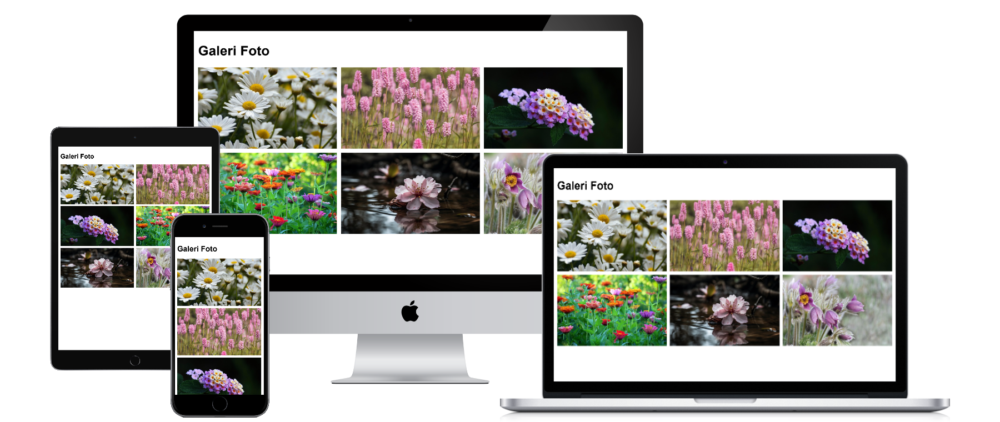
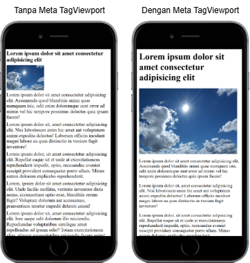
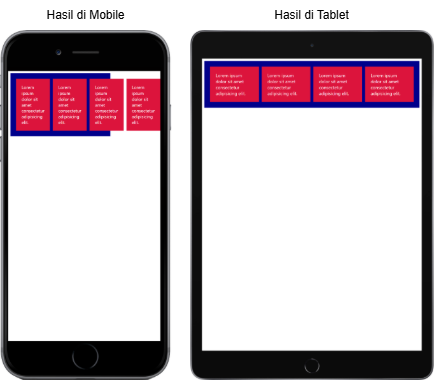
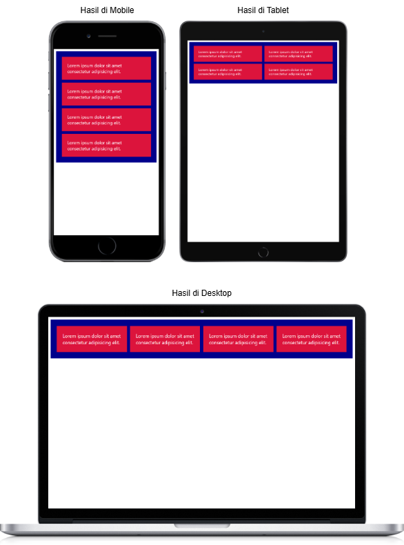

Layout yang responsive sudah menjadi standar ketika membuat website, agar website bisa tampil dengan baik di semua perangkat.

## Apa itu Layout Responsive?



Layout responsive adalah layout yang dapat merespon perubahan ukuran layar perangkat dengan mengubah susunan layout agar bisa tampil baik di ukuran layar perangkat tersebut. 

Tujuannya, agar layout website dapat tampil baik di berbagai perangkat, seperti mobile, tablet, dan dekstop.

Misalnya ketika website dibuka di mobile, maka layout yang digunakan adalah layout 1 kolom. Ketika dibuka di tablet layoutnya jadi 2 kolom dan ketika di desktop jadi 3 atau 4 kolom.

[Jenis-jenis layout website](/courses/belajar-css-layout/jenis-layout-website).

## Cara Membuat Layout Responsive

Untuk membuat layout responsive ada dua langkah yang perlu dilakukan.

### 1. Tambahkan Meta Viewport di Dokumen HTML

Pertama, tambahkan tag meta viewport berikut di dalam tag `head` dokumen HTML:

```html
<head>
    <meta name="viewport" content="width=device-width, initial-scale=1.0">
</head>
```

Fungsi meta tag viewport untuk membuat website ditampilkan sesuai ukuran layar perangkat pengunjung. 

Contoh tampilan website tanpa tag meta viewport dan dengan tag meta viewport:



### 2. Tambahkan Media Query dengan CSS

Media query adalah cara untuk menambahkan style CSS berdasarkan jenis dan ukuran layar perangkat.

Lihatlah kode berikut:

```css
.container {
    display: grid;
    grid-template-columns: repeat(4, 1fr);
}
```

Di semua perangkat seperti mobile, tablet dan desktop, kolom grid akan selalu berjumlah 4 kolom. Hasilnya jadi jelek ketika di perangkat mobile.



Dengan media query, kita bisa membuat jumlah kolom grid berubah-ubah tergantung ukuran lebar layar perangkat. Contoh:

```css
/* Mobile */
.container {
    display: grid;
    grid-template-columns: auto;
}

/* Tablet */
@media (min-width: 640px) {
    .container {
        grid-template-columns: repeat(2, 1fr);
    }
}

/* Desktop */
@media (min-width: 768px) {
    .container {
        grid-template-columns: repeat(4, 1fr);
    }
}
```

Hasilnya: 

- Di perangkat mobile, jumlah kolom 1.
- Di perangkat tablet (lebar minimal 640px), jumlah kolom 2.
- Di perangkat desktop (lebar minimal 768px), jumlah kolom 4.



Layout grid sekarang menjadi responsive, karena tampil bagus dengan menyesuaikan jumlah kolom berdasarkan ukuran layar perangkat.

#### Cara Menulis Media Query

Media query ditulis dengan format berikut:

```
@media (ukuran) {
    daftar style css untuk ukuran ini
}
```

Contoh:

```css
@media (min-width: 600px) {
    h1 {
        color: red;
    }
    
    p {
        width: 400px;
    }
}
```

Kode tersebut akan menerapkan style `h1` dan `p` ketika dibuka di layar yang lebarnya lebih besar dari `600px`.

Selain dengan properti `min-width`, juga bisa dengan properti lain. Contohnya `max-width`:

```css
@media (max-width: 600px) {
    h1 {
        color: red;
    }
    
    p {
        width: 400px;
    }
}
```

Kode tersebut akan menerapkan style `h1` dan `p` ketika dibuka di layar yang lebarnya lebih kecil dari `600px`.

## Contoh Membuat Layout Galeri Foto yang Responsive

Sekarang kita praktek membuat layout galeri foto yang responsive.

Berikut kerangka HTML untuk halaman galeri foto:

```html
<!doctype html>
<html>
    <head>
        <meta name="viewport" content="width=device-width, initial-scale=1.0">
    </head>
    <body>
        <h1>Galeri Foto</h1>
        <div class="container">
            
            
            
            
            
            
        </div>
    </body>
</html>
```

Tambahkan style CSS untuk mengatur lebar halaman, font, dan ukuran gambar:

```css
body {
    font-family: sans-serif;
    max-width: 1200px;
    margin: 0 auto;
    padding: 10px;
    box-sizing: border-box;
}

img {
    width: 100%;
    height: 200px;
    object-fit: cover;
}
```

Tambahkan layout grid 1 kolom pada container galeri foto untuk ditampilkan di perangkat mobile:

```css
.container {
    display: grid;
    grid-template-columns: auto;
    gap: 10px;
}
```

Tambahkan media query untuk layar tablet, di dalamnya ubah layout container galeri foto menjadi grid 2 kolom.

```css
@media (min-width: 640px) {
    .container {
        grid-template-columns: repeat(2, 1fr);
    }
}
```

Tambahkan media query untuk layar desktop, di dalamnya ubah layout container galeri foto menjadi grid 3 kolom.

```css
@media (min-width: 768px) {
    .container {
        grid-template-columns: repeat(3, 1fr);
    }
}
```

Hasilnya, galeri foto tampil baik di semua perangkat:

