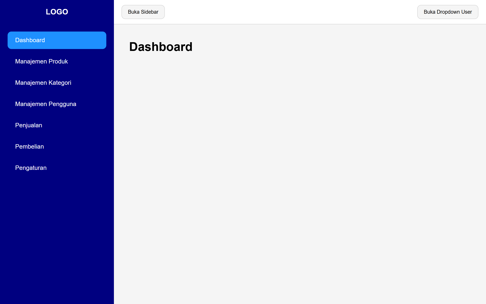
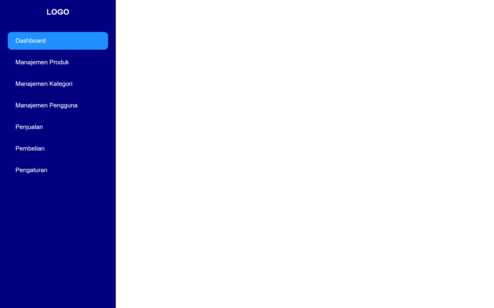
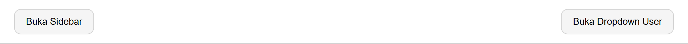
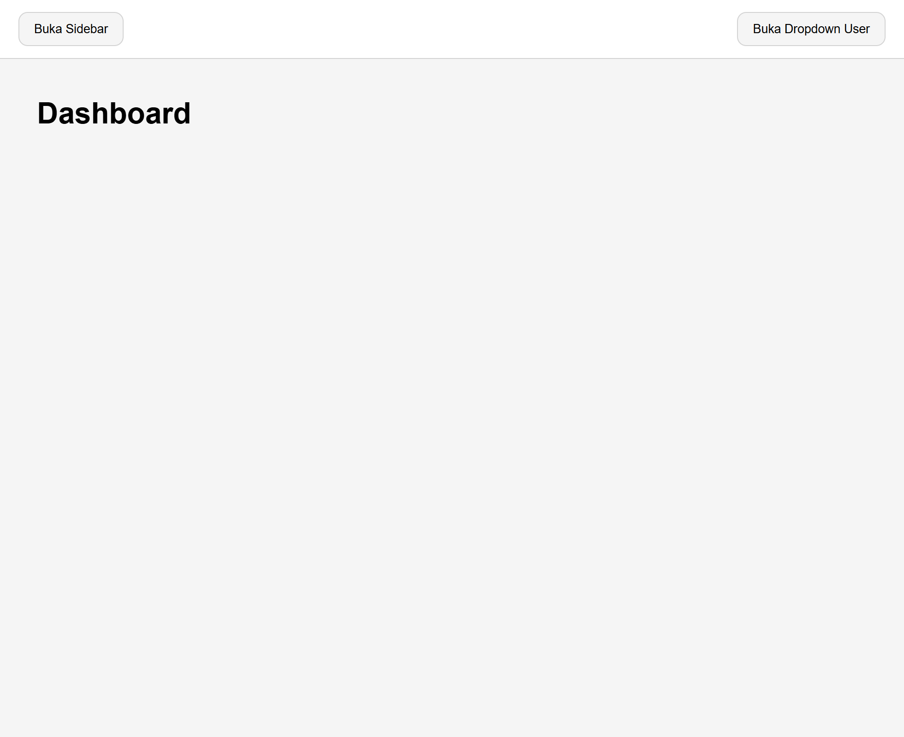

Sebelumnya kita sudah [praktik membuat layout untuk website berita](/courses/belajar-css-layout/praktik-membuat-layout-untuk-website-berita), sekarang kita praktik membuat layout untuk dashboard panel.

Dashboard panel adalah halaman website yang biasanya digunakan oleh admin atau user tertentu untuk mengelola data, melihat statistik dll. Biasanya dashboard panel diakses setelah login.

Dashboard panel biasanya terdiri dari tiga elemen utama:

1. Sidebar, berisi logo dan daftar menu.
2. Navbar, berisi tombol-tombol seperti logout, pencarian, dll.
3. Konten Utama

Berikut hasil akhir dari layout dashboard panel yang akan kita buat:



Langsung saja, berikut langkah-langkahnya:

## 1. Membuat Kerangka HTML

Pertama, buat file `index.html` yang berisi kerangka website dashboard panel, contoh:

```html
<!DOCTYPE html>
<html>
<head>
    <meta name="viewport" content="width=device-width, initial-scale=1.0">
    <title>Dashboard</title>
    <link rel="stylesheet" href="style.css">
</head>
<body>
    
    <aside>
        <div class="logo">
            <a href="">Logo</a>
        </div>

        <div class="menu">
            <a href="" class="active">Dashboard</a>
            <a href="">Manajemen Produk</a>
            <a href="">Manajemen Kategori</a>
            <a href="">Manajemen Pengguna</a>
            <a href="">Penjualan</a>
            <a href="">Pembelian</a>
            <a href="">Pengaturan</a>
        </div>
    </aside>

    <div class="konten">
        <nav>
            <button>Buka Sidebar</button>
            <button>Buka Dropdown User</button>
        </nav>

        <main>
            <h1>Dashboard</h1>
        </main>
    </div>

</body>
</html>
```

## 2. Menambahkan Style Dasar

Buat file `style.css`, tambahkan style dasar pada body yang mengatur font dan menghapus margin serta padding. Contoh:

```css
body {
    margin: 0;
    padding: 0;
    box-sizing: border-box;
    font-family: sans-serif;
}
```

## 3. Menambahkan Style Sidebar

Tambahkan style berikut pada sidebar:

- Atur lebar sidebar menjadi `300px`, tingginya `100vh`, dan tambahkan background.
- Atur posisi sidebar menjadi `fixed` di kiri layar.
- Di mobile, sidebar tidak tampil dengan mengatur nilai posisi left `-300px`.
- Di desktop, sidebar menjadi tampil dengan mengatur nilai posisi left `0`.
- Tambahkan background, warna, padding, dll pada logo dan daftar menu.

Contoh:

```css
aside {
    position: fixed;
    top: 0;
    left: -300px;
    width: 300px;
    height: 100vh;
    background-color: navy;
}

aside .logo {
    padding: 20px;
    text-align: center;
} 

aside .logo a {
    color: white;
    font-size: 1.25rem;
    font-weight: bold;
    text-decoration: none;
    text-transform: uppercase;
}

aside .menu {
    display: flex;
    flex-direction: column;
    gap: 10px;
    padding: 20px;
} 

aside .menu a {
    color: white;
    text-decoration: none;
    padding: 14px 20px;
    border-radius: 10px;
}

aside .menu a.active, aside .menu a:hover {
    background-color: dodgerblue;
}

@media (min-width: 768px) {
    aside {    
        left: 0;
    }
}
```

Hasilnya:



## 4. Menambahkan Style Navbar

Tambahkan style berikut pada navbar:

- Tambahkan bacgkround, padding dan border pada navbar.
- Navbar diberi layout flexbox.
- Tambahkan background, padding, dsb pada button navbar.

Contoh:

```css
.konten nav {
    background-color: white;
    padding: 13px 20px;
    display: flex;
    justify-content: space-between;
    border-bottom: 1px solid lightgray;
}

.konten nav button {
    border: 1px solid lightgray;
    background-color: whitesmoke;
    padding: 10px 16px;
    border-radius: 10px;
    cursor: pointer;
}

.konten nav button:hover {
    background-color: lightgray;
}
```

Hasilnya:



## 5. Menambahkan Style Konten Utama

Tambahkan style berikut pada konten utama:

- Tambahkan background abu-abu dan tinggi minimal `100vh`.
- Tambahkan margin kiri `300px` agar konten berada di sebelah sidebar, hanya di desktop.
- Tambahkan padding pada konten.

Contoh:

```css
.konten {
    background-color: whitesmoke;
    min-height: 100vh;
}

.konten main {
    padding: 0px 20px;
}

@media (min-width: 768px) {
    .konten {
        margin-left: 300px;
    }

    .konten main {
        padding: 20px 40px;
    }
}
```

Hasilnya:



---

## Kode Lengkap dan Hasil Akhir

Berikut kode CSS lengkap yang telah dibuat:

```css
body {
    margin: 0;
    padding: 0;
    box-sizing: border-box;
    font-family: sans-serif;
}

aside {
    position: fixed;
    top: 0;
    left: -300px;
    width: 300px;
    height: 100vh;
    background-color: navy;
}

aside .logo {
    padding: 20px;
    text-align: center;
} 

aside .logo a {
    color: white;
    font-size: 1.25rem;
    font-weight: bold;
    text-decoration: none;
    text-transform: uppercase;
}

aside .menu {
    display: flex;
    flex-direction: column;
    gap: 10px;
    padding: 20px;
} 

aside .menu a {
    color: white;
    text-decoration: none;
    padding: 14px 20px;
    border-radius: 10px;
}

aside .menu a.active, aside .menu a:hover {
    background-color: dodgerblue;
}

.konten {
    background-color: whitesmoke;
    min-height: 100vh;
}

.konten nav {
    background-color: white;
    padding: 13px 20px;
    display: flex;
    justify-content: space-between;
    border-bottom: 1px solid lightgray;
}

.konten nav button {
    border: 1px solid lightgray;
    background-color: whitesmoke;
    padding: 10px 16px;
    border-radius: 10px;
    cursor: pointer;
}

.konten nav button:hover {
    background-color: lightgray;
}

.konten main {
    padding: 0px 20px;
}

@media (min-width: 768px) {
    aside {    
        left: 0;
    }

    .konten {
        margin-left: 300px;
    }

    .konten main {
        padding: 20px 40px;
    }
}
```

Untuk seluruh kode HTML dan CSS bisa dilihat di [repository praktik layout dashbboard panel](https://github.com/narakode/praktik-layout-dashboard-panel).

Hasil akhirnya seperti berikut:

