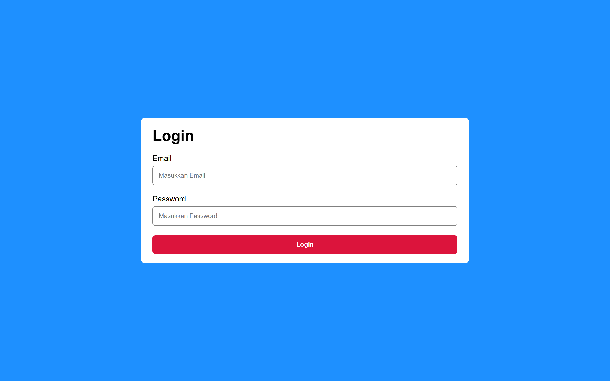
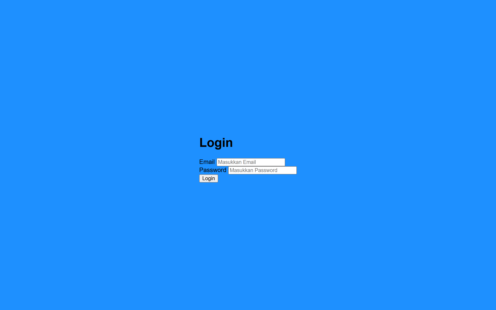
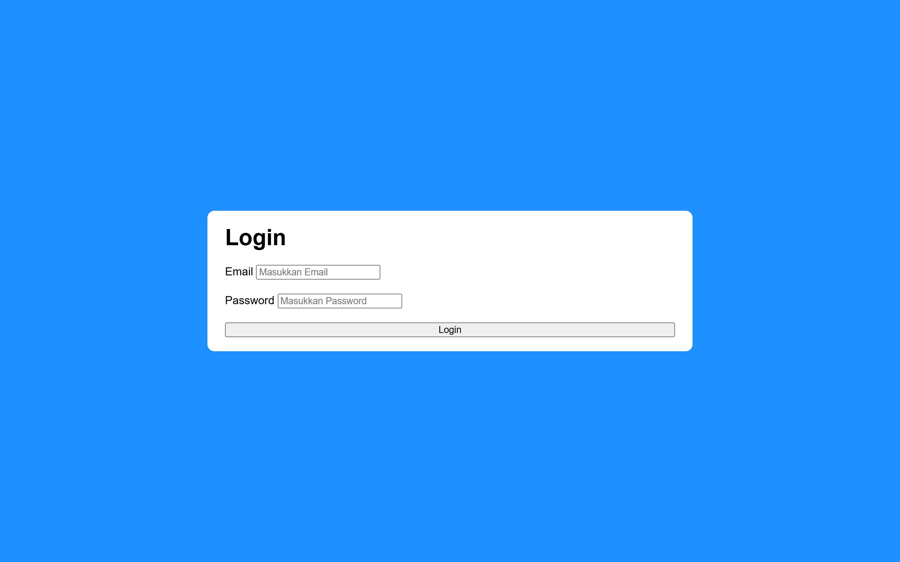

Di materi terakhir tentang belajar membuat layout dengan CSS, kita akan membuat layout untuk form login.

Form login adalah halaman yang digunakan pengguna untuk memasukkan akun mereka agar bisa mengakses website yang membutuhkan login.

Tipikal form login biasanya terdiri dari sebuah kotak yang ditempatkan di tengah halaman, di kotak tersebut terdapat form dengan beberapa elemen, yaitu:

1. Judul form
2. Input email
3. Input password
4. Tombol login

Berikut tampilan hasil akhir form login yang akan kita buat:



Berikut langkah-langkahnya:

## 1. Membuat Kerangka HTML

Pertama, buat kerangka HTML yang berisi form login, judul, input email, input password dan tombol login.

Contoh:

```html
<!DOCTYPE html>
<html>
<head>
    <meta name="viewport" content="width=device-width, initial-scale=1.0">
    <title>Login</title>
    <link rel="stylesheet" href="style.css">
</head>
<body>
    
    <form>
        <h1>Login</h1>
        
        <div>
            <label for="email">Email</label>
            <input type="email" id="email" placeholder="Masukkan Email">
        </div>

        <div>
            <label for="password">Password</label>
            <input type="password" id="password" placeholder="Masukkan Password">
        </div>

        <button>Login</button>
    </form>

</body>
</html>
```

## 2. Menambahkan Style Dasar

Tambahkan style dasar pada `body` berikut:

- Hapus margin bawaan.
- Tambahkan padding, font, dan background.
- Atur tinggi body agar memenuhi halaman.
- Tambahkan flexbox, atur posisi itemnya di tengah secara vertikal dan horizontal.

Contoh:

```css
body {
    margin: 0;
    padding: 20px;
    box-sizing: border-box;
    font-family: sans-serif;
    background-color: dodgerblue;
    
    height: 100vh;
    display: flex;
    align-items: center;
    justify-content: center;
}
```

Hasilnya:



## 3. Menambahkan Style Pada Form

Tambahkan style pada form agar berbentuk seperti kotak:

- Tambahkan backround, padding, dan border radius.
- Tambahkan flex kolom, setiap item diberi jarak `10px`.
- Di mobile lebar form `100%`, di tablet dan dekstop lebar form `640px`.
- Hapus margin bawaan pada `h1`.

Contoh:

```css
form {
    width: 100%;
    background-color: white;
    padding: 20px 25px;
    border-radius: 10px;
    display: flex;
    flex-direction: column;
    gap: 20px;
}

form h1 {
    margin: 0;
}

@media (min-width: 640px) {
    form {
        width: 640px;
    }
}
```

Hasilnya:



## 4. Menambahkan Style Pada Input dan Tombol

- Tambahkan flex kolom dengan jarak `6px` pada setiap `div` untuk input.
- Tambahkan padding, border dan border radius pada input.
- Tambahkan padding, background, color, border radius, dan hapus border pada button.

Contoh:

```css
form div {
    display: flex;
    flex-direction: column;
    gap: 6px;
}

form input {
    padding: 12px;
    border: 1px solid gray;
    border-radius: 6px;
}

form button {
    padding: 12px;
    border: 0;
    background-color: crimson;
    color: white;
    font-weight: bold;
    border-radius: 6px;
    cursor: pointer;
}
```

Hasilnya:


---

## Kode Lengkap dan Hasil Akhir

Berikut kode lengkap CSS yang telah dibuat:

```css
body {
    margin: 0;
    padding: 20px;
    box-sizing: border-box;
    font-family: sans-serif;
    background-color: dodgerblue;
    
    height: 100vh;
    display: flex;
    align-items: center;
    justify-content: center;
}

form {
    width: 100%;
    background-color: white;
    padding: 20px 25px;
    border-radius: 10px;
    display: flex;
    flex-direction: column;
    gap: 20px;
}

form h1 {
    margin: 0;
}

form div {
    display: flex;
    flex-direction: column;
    gap: 6px;
}

form input {
    padding: 12px;
    border: 1px solid gray;
    border-radius: 6px;
}

form button {
    padding: 12px;
    border: 0;
    background-color: crimson;
    color: white;
    font-weight: bold;
    border-radius: 6px;
    cursor: pointer;
}

@media (min-width: 640px) {
    form {
        width: 640px;
    }
}
```

Untuk seluruh kode HTML dan CSS bisa dilihat di [repository praktik layout form login](https://github.com/narakode/praktik-layout-form-login).

Berikut tampilan hasil akhir layout form login yang telah dibuat:

