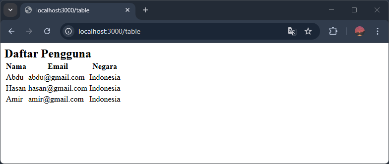

Tabel adalah elemen yang digunakan untuk menampilkan data yang terstruktur dalam bentuk baris dan kolom. Contohnya data pengguna, data penjualan, data barang, dsb.

## Cara Membuat Tabel di HTML

Elemen tabel di HTML dibuat dengan beberapa tag berikut:

1. `<table>` untuk membuat tabel.
2. `<tr>` untuk membuat baris tabel.
3. `<th>` untuk membuat kolom tabel.
4. `<td>` untuk membuat isi tabel.

Ada beberapa tambahan tag lain seperti `thead`, `tbody`, `tfoot` untuk membuat tabel lanjutan, untuk tabel dasar empat tag di atas sudah cukup.

Dari empat tag di atas biasanya disusun jadi sebuah tabel dengan langkah-langkah berikut:

1. Buat wadah tabel dengan tag`<table>`.
2. Buat baris pertama untuk membuat kolom tabel dengan tag `<tr>`.
3. Di dalam baris pertama tambahkan kolom-kolom tabel dengan tag `<th>`.
4. Selanjutnya buat satu baris dengan tag `<tr>` untuk setiap data yang ingin ditampilkan.
5. Di setiap baris, buat isi tabel dengan tag `<td>`.

Contoh:

```html
<h2>Daftar Pengguna
<table>
    <tr>
        <th>Nama</th>
        <th>Email</th>
        <th>Negara</th>
    </tr>
    <tr>
        <td>Abdu</td>
        <td>abdu@gmail.com</td>
        <td>Indonesia</td>
    </tr>
    <tr>
        <td>Hasan</td>
        <td>hasan@gmail.com</td>
        <td>Indonesia</td>
    </tr>
    <tr>
        <td>Amir</td>
        <td>amir@gmail.com</td>
        <td>Indonesia</td>
    </tr>
</table>
```

Hasilnya:



## Tips Membuat Tabel

1. Pastikan hanya ada satu baris (`<tr>`) untuk menampilkan kolom-kolom tabel (`<th>`).
2. Pastikan jumlah `<td>` di satu baris (`<tr>`) sama dengan jumlah `<th>`. Misalnya di baris pertama 3 `<th>`, maka di setiap baris selanjutnya seharusnya hanya ada 3 `<td>`.