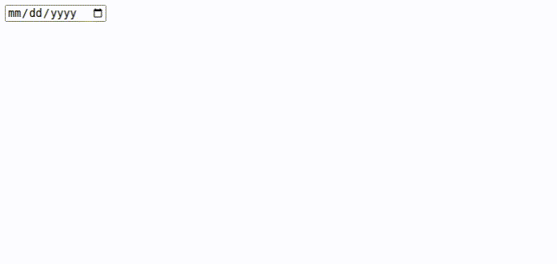
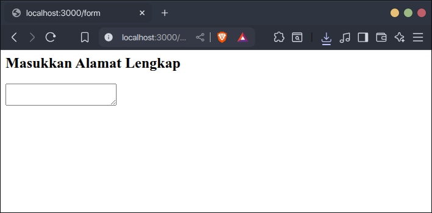

Form adalah elemen yang memungkinkan pengunjung untuk mengisi informasi ke halaman website. Contohnya form pendaftaran, login, kontak, pemesanan, dll.

## Cara Membuat Form di HTML

Form di HTML dapat dibuat dengan beberapa tag berikut:

1. `<form>` untuk membuat wadah form.
2. `<label>` untuk membuat label pada input.
3. `<input>` untuk membuat input.
4. `<select>` untuk membuat kotak pilihan.
5. `<option>` untuk membuat isi kotak pilihan.
6. `<textarea>` untuk membuat input multi baris.
7. `<button>` untuk membuat tombol.

Setiap `input`, `select` dan `textarea` biasanya memiliki label masing-masing.

Contoh:

```html
<h2>Form Pendaftaran</h2>
<form>
	<label for="nama">Nama Lengkap: </label>
	<input id="nama">
	<br>

	<label for="jurusan">Jurusan: </label>
	<select id="jurusan">
		<option>Informatika</option>
		<option>Sistem Informasi</option>
		<option>Teknik Komputer</option>
	</select>
	<br>
	
	<label for="alamat">Alamat Lengkap: </label>
	<textarea id="alamat"></textarea>
	<br>
	
	<button>Simpan</button>
</form>
```

Hasilnya:


## Membuat Input

Input di HTML adalah kotak yang bisa diisi dengan keyboard oleh pengunjung. Input dibuat dengan tag `<input>`. Contoh:

```html
<input>
```

Hasilnya:


Tag input tidak membutuhkan tag penutup, cukup ditulis tag pembukanya saja.

Tag input ada beberapa jenis. Setiap jenis memiliki fungsi dan tampilan yang berbeda-beda. Jenis input ditentukan dengan menambahkan atribut `type` di tag `<input>`. 

Berikut jenis-jenis tag input:

### Membuat Input Teks, Angka Email, dan Password

- Jenis input teks (`text`) adalah input yang pengunjung bisa memasukkan teks apa saja dari keyboard.
- Jenis input angka (`number`) adalah input yang pengunjung hanya bisa memasukkan angka dari keyboard.
- Jenis input email (`email`) adalah input yang pengunjung hanya bisa memasukkan teks berupa email dari keyboard.
- Jenis input password (`password`) adalah input yang pengunjung hanya bisa memasukkan teks berupa kata sandi dari keyboard.

Contoh:

```html
<h2>Input Teks</h2>
<input type="text">

<h2>Input Angka</h2>
<input type="number">

<h2>Input Email</h2>
<input type="email">

<h2>Input Password</h2>
<input type="password">
```

Hasilnya:


Pada contoh di atas setiap tipe input memiliki perbedaan seperti:

- Input angka (`number`) ketika coba diketikkan huruf tidak akan masuk, karena hanya menerima input angka.
- Input password (`password`) teks yang diketikkan tidak akan terlihat tapi diganti dengan simbol bulat hitam.

### Membuat Input Tanggal

Input tanggal dibuat dengan tag `<input>` dengan atribut `type` berisi `date`. Input tersebut ketika diklik akan memunculkan kalender yang bisa dipilih tanggal tertentu oleh pengguna. Contoh:

```html
<input type="date">
```

Hasilnya:



### Membuat Input File

Input juga bisa digunakan untuk memasukan file dari perangkat yang nantinya bisa digunakan misalnya untuk upload. Caranya dengan menambahkan atribut `type` berisi `file` pada tag `<input>`. Contoh:

```html
<input type="file">
```

Hasilnya:


Ketika input diklik akan memunculkan _file explorer_ untuk pengunjung file dari perangkat mereka.

### Membuat Input Checkbox (Centang)

Input checkbox (centang) adalah input berbentuk kotak yang bisa dicentang, biasnya terdiri dari beberapa pilihan yang pengunjung bisa mencentang lebih dari satu pilihan.

Input checkbox dibuat dengan tag `<input>` dengan atribut `type` berisi `checkbox`. Teks pada centangnya dibuat dengan tag `<label>`. Contoh:

```html
<h2>Ceklist Perlengkapan Kemah</h2>

<input type="checkbox" id="tenda">
<label for="tenda">Tenda</label>
<br>

<input type="checkbox" id="selimut">
<label for="selimut">Selimut</label>
<br>

<input type="checkbox" id="kompor">
<label for="kompor">Kompor</label>
```

Agar teks centang (`<label>`) dan kotak centang (`<input>`) dapat terhubung, tambahkan atribut `id` di `<input>` dan `for` di `<label>` dengan nilai yang sama. Penjelasan lebih lanjut akan dijelaskan di [membuat label pada input](#membuat-label-pada-input).

Hasil kode di atas:


### Membuat Input Radio

Input radio adalah input berbentuk lingkaran yang bisa dipilih, biasanya terdiri dari beberapa pilihan, pengunjung hanya bisa memilih satu pilihan saja.

Input radio dibuat dengan tag `<input>` dengan atribut `type` berisi `radio`. Teks pada pilihannya dibuat dengan tag `<label>`. Setiap pilihan radio harus memiliki atribut `name` dengan nilai yang sama.

Contoh:

```html
<h2>Jenis Kelamin</h2>

<input type="radio" id="laki-laki" name="jenis_kelamin">
<label for="laki-laki">Laki-Laki</label>
<br>

<input type="radio" id="perempuan" name="jenis_kelamin">
<label for="perempuan">Perempuan</label>
```

Agar teks pilihan (`<label>`) dan radio (`<input>`) dapat terhubung, tambahkan atribut `id` di `<input>` dan `for` di `<label>` dengan nilai yang sama. Penjelasan lebih lanjut akan dijelaskan di [membuat label pada input](#membuat-label-pada-input).

Hasil kode di atas:


## Membuat Select (Kotak Pilihan)

Select adalah elemen form yang digunakan untuk membuat kotak berisi beberapa pilihan yang bisa dipilih oleh pengunjung.

Select biasa digunakan untuk memilih jenis tertentu, memilih negara, kota, desa, dll.

Select dibuat dengan dua tag:

1. `<select>` untuk membuat wadah select.
2. `<option>` untuk membuat pilihan select.

Contoh:

```html
<h2>Pilih Negara</h2>

<select>
	<option>Indonesia</option>
	<option>Malaysia</option>
	<option>Singapua</option>
	<option>Brunei</option>
</select>
```

Hasilnya:


## Membuat Input Multi Baris (Textarea)

Textarea adalah input teks yang bisa ditambahkan beberapa baris. Biasanya digunakan untuk input alamat, biodata, deskripsi, dll.

Perbedaan textarea dengan input biasa adalah ketika di-`Enter`, input biasa akan memicu form untuk dikirim, sedangkan textarea akan membuat baris baru yang bisa ditambahkan teks lagi.

Textarea dibuat dengan tag `<textarea>`, tag ini wajib ditulis dengan tag penutupnya. Contoh:

```html
<h2>Masukkan Alamat Lengkap</h2>
<textarea></textarea>
```

Hasilnya:



Untuk mengatur jumlah barisnya tambahkan atribut `rows` berisi angka jumlah barisnya. Contoh:

```html
<h2>Masukkan Alamat Lengkap</h2>
<textarea rows="10"></textarea>
```

Hasilnya:


## Menambahkan Label Pada Input

Label adalah teks penanda suatu input. Biasanya digunakan untuk memberitahukan pengguna tentang tujuan atau jenis input tersebut. Label bisa digunakan pada tag `<input>`, `<select>` dan `<textarea>`.

Label dibuat dengan tag `<label>`.

Agar label terhubung dengan input, label perlu ditambahkan atribut `for` dan inputnya juga perlu ditambahkan atribut `id`, kemudian isi atribut `for` dan `id` harus sama. Contoh:

```html
<h2>Form Login</h2>

<form>
	<label for="email">Email</label>
	<input id="email" type="email">
	<br>

	<label for="password">Password</label>
	<input id="password" type="password">
</form>
```

Hasilnya:


## Menambahkan Placeholder (Teks Bantuan) Pada Input

Placeholder adalah teks bantuan yang muncul di dalam kotak input ketika kondisi input kosong. Biasanya digunakan untuk membantu pengguna untuk contoh isian inputnya. Placeholder bisa digunakan di `input` dan `textarea`.

Untuk menambahkan placeholder, tambahkan atribut `placeholder` berisi teks placeholder-nya ke tag `<input>` atau `<textarea>`. Contoh:

```html
<h2>Form Biodata Pengguna</h2>

<form>
	<label for="nama">Nama</label>
	<input type="text" id="nama" placeholder="Contoh: Andi">
	<br>
	
	<label for="biodata">Biodata</label>
	<textarea id="biodata" placeholder="Contoh: Saya seorang web developer dengan pengalaman ... tahun."></textarea>
	<br>
</form>
```

Hasilnya:


## Membuat Button (Tombol)

Button (tombol) adalah elemen form yang bisa diklik. Fungsinya untuk memicu suatu aksi tertentu pada form, seperti mengirim form atau mereset form.

Button dibuat dengan tag `<button>`, teks tombol dimasukkan di dalam tag tersebut.

Button memiliki tiga tipe, untuk dimasukkan ke dalam atribut `type` pada tag button, yaitu:

1. `submit`, untuk mengirim form ketika tombol diklik (default).
2. `reset`, untuk mereset isian form.
3. `button`, untuk mengatur button agar tidak melakukan aksi apapun ketika diklik.

`submit` adalah default tipe button, jadi ketika button diklik form akan otomatis dikirim.

Contoh:

```html
<h2>Form Pendaftaran</h2>

<form>
	<label for="nama">Nama Lengkap</label>
	<input id="nama" type="nama">
	<br>

	<label for="email">Email</label>
	<input id="email" type="email">
	<br>

	<label for="password">Password</label>
	<input id="password" type="password">
	<br>

	<button type="submit">Daftar Sekarang</button>
	<button type="reset">Reset Form</button>
</form>
```

Hasilnya:

