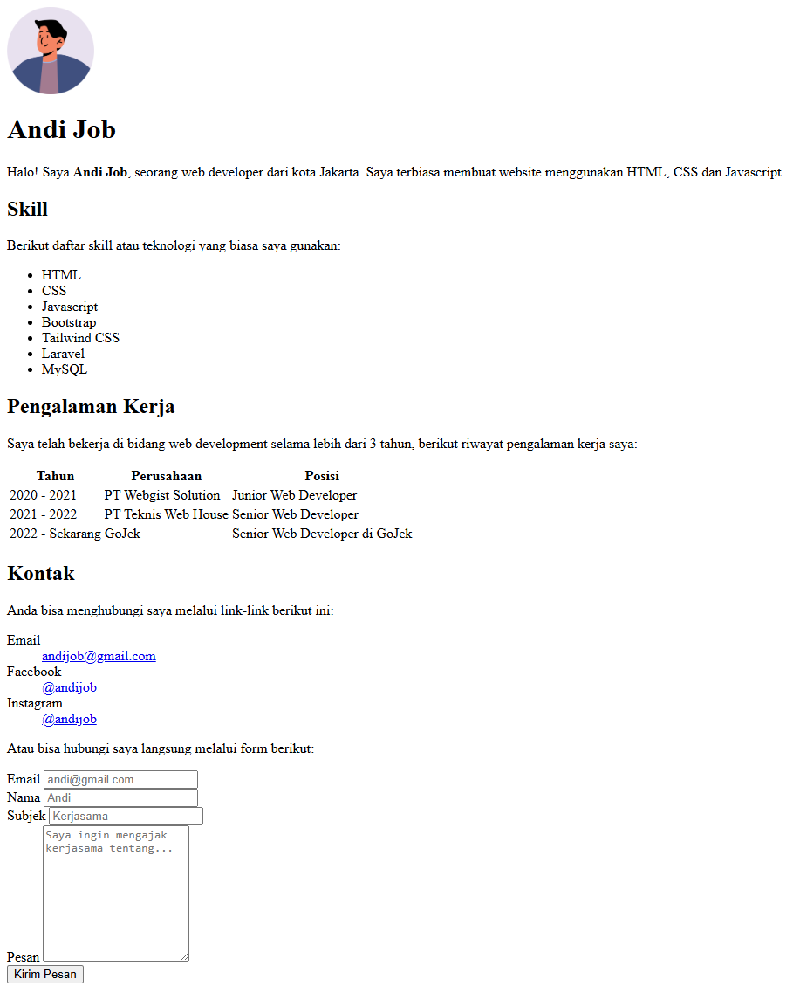
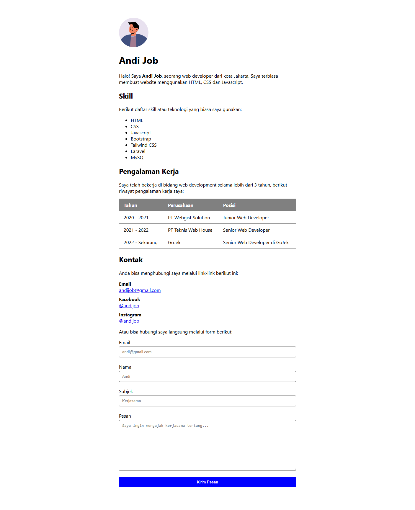

Setelah mempelajari struktur dasar HTML dan beberapa tag-tag dasar HTML, sekarang saatnya kita praktek mengaplikasikan pengetahuan tersebut dengan membuat sebuah website sederhana, yaitu website pribadi.

Website pribadi adalah website yang menampilkan informasi-informasi pribadi seperti nama, biografi, pengalaman kerja, dsb yang bisa digunakan sebagai CV, portofolio, biodata diri dsb.

Website pribadi yang akan dibuat akan terdiri dari beberapa bagian, yaitu:

1. Foto pribadi
2. Judul (Nama pribadi)
3. Biodata
4. Daftar keahlian / skills
5. Tabel pengalaman kerja
6. Daftar link kontak
7. Form kontak

Hasil akhir website akan seperti berikut:



Agar lebih cantik, nanti juga akan diberikan cara untuk menambahkan style sederhana di akhir pembuatan website (opsional), hasilnya akan seperti berikut:



Langsung saja berikut langkah-langkah pembuatannya:

## Membuat File HTML

Pertama, buat file HTML untuk website pribadi yang akan dibuat, beri nama misalnya `index.html`. Lalu buka dengan kode editor. Penjelasannya dapat dilihat di [cara membuat dan menjalankan file HTML](/courses/belajar-html-dasar/membuat-dan-menjalankan-html).

## Membuat Struktur Dasar

Buat struktur dasar HTML terlebih dahulu. Penjelasannya dapat dilihat di [cara membuat struktur dasar HTML](/courses/belajar-html-dasar/struktur-dasar-html).

Untuk teks di dalam `title` diisi dengan judul website, misalnya `Website Pribadi - Nama`.

```html
<!DOCTYPE html>
<html lang="id">
<head>
    <title>Website Pribadi - Andi Job</title>
</head>
<body>
    
</body>
</html>
```

## Menampilkan Foto Pribadi

Elemen pertama di website pribadi yang akan dibuat adalah foto pribadi.

Siapkan sebuah foto pribadi dan letakkan di folder yang sama dengan file HTML yang sudah dibuat sebelumnya, misal nama file fotonya `foto.png`.

Tampilkan foto tersebut ke halaman website dengan menambahkan tag `` di dalam tag `<body>`, lalu masukkan nama file foto ke dalam atribut `src`.

```html

```

Baca disini untuk [cara menampilkan gambar di HTML](/courses/belajar-html-dasar/menampilkan-gambar-di-html)

## Membuat Judul (Nama Pribadi)

Tampilkan nama pribadi Anda di halaman website dalam bentuk judul (`heading`).

Buat tag `<h1>` dengan isi teks nama Anda. Letakkan di bawah tag `` foto pribadi.

```html
<h1>Andi Job</h1>
```

Baca disini untuk [cara membuat judul di HTML](/courses/belajar-html-dasar/membuat-judul-di-html)

## Membuat Biodata

Tampilkan biodata Anda di halaman website dalam bentuk paragraf.

Buat tag `<p>` dengan isi teks paragraf biodata Anda. Letakkan di bawah tag `<h1>` nama pribadi.

```html
<p>
  Halo! Saya <b>Andi Job</b>, seorang web developer dari kota Jakarta. Saya
  terbiasa membuat website menggunakan HTML, CSS dan Javascript.
</p>
```

> Anda boleh menambahkan lebih dari satu paragraf jika ingin biodata yang lebih panjang.

Baca disini untuk [cara membuat paragraf di HTML](/courses/belajar-html-dasar/membuat-paragraf-di-html)

## Membuat Daftar Keahlian / Skills

Tunjukan apa saja keahlian Anda di halaman website dalam bentuk daftar.

Buat tag `<ul>`, letakkan di bawah tag `<p>` biodata. Di dalamnya tampilkan daftar keahlian Anda, setiap keahlian dibuat dengan tag `<li>`.

```html
<ul>
  <li>HTML</li>
  <li>CSS</li>
  <li>Javascript</li>
  <li>Bootstrap</li>
  <li>Tailwind CSS</li>
  <li>Laravel</li>
  <li>MySQL</li>
</ul>
```

> Jika ingin daftarnya urut, maka ganti tag `<ul>` menjadi tag `<ol>`.

Baca disini untuk [cara membuat daftar di HTML](/courses/belajar-html-dasar/membuat-daftar-di-html)

## Membuat Tabel Pengalaman Kerja

Tampilkan pengalaman kerja anda di halaman website dalam bentuk tabel yang terstruktur. Langkah-langkahnya:

1. Pertama buat tag `<table>`, letakkan di bawah tag `<ul>` daftar keahlian.
2. Buat sebuah baris dengan tag `<tr>`, di dalam baris tersebut buat 3 buah kolom tabel dengan tag `<th>`. Kolom-kolomnya: tahun, perusahaan dan posisi.
3. Tampilkan pengalaman kerja anda, setiap pengalaman kerja dibuat per baris dengan tag `<tr>`, di dalam baris tersebut buat 3 buah sel dengan tag `<td>`. Sel pertama diisi tahun kerja, sel kedua diisi nama perusahaan, sel ketiga diisi posisi jabatan.

```html
<table>
  <tr>
    <th>Tahun</th>
    <th>Perusahaan</th>
    <th>Posisi</th>
  </tr>
  <tr>
    <td>2020 - 2021</td>
    <td>PT Webgist Solution</td>
    <td>Junior Web Developer</td>
  </tr>
  <tr>
    <td>2021 - 2022</td>
    <td>PT Teknis Web House</td>
    <td>Senior Web Developer</td>
  </tr>
  <tr>
    <td>2022 - Sekarang</td>
    <td>GoJek</td>
    <td>Senior Web Developer di GoJek</td>
  </tr>
</table>
```

Baca disini untuk [cara membuat tabel di HTML](/courses/belajar-html-dasar/membuat-tabel-di-html)

## Membuat Daftar link kontak
## Membuat Form kontak
## Hasil Akhir
## Menambahkan Style (Opsional)

<!-- ```html

<h1>Andi Job</h1>
<p>
  Halo! Saya <b>Andi Job</b>, seorang web developer dari kota Jakarta. Saya
  terbiasa membuat website menggunakan HTML, CSS dan Javascript.
</p>
<h2>Skill</h2>
<p>Berikut daftar skill atau teknologi yang biasa saya gunakan:</p>
<ul>
  <li>HTML</li>
  <li>CSS</li>
  <li>Javascript</li>
  <li>Bootstrap</li>
  <li>Tailwind CSS</li>
  <li>Laravel</li>
  <li>MySQL</li>
</ul>
<h2>Pengalaman Kerja</h2>
<p>
  Saya telah bekerja di bidang web development selama lebih dari 3 tahun,
  berikut riwayat pengalaman kerja saya:
</p>
<table>
  <tr>
    <th>Tahun</th>
    <th>Perusahaan</th>
    <th>Posisi</th>
  </tr>
  <tr>
    <td>2020 - 2021</td>
    <td>PT Webgist Solution</td>
    <td>Junior Web Developer</td>
  </tr>
  <tr>
    <td>2021 - 2022</td>
    <td>PT Teknis Web House</td>
    <td>Senior Web Developer</td>
  </tr>
  <tr>
    <td>2022 - Sekarang</td>
    <td>GoJek</td>
    <td>Senior Web Developer di GoJek</td>
  </tr>
</table>
<h2>Kontak</h2>
<p>Anda bisa menghubungi saya melalui link-link berikut ini:</p>
<dl>
  <dt>Email</dt>
  <dd>
    <a href="mailto:andijob@gmail.com">andijob@gmail.com</a>
  </dd>
  <dt>Facebook</dt>
  <dd>
    <a href="https://facebook.com/andijob">@andijob</a>
  </dd>
  <dt>Instagram</dt>
  <dd>
    <a href="https://instagram.com/andijob">@andijob</a>
  </dd>
</dl>
<p>Atau bisa hubungi saya langsung melalui form berikut:</p>
<form>
  <label for="email">Email</label>
  <input type="email" id="email" placeholder="andi@gmail.com" />
  <br />

  <label for="nama">Nama</label>
  <input type="text" id="nama" placeholder="Andi" />
  <br />

  <label for="subjek">Subjek</label>
  <input type="subjek" id="subjek" placeholder="Kerjasama" />
  <br />

  <label for="pesan">Pesan</label>
  <textarea
    id="pesan"
    rows="10"
    placeholder="Saya ingin mengajak kerjasama tentang..."
  ></textarea>
  <br />

  <button type="submit">Kirim Pesan</button>
</form>
``` -->

<!-- ```css
body {
    box-sizing: border-box;
    margin: 0 auto;
    max-width: 600px;
    padding: 60px 0;
    font-family: 'Segoe UI', Tahoma, Geneva, Verdana, sans-serif;
}

img {
    border-radius: 100%;
}

table {
    width: 100%;
    border: 1px solid gray;
    border-collapse: collapse;
}

tr {
    border-bottom: 1px solid gray;
}

th, td {
    text-align: left;
    padding: 10px 15px;
}

th {
    background-color: gray;
    color: white;
}

dt {
    font-weight: bold;
    margin-top: 10px;
}

dd {
    margin: 0;
}

input, textarea {
    display: block;
    width: 100%;
    padding: 10px;
    margin-top: 4px;
    border-radius: 4px;
    outline: none;
    border: 1px solid gray;
}

button {
    width: 100%;
    padding: 10px;
    background-color: blue;
    color: white;
    border: 0;
    border-radius: 4px;
}
``` -->