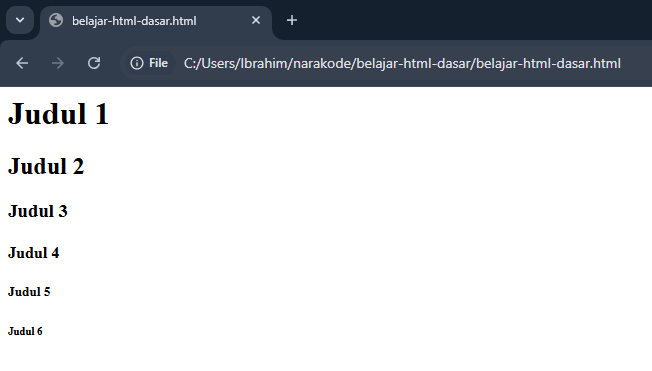

Judul adalah elemen yang penting dan hampir selalu ada di halaman website.

Judul berfungsi untuk membuat struktur konten di halaman website, sehingga memudahkan pengunjung dan mesin pencari untuk memahami isi konten halaman tersebut.

## Cara Membuat Judul di HTML

Elemen judul di HTML dibuat dengan tag `<h1>`, `<h2>`, dst sampai `<h6>`. Teks judul ditulis di antara tag pembuka dan tag penutup. Contoh:

```html
<h1>Judul 1</h1>
<h2>Judul 2</h2>
<h3>Judul 3</h3>
<h4>Judul 4</h4>
<h5>Judul 5</h5>
<h6>Judul 6</h6>
```

Hasilnya:



## Level Judul

`h1` digunakan untuk judul utama, `h2`, `h3` dst sampai `h6` digunakan untuk subjudul. Semakin ke bawah maka levelnya semakin kecil, biasanya ukuran teksnya juga makin kecil.

## Tips Membuat Judul

Ada beberapa tips untuk membuat judul yang baik dan benar di HTML dan halaman website:

1. Pastikan level judul berurutan, buat `h1` dulu, lalu `h2`, `h3`, dst sampai `h6`.
2. Judul yang loncat-loncat / tidak berurutan bisa membingungkan mesin pencari dalam memahami sebuah halaman, dampaknya rangking halaman tersebut bisa turun.
3. Pastikan hanya ada satu `h1` per satu halaman website, karena `h1` adalah judul utama maka sebaiknya hanya ada satu. Judul-judul lainnya dibuat di `h2`, `h3`, dst sampai `h6` dan boleh lebih dari satu.