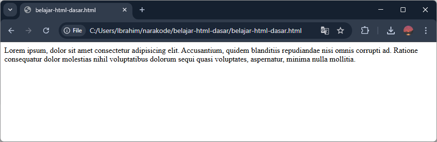

Paragraf adalah elemen yang hampir selalu ada di halaman website. Fungsinya untuk menampilkan teks berisi kalimat-kalimat di halaman website.

## Cara Membuat Paragraf di HTML

Elemen paragraf di HTML dibuat dengan tag `<p>`. Teks paragrafnya ditulis di dalam tag `<p>`. Contoh:

```html
<p>Lorem ipsum, dolor sit amet consectetur adipisicing elit. Accusantium, quidem blanditiis repudiandae nisi omnis corrupti ad. Ratione consequatur dolor molestias nihil voluptatibus dolorum sequi quasi voluptates, aspernatur, minima nulla mollitia.</p>
```

Hasilnya.



Elemen paragraf akan membuat baris baru ketika dibuat, sehingga jika ada beberapa elemen paragraf maka setiap paragraf akan dipisahkan dengan baris baru.

```html
<p>Lorem ipsum, dolor sit amet consectetur adipisicing elit. Accusantium, quidem blanditiis repudiandae nisi omnis corrupti ad. Ratione consequatur dolor molestias nihil voluptatibus dolorum sequi quasi voluptates, aspernatur, minima nulla mollitia.</p>
<p>Lorem ipsum dolor sit amet consectetur adipisicing elit. Voluptate, nemo. Inventore velit voluptate repudiandae error exercitationem reprehenderit qui obcaecati quam deserunt maxime tempore, voluptatibus possimus illum nihil quidem molestiae veniam!</p>
<p>Lorem ipsum dolor sit amet consectetur adipisicing elit. Nihil, expedita tenetur culpa, quod aspernatur libero eveniet ipsam, necessitatibus eos corrupti veritatis reiciendis autem minus quibusdam nesciunt quia pariatur laboriosam fuga!</p>
```


## Format Teks Di Dalam Paragraf

Kita bisa memberikan format pada teks, kata, atau kalimat tertentu di dalam paragraf menjadi tebal, miring, bergaris bawah dsb, dengan menaruh teks tersebut ke dalam tag-tag berikut:

1. `<b>` dan `<strong>`, untuk membuat teks menjadi tebal.
2. `<i>` dan `<em>`, untuk membuat teks menjadi miring.
3. `<u>`, untuk membuat garis bawah di teks.
4. `<br>` untuk membuat baris baru setelah teks.
5. dll.

Contoh:

```html
<p>
    Ini adalah teks paragraf lengkap, ada yang <strong>teksnya tebal</strong>, ada yang <em>teksnya miring</em>, ada yang <u>teksnya bergaris bawah</u>. Teks setelah ini <br> akan berganti baris.
</p>
```

Hasilnya.

