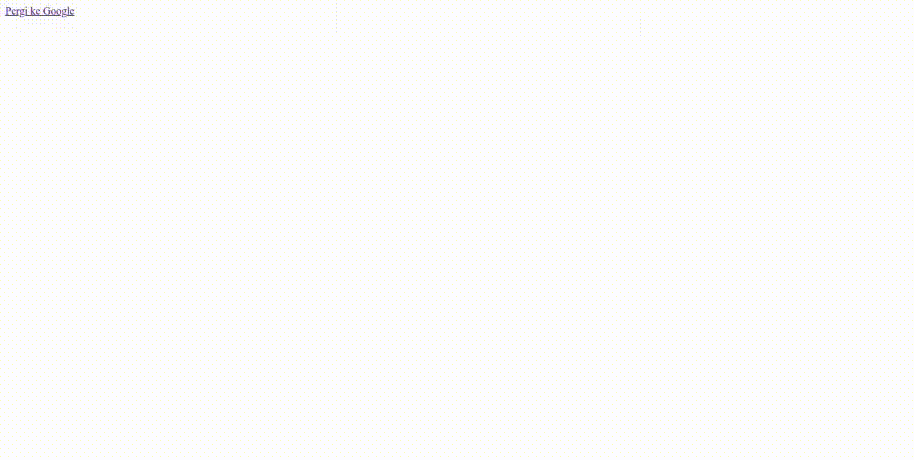
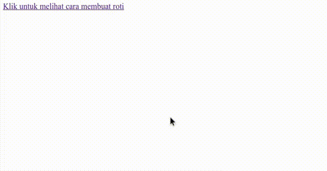

Link adalah elemen yang hampir selalu ada di halaman website. Fungsinya untuk menghubungkan halaman website ke halaman lain atau ke website lain.

Link di halaman website umumnya berbentuk teks, ada juga yang berbentuk gambar, tombol, ikon, dsb.

## Cara Membuat Link di HTML

Elemen link di HTML dibuat dengan tag _anchor_ (`<a>`). Url tujuan link dimasukkan ke dalam atribut `href`. Teks link ditulis di antara tag pembuka dan tag penutup. Contoh:

```html
<a href="https://google.com">Pergi ke Google</a>
```

Hasilnya:



## Membuat Link ke Website Lain

Caranya, masukkan url website lain ke dalam url link lengkap dengan protokol (`http` atau `https`) dan domainnya. Contoh:

```html
<a href="https://google.com">Pergi ke Google</a>
<a href="https://www.youtube.com/watch?v=MzFrT3YDPCM">Tonton di Youtube</a>
<a href="https://shope.ee/5KWTbKxRdQ">Beli di Shopee</a>
```

Url yang lengkap dengan protokol dan domainnya disebut dengan __absolute url__.

## Membuat Link ke Halaman Lain

Caranya, masukkan url lokasi halaman lain ke dalam url link. Contoh:

```html
<a href="/about">Tentang Kami</a>
<a href="pencarian">Pencarian</a>
```

Url yang seperti ini disebut dengan __relative url__. Jika diawali dengan `/` maka url relatif terhadap domain website, jika tidak diawali dengan `/` maka url relatif terhadap lokasi halaman yang sedang dibuka.

Contohnya, jika kode di atas dibuka di halaman `narakode.id/daftar-artikel`, maka browser akan membaca _relative url_ dengan cara seperti berikut:

```bash
# narakode.id/daftar-artikel
/about -> /narakode.id/about
pencarian -> /narakode.id/daftar-artikel/pencarian
```

## Membuat Link ke File HTML Lain

Caranya, masukkan nama file lengkap dengan lokasi filenya dalam url link. Contoh:


```html
<a href="komentar.html">Tambah Komentar</a>
<a href="artikel/cara-membuat-kue.html">Cara Membuat Kue</a>
<a href="/kontak.html">Hubungi Kami</a>
<a href="../login.html">Masuk ke Aplikasi</a>
```

Penjelasan:

- Jika nama filenya diawali dengan `/` maka file HTML akan dicari dari root (di `C:/` atau di `/` di Linux).
- Jika nama filenya tidak diawali dengan `/` maka file HTML akan dicari di folder yang sama dengan file HTML yang sedang dibuka.
- Kode `../` maksudnya adalah mencari file HTML di folder luar dari folder file HTML yang sedang dibuka.

## Membuat Link ke Elemen Tertentu di Halaman Website

Link bisa diarahkan ke elemen tertentu di halaman website, biasanya diarahkan ke judul di halaman.

Caranya, elemen yang ingin dituju harus memiliki atribut `id` dengan nilai teks tertentu. Contoh:

```html
<h1 id="cara-membuat-roti">Cara Membuat Roti</h1>
```

Lalu buat elemen link yang urlnya berisi `id` dari elemen yang ingin dituju ditambah tanda `#` di depannya. Contoh:

```html
<a href="#cara-membuat-roti">Klik untuk melihat cara membuat roti</a>
```

Ketika link diklik, browser akan scroll ke elemen dengan atribut `id` yang sesuai. Contoh hasilnya:



## Membuat Link ke Email dan Nomor Telepon

Link bisa diarahkan untuk membuka ke email dan nomor telepon, caranya dengan menambahkan protokol `mailto:` untuk email dan `tel:` untuk nomor telepon di url link. Contoh:

```html
<a href="mailto:info@teknogain.com">Hubungi kami lewat email</a>
<a href="tel:082667177263">Hubungi kami lewat telepon</a>
```

Ketika link email diklik, browser akan membuka aplikasi email di perangkat untuk memproses email, begitu juga dengan link nomor telepon.

## Membuat Link dengan Gambar

Untuk membuat link dengan gambar, tambahkan elemen gambar di dalam elemen link. Contoh:

```html
<a href="https://google.com">
    
</a>
```

Ketika gambar `google.jpg` diklik, browser akan membuka url `https://google.com`. Contoh hasilnya:


[Baca disini untuk belajar menampilkan elemen gambar di HTML](/courses/belajar-html-dasar/menampilkan-gambar-di-html).

## Membuka Link di Tab Baru

Untuk membuka link di tab baru, tambahkan atribut `target` dengan isi `_blank` di elemen link. Contoh:

```html
<a href="https://google.com" target="_blank">Pergi ke Google</a>
```

Selain di tab baru, link juga bisa dibuka di beberapa tempat lain, di antaranya:

- `_self`, dibuka di tab yang sama.
- `_blank`, dibuka di tab baru.
- `_parent`, dibuka di frame atasnya.
- `_top`, dibuka frame paling luar.

Atribut `target` sifatnya opsional di elemen link, default browser membuka link di tab yang sama (`_self`).