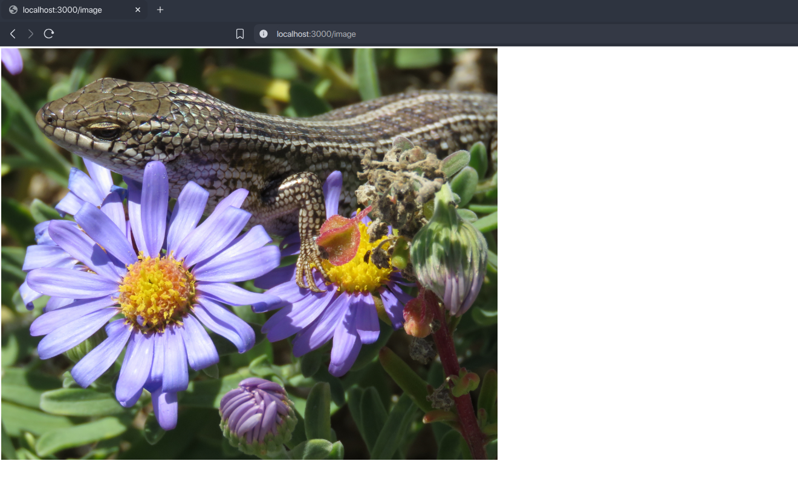
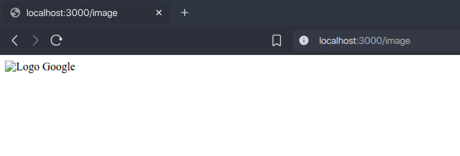
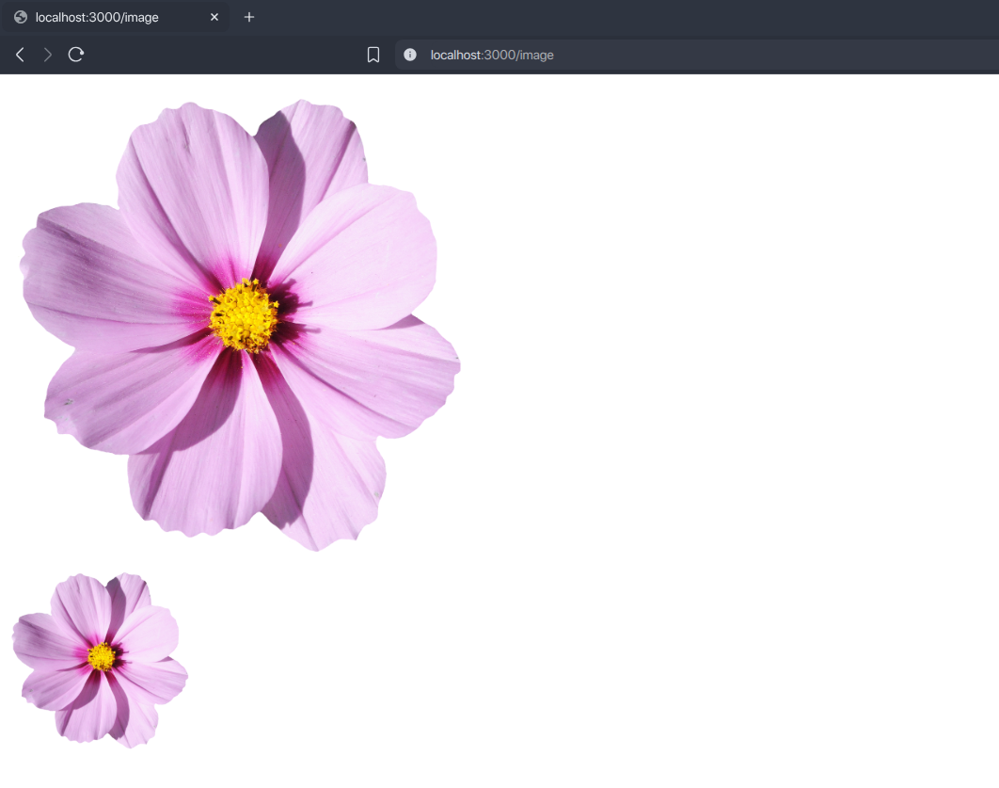

Gambar adalah elemen sering ada di halaman website. Fungsinya untuk menampilkan informasi dalam bentuk grafis.

## Cara Menampilkan Gambar di HTML

Elemen gambar di HTML dibuat dengan tag _image_ (``). Gambar yang ingin ditampilkan dimasukkan ke dalam atribut `src`. Contoh:

```html

```

Gambar yang ditampilkan harus dalam bentuk file dengan format yang didukung oleh browser seperti jpg, png, gif, webp, svg, ico, dsb.

Tag `` tidak perlu memerlukan tag penutup.

## Menampilkan Gambar dari Website Lain

Caranya, masukkan url file gambar dari website lain secara lengkap mulai dari protokol (`https`  atau `http`), domain, hingga lokasi filenya. Contoh:

```html

```

Hasilnya:



## Menampilkan Gambar Lokal

Caranya, masukkan nama file gambar yang ingin ditampilkan. Contoh:

```html

```

Jika gambar di dalam folder maka masukkan juga foldernya. Contoh:

```html

```

Jika gambar di luar folder maka gunakan kode `../` untuk mencari ke luar folder setiap satu tingkat. Contoh:

```html

```

## Menambahkan Teks Alternatif Pada Gambar

Teks alternatif adalah teks yang muncul ketika gambar tidak bisa ditampilkan. Sehingga pengunjung dan mesin pencari sedikit bisa mengetahui tentang gambar yang sebenarnya ingin ditampilkan.

Teks alternatif di gambar HTML dimasukkan ke atribut `alt` tag ``. Contoh:

```html

```

Karena gambar di `src` tidak ditemukan, maka browser akan menampilkan teks `Logo Google` sebagai alternatif yang ditampilkan. Contoh hasilnya:



Gambar tidak bisa ditampilkan bisa karena beberapa sebab:

- Nama file gambar salah.
- Folder file gambar tidak lengkap.
- File gambar sudah dihapus.
- Jika gambar dari website lain, bisa jadi membutuhkan hak akses tertentu.
- Tidak ada koneksi internet.

## Mengatur Ukuran Gambar yang Ditampilkan

Gambar yang ingin ditampilkan juga bisa diatur ukuran gambarnya (lebar dan tinggi) dengan menambahkan atribut:

- `width` untuk lebar gambar, isinya angka.
- `height` untuk tinggi gambar, isinya angka.

Kedua atribut tersebut satuan ukurannya adalah piksel (`px`) jadi jika diisi `width="200" height="200"` maka ukuran gambarnya adalah 200 piksel lebar dan tingginya. Contoh:

```html

<br>

```

Pada kode di atas, gambar pertama akan ditampikan sesuai ukuran aslinya, sedangkan yang kedua ditampilkan dengan 200 piksel lebar dan tingginya. Contoh hasilnya:

