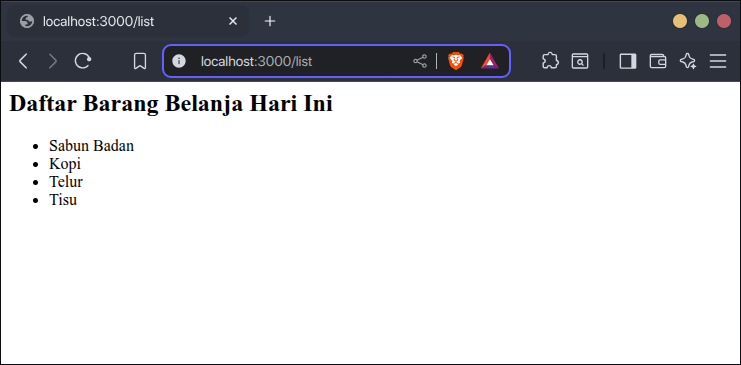
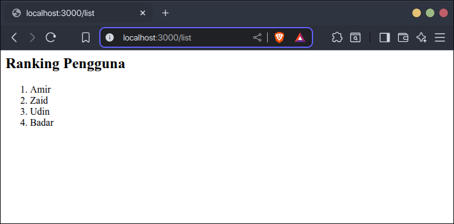
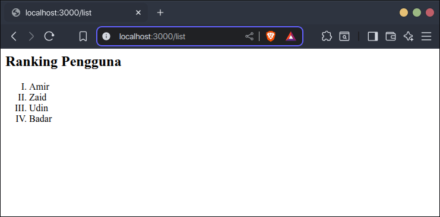
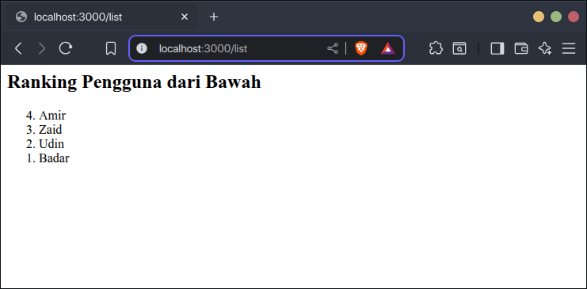
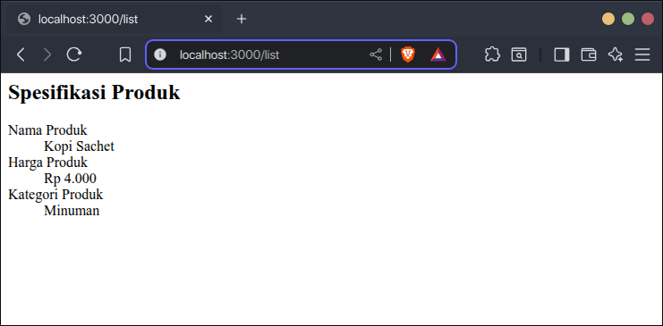
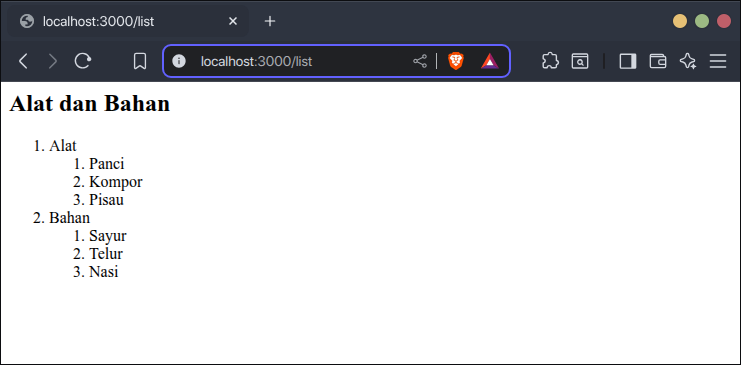

Daftar adalah salah satu cara untuk menampilkan informasi yang terdiri dari beberapa jenis di halaman website. Misalnya untuk menampilkan daftar barang belanja, daftar bahan masakan, daftar pengguna, dll.

## Cara Membuat Daftar di HTML

Untuk membuat daftar di HTML ada dua langkah:

1. Buat wadah daftar dengan tag `<ul>`.
2. Buat setiap isi daftar dengan tag `<li>`, lalu masukkan ke dalam wadah daftar `<ul>`.

Contoh:

```html
<h2>Daftar Barang Belanja Hari Ini</h2>
<ul>
    <li>Sabun Badan</li>
    <li>Kopi</li>
    <li>Telur</li>
    <li>Tisu</li>
</ul>
```

Hasilnya:



Daftar ada beberapa jenis, setiap jenisnya memiliki tag-nya masing-masing:

1. Daftar tak berurutan.
2. Daftar berurutan.
3. Daftar deskripsi.

## Membuat Daftar Tak Berurutan

Daftar yang tak berurutan adalah daftar yang tidak memiliki urutan (1, 2, 3) atau (a, b, c). Contonya seperti daftar barang belanja, daftar tugas, daftar perlengkapan, dll.

Daftar tak berurutan di HTML dibuat dengan tag `<ul>`, isi daftarnya dibuat dengan tag `<li>`. Contoh:

```html
<h2>Daftar Barang Belanja Hari Ini</h2>
<ul>
    <li>Sabun Badan</li>
    <li>Kopi</li>
    <li>Telur</li>
    <li>Tisu</li>
</ul>
```

Hasilnya, setiap isi daftar akan ditampilkan dengan simbol:


## Membuat Daftar Berurutan

Daftar yang berurutan adalah daftar yang memiliki urutan (1, 2, 3) atau (a, b, c). Contohnya seperti daftar langkah-langkah melakukan sesuatu, daftar ranking pengguna, dll.

Daftar tak berurutan di HTML dibuat dengan tag `<ol>`, isi daftarnya dibuat dengan tag `<li>`. Contoh:

```html
<h2>Ranking Pengguna</h2>
<ol>
    <li>Amir</li>
    <li>Zaid</li>
    <li>Udin</li>
    <li>Badar</li>
</ol>
```

Hasilnya, setiap isi daftar akan ditampilkan dengan urutannya, default dengan angka arab (1, 2, 3 dst):



### Mengubah Simbol Urutan

Daftar yang berurutan simbolnya dapat diubah dengan menambahkan atribut `type`, diisi dengan nama simbolnya:

1. `1`, angka arab (1, 2, 3, dst).
2. `A`, huruf kapital (A, B, C, dst).
3. `a`, huruf kecil (a, b, c, dst).
4. `I`, angka romawi (I, II, III, dst).
5. `i`, angka romawi kecil (i, ii, iii, dst).

Contoh:

```html
<h2>Ranking Pengguna</h2>
<ol type="I">
    <li>Amir</li>
    <li>Zaid</li>
    <li>Udin</li>
    <li>Badar</li>
</ol>
```

Hasilnya:



### Membalikan Urutan

Secara default daftar yang berurutan ditampilkan urut dari yang terkecil (1, 2, 3, dst). Ini bisa diubah dengan menambahkan atribut `reserved` untuk membalikan urutan dari yang terbesar, misal (10, 9, 8, dst sampai 1).

Atribut `reversed` adalah atribut `boolean`, artinya tidak memerlukan nilai. Contoh:

```html
<h2>Ranking Pengguna dari Bawah</h2>
<ol reversed>
    <li>Amir</li>
    <li>Zaid</li>
    <li>Udin</li>
    <li>Badar</li>
</ol>
```

Hasilnya:



## Membuat Daftar Deskripsi

Daftar deskripsi adalah daftar yang setiap isi daftarnya memiliki dari judul dan isi. Contohnya untuk menampilkan biodata pengguna, spesifikasi produk, dsb. 

Daftar deskripsi dibuat dengan 3 tag:

- `<dl>` untuk membuat wadah daftar.
- `<dt>` untuk membuat judul isi daftar.
- `<dd>` untuk membuat isi dari judul daftar.

Setiap isi daftar memiliki dua tag `<dt>` dan `<dd>`. Contoh:

```html
<h2>Spesifikasi Produk</h2>
<dl>
    <dt>Nama Produk</dt>
    <dd>Kopi Sachet</dt>

    <dt>Harga Produk</dt>
    <dd>Rp 4.000</dt>

    <dt>Kategori Produk</dt>
    <dd>Minuman</dt>
</dl>
```

Hasilnya:



## Membuat Daftar Bercabang

Daftar di HTML bisa dibuat bercabang.

Caranya, di dalam isi daftar (`<li>`) yang bercabang, tambahkan daftar lagi dengan `<ul>` atau `<ol>` dan isi daftar cabangnya (`<li>`). Contoh:

Contoh:

```html
<h2>Alat dan Bahan</h2>
<ol>
    <li>
        Alat
        <ol>
            <li>Panci</li>
            <li>Kompor</li>
            <li>Pisau</li>
        </ol>
    </li>
    <li>
        Bahan
        <ol>
            <li>Sayur</li>
            <li>Telur</li>
            <li>Nasi</li>
        </ol>
    </li>
</ol>
```

Hasilnya:

